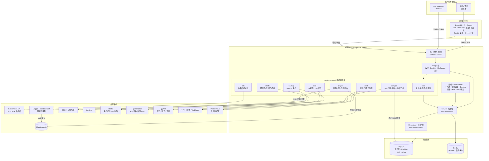
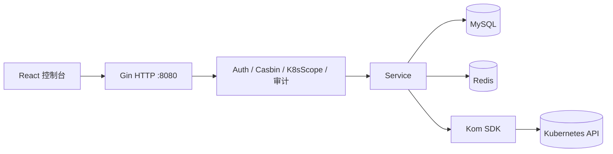
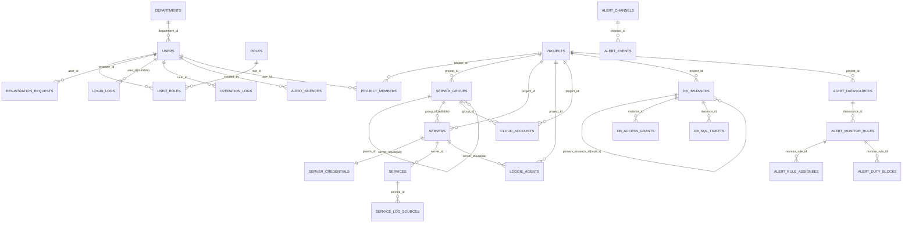

# Yunshu

[](https://go.dev/)
[](https://react.dev/)
[](https://ant.design/)
[](#)

> 基于 Go + React 的 Kubernetes 运维与项目化告警平台，涵盖系统管理、权限管理、项目管理、**数据库管理（dbmgmt）**、K8s 资源管理、告警平台与日志平台。

---

## 目录

- [项目简介](#项目简介)
- [架构与权限模型](#架构与权限模型)
  - [系统全景图](#系统全景图)
  - [分层架构](#分层架构)
- [快速开始](#快速开始)
  - [环境要求](#环境要求)
  - [本地源码启动](#本地源码启动)
  - [Docker Compose 部署](#docker-compose-部署)
  - [分支切换（git checkout）](#分支切换git-checkout)
- [配置说明](#配置说明)
- [运维操作手册](#运维操作手册)
  - [首次登录与初始化](#首次登录与初始化)
  - [权限配置（Casbin + 集群档位）](#权限配置casbin--集群档位)
  - [纳管 Kubernetes 集群](#纳管-kubernetes-集群)
  - [日志平台（Loggie + Elasticsearch）](#日志平台loggie--elasticsearch)
  - [告警平台要点](#告警平台要点)
  - [CI/CD 要点（cicd 插件）](#cicd-要点cicd-插件)
  - [数据库管理要点（dbmgmt 插件）](#数据库管理要点dbmgmt-插件)
- [前端路由索引](#前端路由索引)
- [常用 CLI 命令](#常用-cli-命令)
- [排障指南](#排障指南)
- [功能状态标记说明](#功能状态标记说明)
- [页面功能与截图](#页面功能与截图)
  - [1. 登录与概览](#1-登录与概览)
  - [2. 系统管理](#2-系统管理)
  - [3. 项目管理](#3-项目管理)
  - [4. 日志平台](#4-日志平台)
  - [5. 数据库管理（dbmgmt）](#5-数据库管理dbmgmt)
  - [6. 告警平台](#6-告警平台)
  - [7. Kubernetes 管理](#7-kubernetes-管理)
- [告警通知与恢复示例](#告警通知与恢复示例)
- [数据库 ER 图](#数据库-er-图)
- [项目结构](#项目结构)
- [文档链接](#文档链接)
- [参考项目](#参考项目)

---

## 项目简介

Yunshu 主要能力：

- 多模块后台管理（用户、角色、菜单、组织、字典、审计）
- **双层 K8s 鉴权**：Casbin API 权限 + 集群档位（`readonly` / `readonly_exec` / `admin`）+ 命名空间黑/白名单
- 项目维度的 **CMDB**（服务器、云账号、SSH/Web 终端）与服务配置
- **日志平台**（Loggie Agent + Elasticsearch）：按服务器按日索引采集、检索、导出、保留策略、Agent 安装/热更/启停
- **MySQL 备份**（mysqldump / xtrabackup / innobackupex，MinIO 存储，Cron 调度）
- **数据库管理（dbmgmt）**：MySQL/PostgreSQL 实例纳管（主库/从库）、SQL 查询与审核（goInception）、库表级授权、应用用户 GRANT、审批工单与审计
- **CI/CD**（Jenkins 打包、多级审批发布、制品 MinIO；`cicd` 插件）
- 告警数据源、规则、值班、静默、策略、**云到期规则**、多渠道通知（钉钉/邮件等）
- Kubernetes 资源可视化管理（工作负载、网络、存储、RBAC、CRD、Ingress-Nginx 运维）

默认管理员（**首次** `go run . seed` 创建；重复 seed **不会重置**已有 admin 密码）：

| 项 | 值 |
|----|-----|
| 用户名 | `admin` |
| 密码 | `Admin@123`（仅首次创建时写入） |
| 邮箱 | `rootwxd@163.com` |

业务功能以**编译期插件**组织，由 `configs/config.yaml` 的 `plugins.enabled` 控制启停，详见 [docs/plugins.md](docs/plugins.md)。

> **日志架构**：采集链路为 **目标机 Loggie → Elasticsearch**；Yunshu 后端仅提供 HTTP `:8080`（Agent 引导/心跳、检索、保留策略），不向业务机开放独立采集端口。

---

## 架构与权限模型

### 系统全景图

下图概括 Yunshu 的**用户入口、插件化后端、数据层与外部依赖**（以默认启用全部插件为例）：



**读图要点**：

| 区域 | 说明 |
|------|------|
| **插件** | 同一二进制，`config.yaml` → `plugins.enabled` 控制路由、迁移、Worker；详见 [docs/plugins.md](docs/plugins.md) |
| **项目维度** | CMDB / 日志 / 备份 / **dbmgmt** / CI/CD API 多在 `/api/v1/projects/:id/...` 下，需项目成员权限 |
| **日志** | Loggie 在目标机采集并写 ES；Yunshu 经 HTTP 管理 Agent 与代理检索 |
| **K8s 三元策略** | Casbin API 授权 → 路由 K8s 范围校验 → 集群档位 + NS 黑/白名单（见下文） |
| **配置优先级** | 数据字典 `dict_entries` 可覆盖 YAML（Jenkins、MinIO、邮件、备份调度、dbmgmt 等） |

### 分层架构



### 三道权限闸门（K8s 相关请求）

| 顺序 | 控制台入口 | 作用 |
|------|------------|------|
| 1 | **授权管理**（角色勾选 API） | 能否调用该 HTTP 接口（Casbin） |
| 2 | **API 管理 → K8s 范围校验** | 该路由是否进入集群档位中间件 |
| 3 | **K8s 集群访问档位** + **命名空间黑/白名单** | 在指定 `cluster_id` / `namespace` 上是否具备足够档位 |

档位说明：

| 档位 | 典型能力 |
|------|----------|
| `readonly` | 列表/详情类 GET（资源只读 API） |
| `readonly_exec` | 只读 + Pod 日志/终端 Exec |
| `admin` | 变更类操作（apply/delete/scale、Ingress-Nginx 重启等） |

详细设计见：[docs/handbook/permissions/casbin-and-k8s-triple-policy.md](docs/handbook/permissions/casbin-and-k8s-triple-policy.md)

---

## 快速开始

### 环境要求

- Go 1.23+
- Node.js 18+
- MySQL
- Redis

### 本地源码启动

#### 启动步骤

```bash
git clone https://github.com/AshesToVow/yunshu.git
cd yunshu
git checkout yunshu_prod_20260701
go mod download
cd web && npm install && cd ..

go run . migrate
go run . seed
go run . server
```

新终端启动前端：

```bash
cd web
npm run dev
```

访问地址（本地开发）：

| 服务 | 地址 |
|------|------|
| 前端 | http://localhost:5173 |
| 后端 API | http://localhost:8080 |
| Swagger | http://localhost:8080/swagger/index.html |

> 后端二进制入口为 Cobra 子命令，根命令名为 `permission-system`（`go run . server` 即可）。

### Docker Compose 部署

项目根目录已提供 `docker-compose.yml`，包含以下服务：

- `mysql`（5.7）
- `redis`（7.x）
- `backend`（Go API）
- `frontend`（Nginx + 前端静态资源）

#### 1) 启动

```bash
git clone <your-repo-url>
cd yunshu
git checkout <branch-name>
# 首次或镜像更新时建议带 --build
docker compose up -d --build
```

#### 2) 查看状态与日志

```bash
docker compose ps
docker compose logs -f backend
docker compose logs -f frontend
```

#### 3) 停止与清理

```bash
docker compose down

# 连同数据卷一起清理（谨慎）
docker compose down -v
```

#### 4) 访问入口

- 前端：`http://<host>:80`
- 后端 API：`http://<host>:8080`

> 说明：`docker-compose.yml` 默认读取项目内 `configs`、`logs`，并映射 MySQL/Redis 端口。生产环境请替换默认密码、JWT/加密密钥，并按需调整挂载路径与资源限制。

### 分支切换（git checkout）

```bash
# 查看本地与远程分支
git branch -a

# 切换到已有本地分支
git checkout <branch-name>

# 基于远程分支创建并切换本地分支
git checkout -b <branch-name> origin/<branch-name>

# 回到主分支（按仓库实际分支名 main/master）
git checkout main
```

常见场景建议：

- 开发新功能：从 `main` 切新分支后再开发。
- 联调/排障：先 `git checkout main && git pull`，再切目标分支，避免基线过旧。

---

## 配置说明

主配置文件：`configs/config.yaml`（可通过 `--config` 指定路径）。

| 配置块 | 说明 |
|--------|------|
| `app` / `http` | 服务端口、超时（仅 HTTP，默认 `:8080`） |
| `mysql` / `redis` | 业务库与缓存 |
| `elasticsearch` | Loggie 写入 / 控制台检索后端（索引模式、保留天数、清理 Cron；部分项可在**数据字典**覆盖） |
| `loggie` | 离线二进制路径、systemd 单元名、远端部署目录（见下方示例） |
| `auth` | JWT 密钥、Token 有效期、邮箱验证码 TTL |
| `security.encryption_key` | 服务器 SSH / 云账号等敏感字段加密 |
| `alert` | Webhook、Prometheus 富化、聚合窗口等（部分项可在**数据字典**覆盖） |
| `dbmgmt` | 查询超时、结果行数、goInception 地址、生产强制审批等（部分项可在**数据字典**覆盖，见 [docs/dbmgmt.md](docs/dbmgmt.md)） |
| `plugins.enabled` | 编译期插件启停：`core` / `project` / `cmdb` / `k8s` / `alert` / `backup` / `cicd` / `dbmgmt` |

日志平台相关示例：

```yaml
elasticsearch:
  enabled: true
  addresses: ["http://127.0.0.1:9200"]
  index_pattern: "yunshu-agent-*"
  default_retention_days: 30
  cleanup_cron_spec: "0 3 * * *"

loggie:
  offline_binary_path: "deploy/loggie/binary/loggie"
  unit_name: "loggie.service"
  deploy_dir: "/export/loggie"
```

生产环境务必修改：MySQL/Redis 密码、`auth.jwt_secret`、`security.encryption_key`。

---

## 运维操作手册

### 首次登录与初始化

1. 执行 `go run . migrate` 与 `go run . seed`（Docker 镜像内通常在启动脚本中已包含，以实际 Dockerfile 为准）。
2. 使用 `admin` / `Admin@123` 登录控制台（若 admin 已存在且改过密码，seed 不会覆盖）。
3. **系统管理 → 菜单管理**：内置菜单由 `internal/menu/catalog.go` 定义，经 `seed` 按 `(parent_id, path)` 同步；缺失或升级后请再次执行 `seed`。
4. **系统管理 → 授权管理**：为业务角色勾选所需 API（或复制 `super-admin` 策略模板）。

### 权限配置（Casbin + 集群档位）

**场景：让角色 `dev` 只读访问集群 1 的 `default` 命名空间**

1. **API 管理**：确认 Pod/Deployment 等列表接口已勾选「K8s 范围校验」。
2. **授权管理**：为角色 `dev` 勾选对应 GET 接口（如 `/api/v1/pods` GET）。
3. **K8s 集群访问档位**（菜单路径以 seed 为准，一般为「K8s 范围策略」或「集群档位」）：
   - 主体：角色 `dev`
   - 集群：`1`
   - 档位：`readonly`
4. （可选）**命名空间白名单**：仅允许 `default`。
5. 使用 `dev` 用户登录验证：列表可读；`apply` / `delete` / `exec` 应返回 403。

**高危操作额外要求**

| 操作 | 要求 |
|------|------|
| Pod Exec（HTTP/WS） | `readonly_exec` 及以上 + Casbin 授权 |
| Ingress-Nginx 重启 `POST /api/v1/ingresses/nginx/restart` | **admin 档位** + 请求体 `confirm: true` + Casbin 授权 |
| Node 调度/污点 | 已纳入 K8s 范围校验，需 **admin** 档位 |

### 纳管 Kubernetes 集群

1. **集群管理 → 新建集群**
   - 连接方式：`kubeconfig`（粘贴 YAML）或 `direct`（API Server + Token/证书）。
   - 可选 **归属项目**：非 super-admin 仅能看到有项目成员关系的集群。
2. 保存后查看 **连接状态**；失败时检查 kubeconfig、网络与 API Server 可达性。
3. **安全说明**：详情接口**不回显**完整 kubeconfig/密钥，仅显示 `kubeconfig_configured` 与脱敏后的直连字段；更新凭证需重新粘贴。
4. **组件状态 / 命名空间**：在集群详情或对应菜单查看。

### 日志平台（Loggie + Elasticsearch）

完整说明见 **[docs/log-platform-es.md](docs/log-platform-es.md)**、模块需求 [M-04](docs/handbook/requirements/modules/M-04-log-platform.md)。

**链路**：目标机 Loggie 采集文件 → bulk 写入 ES（按服务器按日索引）→ Yunshu 控制台检索 / 导出 / 保留清理。

| 索引写入 | 检索 / 保留 |
|----------|-------------|
| `yunshu-agent-{server_id}-YYYY.MM.DD` | 单机 `yunshu-agent-{server_id}-*`；全局 `yunshu-agent-*` |

**推荐操作流程**：

1. **项目管理**：创建项目、纳管服务器；在 **日志平台 → 服务与日志源** 配置服务与采集路径（可选解析模板：elasticsearch / spring / cri / kafka / redis / mysql / cityeyes-vap 等）。
2. 配置 `elasticsearch` + `loggie`（见上文「配置说明」），并确保 `plugins.enabled` 含 `project`。
3. **Agent 管理**：选择服务器 → **引导 / 安装**（离线二进制从 `deploy/loggie/binary/loggie` SFTP 上传）→ 生成 `pipeline.yml` / `pipelines.yml` / 心跳脚本并装 systemd。
4. **热更 / 同步**：日志源变更后热更 pipeline（无需重装）；启停 / 重启走 systemd；心跳上报在线状态与 FD 监控。
5. **日志检索**：按项目、服务器、服务、级别、文件路径、关键字、时间范围查询与导出。
6. **保留策略**：按天数清理过期 `yunshu-agent-*` 日索引；可查看 ES 存储概览。

**部署目录示例**（目标机）：`/export/loggie/{loggie, pipeline.yml, pipelines.yml, start.sh, heartbeat.sh, loggie.service, ...}`

---

### 告警平台要点

1. **告警数据源**：绑定项目与 Prometheus（等）地址。
2. **告警规则 / 值班**：规则归属由数据源推导；配置值班块与通知对象。
3. **云到期规则**（监控平台 →「云到期规则」Tab）：按项目配置云厂商、提前天数、**Cron**（如 `0 */2 * * *` 每 2 小时）；后台每分钟检查是否到点（非每 5 秒拉云）；须配置 `security.encryption_key` 以解密云账号。
4. **告警策略**：匹配标签、路由到渠道（钉钉/邮件/Webhook）。
5. **告警静默**：维护窗口内抑制通知。
6. **Alertmanager Webhook**：配置 `alert.webhook_token`（或数据字典），指向 `POST /api/v1/alerts/webhook/alertmanager`；鉴权使用请求头 **`X-Alert-Token`**（或 `Authorization: Bearer <token>`），**不支持** URL query `?token=`。

说明见：[docs/alert-notify-guide.md](docs/alert-notify-guide.md)、[docs/alert-routing-and-delivery-guide.md](docs/alert-routing-and-delivery-guide.md)

### CI/CD 要点（`cicd` 插件）

1. 在 `plugins.enabled` 中启用 `cicd`（须与 `project` 同时启用），执行 `migrate`。
2. **数据字典**配置 Jenkins 地址、凭据、`cicd_enabled=true`（见 [docs/cicd.md](docs/cicd.md)）。
3. **CI/CD → 应用服务**：创建服务、CI/发布配置，触发打包或发布。
4. **审批管理**：定义项目级审批阶段；发布工单在「待办列表」处理。
5. 首页 CI 图表依赖 `cicd_release_runs`；禁用插件时图表为空属预期。

### 数据库管理要点（`dbmgmt` 插件）

完整说明见 **[docs/dbmgmt.md](docs/dbmgmt.md)** 与 [menu-dbmgmt.md](docs/handbook/requirements/menus/menu-dbmgmt.md)。

1. 在 `plugins.enabled` 中启用 **`dbmgmt` + `project`**，执行 `migrate` 与 `seed`。
2. **数据字典**（分类「数据库管理」）或 `config.yaml` 的 `dbmgmt` 块配置 goInception、超时、行数上限等。
3. **资源管理 → 实例管理**：纳管 MySQL/PostgreSQL；区分 **主库 / 从库**（从库须关联主库并自动只读）；探活确认 `online`。
4. **资源申请**（四类入口，互不重复）：
   - 数据库创建申请
   - 平台查询权限申请（SELECT）
   - 应用用户权限申请（CREATE USER / GRANT / 回收）
   - 查询权限管理（已生效授权）
5. **SQL 操作**：只读走 **SQL 查询**；DDL/DML 走 **SQL 审核**（goInception 预检 → 工单 → 审批 → 执行）。
6. **工单管理**：待审核 / 历史工单 / 审批流配置；**审计日志**记录查询、执行、授权等。

**MySQL 管理员授权要点**：平台从云枢服务器 IP 连接实例时，须对 **`管理员@'<平台IP>'`** 授予 **GRANT OPTION**，不能只授 `@'%'`（更具体的 host 条目优先匹配）。

```sql
-- 示例：平台 10.10.10.1 连接 MySQL 10.10.10.103
GRANT ALL PRIVILEGES ON *.* TO 'root'@'10.10.10.1' WITH GRANT OPTION;
FLUSH PRIVILEGES;
```

---

## 前端路由索引

| 模块 | 路径示例 |
|------|----------|
| 总览 | `/` |
| 插件管理 | `/plugins` |
| 用户/角色/授权/API/菜单 | `/users`、`/roles`、`/policies`、`/permissions`、`/menus` |
| K8s 档位/NS 策略 | `/k8s-scoped-policies` |
| 项目管理 | `/projects`、`/project-members`、`/project-servers` |
| 日志平台 | `/project-services`（服务与日志源）、`/project-logs`、`/log-retention`、`/loggie-status` |
| MySQL 备份 | `/mysql-backup` |
| 数据库管理 | `/dbmgmt/instances`、`/dbmgmt/apply/*`、`/dbmgmt/sql/query`、`/dbmgmt/sql/audit`、`/dbmgmt/workflow/pending`、`/dbmgmt/audit` |
| CI/CD | `/cicd/services`、`/cicd/todo`、`/cicd/build-records`、`/cicd/release-records` |
| 集群与资源 | `/clusters`、`/pods`、`/deployments`、`/k8s/event-forward`、`/k8s-resource-topology`、… |
| 告警 | `/alert-channels`、`/alert-monitor-platform`（含云到期规则 Tab）、`/alert-duty`、`/alert-maintenance` |

> 已废弃/重定向：`/alert-config-center` → 监控平台「策略与联调」；`/alert-events` → 监控平台「历史」；`/runtime-config` → `/dict-entries`；旧 `/agent-list`、应用拓扑图菜单已移除。

完整菜单由 `internal/menu/catalog.go` + `seed` 写入 `menus` 表；前端按插件启用状态与权限动态加载（`web/src/modules/`）。

---

## 常用 CLI 命令

```bash
# 数据库迁移与种子数据（seed：事务 + Permission 批量 upsert + Casbin AddPolicies；admin 密码仅首次创建）
go run . migrate
go run . seed

# 启动 HTTP 服务
go run . server

# 测试与格式化
go test ./...
gofmt -w ./...

# 前端
cd web && npm run dev      # 开发
cd web && npm run build    # 生产静态资源
```

OpenAPI / Swagger：启动后访问 `/swagger/index.html`。部分接口说明见 `docs/apipost/`。

---

## 排障指南

| 现象 | 排查建议 |
|------|----------|
| 登录后菜单为空 | 执行 `seed`；检查角色是否分配；检查菜单 `status` |
| K8s 操作 403 | 依次检查：授权管理 API → 集群档位 → NS 黑/白名单；请求是否带 `cluster_id` |
| Pod Exec 403 | 需 `readonly_exec`；WS 需 Casbin + 档位；检查 Origin 与 token |
| Loggie 无上报 / 离线 | **Agent 管理** 看心跳与探活；目标机 `systemctl status loggie`；监控端口默认 `9196`；确认 Token / `YUNSHU_URL` 指向后端 `:8080` |
| ES 检索为空 | 确认 `elasticsearch.enabled`；索引 `yunshu-agent-{server_id}-*` 是否有文档；时间范围是否过窄；热更后新日志才按新解析模板入库 |
| ERROR 堆栈拆成多行 | 确认解析模板为 `elasticsearch` 且 pipeline 使用 `multi.active`；热更 Agent 后再产生日志 |
| 集群详情无 kubeconfig | 预期行为（安全脱敏）；更新时重新粘贴 YAML |
| 首页 Pod 统计与预期不符 | 非 super-admin 仅聚合**有项目成员关系且具备 readonly+ 档位**的集群 |
| Docker 后端连不上库 | 检查 `MYSQL_*` / `REDIS_*` 环境变量与服务名 `yunshu-mysql` |
| dbmgmt 应用用户审批 1044 | 实例管理员对目标库无 GRANT OPTION；检查 `root@'<平台IP>'` 而非仅 `root@'%'` |
| SQL 审核报「禁止多语句」 | 启用 `dbmgmt_goinception_enabled` 并确认 goInception 可达 |
| dbmgmt 菜单不可见 | 确认 `plugins.enabled` 含 `dbmgmt` + `project`；执行 `seed`；角色勾选 dbmgmt API |
| 从库无法写操作 | 从库角色自动只读属预期；写操作请连主库 |

---

## 功能状态标记说明

-  已实现：`- [x]`
-  未实现/待规划：`- [ ]`

---

## 页面功能与截图

> 按你 `images` 目录中的页面分组整理，每个页面给出“已实现/待规划”能力点。

### 1. 登录与概览

#### 系统登录页面-账密登录


- [x] 用户名/密码登录
- [x] 登录失败提示与鉴权校验
- [ ] 第三方统一登录（如 OAuth2 / SSO）

#### 系统登录页面-邮箱登录


- [x] 邮箱验证码登录流程
- [x] 登录后权限菜单动态加载
- [ ] 多因子验证（MFA）统一入口

#### 概览页面


- [x] 系统总览数据展示
- [x] 关键指标可视化
- [x] Pod/事件按**项目成员 + 集群档位**过滤聚合（非 super-admin）
- [ ] 指标自定义看板

---

### 2. 系统管理

#### 系统管理-用户管理页面


- [x] 用户增删改查
- [x] 用户状态管理


#### 用户管理-用户设置页面


- [x] 个人信息维护
- [x] 账号基础设置
- [x] 个性化主题/通知偏好

#### 系统管理-角色管理页面


- [x] 角色增删改查
- [x] 角色与用户绑定
- [x] 角色模板快速复制

#### 系统管理-授权管理页面


- [x] Casbin 权限规则维护
- [x] API 级授权分配
- [x] 可视化权限冲突分析

#### 系统管理-菜单管理页面


- [x] 菜单树管理
- [x] 菜单顺序与父子层级维护
- [ ] 菜单版本回滚

#### 系统管理-组织架构管理页面


- [x] 部门树管理
- [x] 组织层级调整
- [ ] 组织历史变更审计报表

#### 系统管理-数据字典管理页面


- [x] 字典项增删改查
- [x] 字典在业务表单中复用
- [x] 字典国际化多语言

#### 系统管理-登录日志页面


- [x] 登录记录查询
- [x] 关键字段筛选
- [ ] 异常登录记录日志

#### 系统管理-操作日志管理


- [x] 操作行为审计
- [x] 接口请求与操作者关联


#### 系统管理-IP封禁管理页面


- [x] 封禁列表管理
- [x] 封禁状态即时生效
- [x] 自动解封策略配置

#### 系统管理-注册审核管理页面


- [x] 注册申请审核
- [x] 审核状态流转
- [x] 审核 SLA 超时提醒

#### 系统管理-API管理页面


- [x] API 资源项管理
- [x] API 与权限点绑定
- [ ] API 文档自动回填

#### 系统管理-页面切换功能


- [x] 菜单路由切换
- [x] 多页面导航
- [ ] 最近访问页签固定功能

---

### 3. 项目管理

#### 项目管理-项目列表页面


- [x] 项目增删改查
- [x] 项目成员入口
- [x] 操作栏样式统一优化
- [ ] 项目归档功能

#### 项目管理-服务器管理页面


- [x] 项目服务器管理
- [x] 基础连接信息维护
- [x] SSH / Web 终端（CMDB）
- [x] 服务器批量导入向导

#### 项目管理-项目成员页面

- [x] 项目成员增删改
- [x] owner / 成员角色
- [ ] 按组织批量邀请

---

### 4. 日志平台

> 侧栏独立一级菜单「日志平台」。采集链路：**Loggie Agent → Elasticsearch**，Yunshu 提供引导、心跳、检索与保留。详见 [docs/log-platform-es.md](docs/log-platform-es.md)。

#### 日志平台-服务与日志源

- [x] 服务与日志源合并配置页（Tabs）
- [x] 路径 / include / exclude / 编码
- [x] 解析模板（elasticsearch、spring、cri、kafka、redis、mysql、zookeeper、cityeyes-vap 等）
- [x] 多行合并（Loggie `multi.active`，Java 堆栈 / CRI / JSON 续行）

#### 日志平台-日志检索


- [x] 按项目 / 服务器 / 服务 / 级别 / 文件路径 / 关键字 / 时间检索
- [x] 结果高亮与导出
- [x] 使用日志内时间（`@timestamp`，解析成功时）而非仅采集时间
- [ ] 日志收藏与分享

#### 日志平台-保留策略

- [x] 全局 / 项目级保留天数
- [x] ES 存储概览（索引数、文档、占用）
- [x] 立即清理与按日索引删除

#### 日志平台-Agent 管理

- [x] 引导 / 离线安装 / 热更 pipeline / 启停重启 / 卸载
- [x] 在线状态、心跳、ES 写入探测、监控端口与 FD（active+inactive）
- [x] 按日志源自动生成多 pipeline

---

### 5. 数据库管理（dbmgmt）

> 需启用 `dbmgmt` + `project` 插件。完整运维手册见 [docs/dbmgmt.md](docs/dbmgmt.md)。

#### 数据库管理-实例与 SQL 操作

- [x] 实例纳管（MySQL/PostgreSQL）、探活、元数据树
- [x] **主库 / 从库**角色（从库关联主库并自动只读）
- [x] 实例详情：DB 管理、MySQL 用户管理（SHOW GRANTS、托管密码查看）
- [x] SQL 查询页：只读 SQL、查询历史（`db_sql_executions`）
- [x] SQL 审核页：goInception 预检、多语句（启用 goInception 时）、SQL 文件导入、工单提交
- [x] 菜单：资源申请 / 资源管理（实例） / SQL 操作 / 工单管理
- [ ] 列级脱敏

#### 数据库管理-授权与工单

- [x] 平台查询权限申请（SELECT + 行数上限 `query_limit_num`）
- [x] 库表级权限申请、新建库申请
- [x] 应用用户权限（新用户 / 加权限 / 加 IP / 回收）
- [x] 查询权限管理（已生效授权）
- [x] 三阶段可配置审批流；待审核 / 历史工单；SQL 回滚与 OSC
- [x] 审计日志（查询/执行/授权/工单/应用用户）
- [ ] 跨项目授权模板复用

---

### 6. 告警平台

#### 告警平台-数据源配置页面


- [x] 告警数据源按项目绑定
- [x] 数据源列表与筛选
- [x] 数据源健康探测

#### 告警平台-告警规则与值班人配置页面


- [x] 规则管理与值班人配置
- [x] 规则项目归属由数据源派生
- [ ] 规则变更审批流

#### 告警平台-值班总览页面


- [x] 值班排班总览
- [x] 值班关联规则可视化
- [ ] 值班冲突自动检测

#### 告警平台-告警策略与告警记录页面


- [x] 告警策略配置
- [x] 告警记录查询
- [ ] 记录导出与归档

#### 告警平台-告警静默页面


- [x] 静默规则管理
- [x] 生效时间控制
- [x] 静默模板管理

#### 告警通知-告警渠道页面


- [x] 告警渠道配置
- [x] 多渠道参数维护
- [x] 渠道联调测试按钮

#### 告警平台-promql查询页面


- [x] PromQL 查询调试
- [x] 查询结果展示
- [ ] 常用查询语句收藏

---

## 告警通知与恢复示例

#### 告警通知与恢复-钉钉示例


- [x] 告警触发消息投递（钉钉渠道）
- [x] 告警恢复消息投递（Recover 通知）
- [x] 策略匹配结果与通知链路联动
- [ ] 钉钉消息模板可视化编辑器

#### 告警通知与恢复-邮箱示例


- [x] 告警触发邮件通知
- [x] 告警恢复邮件通知
- [x] 处理人 + 项目成员邮箱合并去重
- [ ] 邮件模板分级管理（按策略/渠道）

---

### 7. Kubernetes 管理

#### 集群与基础资源


- [x] 集群、命名空间、节点、Pod 基础管理
- [x] 组件状态：Node Ready + kube-system 控制平面 Pod（替代已废弃 ComponentStatus API）
- [x] Pod 详情改为只读，编辑收口到表单
- [x] 集群凭证 API 脱敏；kubeconfig 不回显
- [x] Node / Ingress-Nginx 重启纳入集群档位校验
- [ ] 多集群统一搜索

#### 工作负载


- [x] 工作负载列表与详情
- [x] 表单创建与编辑能力
- [ ] 工作负载版本回滚助手

#### 网络与配置


- [x] Service/Ingress/NetworkPolicy 管理
- [x] ConfigMap/Secret 管理
- [ ] Ingress 联调诊断向导

#### 存储与扩展资源


- [x] PV/PVC/StorageClass 管理
- [x] CRD 与事件管理
- [ ] CR 模板库

#### RBAC 与三元策略


- [x] K8s RBAC 资源可视化管理
- [x] 集群访问档位（`k8s_cluster_access_grants`）+ 命名空间黑/白名单
- [x] API 管理「K8s 范围校验」开关
- [x] 权限变更模拟器（预检查）

---

## 数据库 ER 图

> 当前默认数据库名（见 `configs/config.yaml`）：`permission_system`。  
> README 仅保留总览图；5 大域精细版请查看：`docs/handbook/database/er-diagrams.md`。



更多细分图（系统管理 / 项目管理 / **dbmgmt** / 告警 / 日志 / K8s）请见：`docs/handbook/database/er-diagrams.md`。

> Elasticsearch 中的日志文档不在 MySQL ER 内；索引约定见 [docs/log-platform-es.md](docs/log-platform-es.md)。

---

## 项目结构

```text
yunshu/
├── cmd/                    # Cobra：server / migrate / seed
├── configs/                # config.yaml、casbin_model.conf、plugins.enabled
├── docs/                   # 产品手册、API、架构文档（见 docs/CODEBASE-MAP.md）
├── internal/
│   ├── bootstrap/          # 应用启动、迁移
│   ├── handler/            # HTTP 处理器
│   ├── menu/               # 内置菜单 catalog + seed 同步（internal/menu/catalog.go）
│   ├── middleware/         # Auth、Casbin、K8sScope、ErrorHandler、审计
│   ├── plugin/             # 插件注册表与 Runtime
│   ├── plugins/            # 编译期业务插件：core/k8s/alert/project/cmdb/backup/cicd/dbmgmt
│   ├── dictconfig/         # 数据字典运行期配置（mail/cicd/minio/parse）
│   ├── pkg/                # cronutil、sshserver、mysqlbackup、logutil…
│   ├── interfaces/         # Repository 接口
│   ├── repository/         # GORM 仓储实现
│   ├── model/              # 数据模型
│   ├── providers/          # Wire：Config / DB / Redis
│   ├── router/             # 路由 + plugin_bind + Wire 装配
│   └── service/            # 业务逻辑（按域子包 + exports.go 门面）
│       ├── alert/ cmdb/ k8s/ project/ system/ logplatform/ dbmgmt/ ...
│       └── exports.go
├── web/                    # React + Vite 前端（web/src/modules 按插件懒加载）
├── docker-compose.yml
└── README.md
```

---

## 文档链接

| 文档 | 路径 |
|------|------|
| **二次开发 / 贡献指南** | [CONTRIBUTING.md](CONTRIBUTING.md) |
| **后端代码地图（推荐开发者首读）** | [docs/CODEBASE-MAP.md](docs/CODEBASE-MAP.md) |
| **业务插件（GVA 风格）** | [docs/plugins.md](docs/plugins.md) |
| **CI/CD 插件** | [docs/cicd.md](docs/cicd.md) |
| **数据库管理（dbmgmt）** | [docs/dbmgmt.md](docs/dbmgmt.md) |
| **日志平台（Loggie + ES）** | [docs/log-platform-es.md](docs/log-platform-es.md) |
| 模块需求索引（M-00～M-10） | [docs/handbook/requirements/modules/_INDEX.md](docs/handbook/requirements/modules/_INDEX.md) |
| 后端完整架构 | [docs/backend-architecture-complete.md](docs/backend-architecture-complete.md) |
| 重构实施状态 | [docs/refactoring-report.md](docs/refactoring-report.md) |
| 产品手册总览 | [docs/handbook/README.md](docs/handbook/README.md) |
| 权限设计（必读） | [docs/handbook/permissions/casbin-and-k8s-triple-policy.md](docs/handbook/permissions/casbin-and-k8s-triple-policy.md) |
| K8s 控制台需求 | [docs/handbook/requirements/modules/M-06-kubernetes.md](docs/handbook/requirements/modules/M-06-kubernetes.md) |
| 日志平台模块需求 | [docs/handbook/requirements/modules/M-04-log-platform.md](docs/handbook/requirements/modules/M-04-log-platform.md) |
| 数据库管理模块需求 | [docs/handbook/requirements/modules/M-07-dbmgmt.md](docs/handbook/requirements/modules/M-07-dbmgmt.md) |
| 告警通知 | [docs/alert-notify-guide.md](docs/alert-notify-guide.md) |
| 告警路由投递 | [docs/alert-routing-and-delivery-guide.md](docs/alert-routing-and-delivery-guide.md) |
| 数据库 ER（细分） | [docs/handbook/database/er-diagrams.md](docs/handbook/database/er-diagrams.md) |
| Loggie 离线二进制 | [deploy/loggie/binary/README.md](deploy/loggie/binary/README.md) |
| 麒麟部署示例 | [docs/deployment/KYLIN_V10_X86_64.md](docs/deployment/KYLIN_V10_X86_64.md) |
| 文档索引（全部） | [docs/README.md](docs/README.md) |
| OpenAPI 集合 | [docs/apipost/README.md](docs/apipost/README.md) |

---

## 参考项目

- [weibaohui/k8m](https://github.com/weibaohui/k8m) — 多集群权限模型参考
- [dnsjia/luban](https://github.com/dnsjia/luban)

---

## License

MIT

