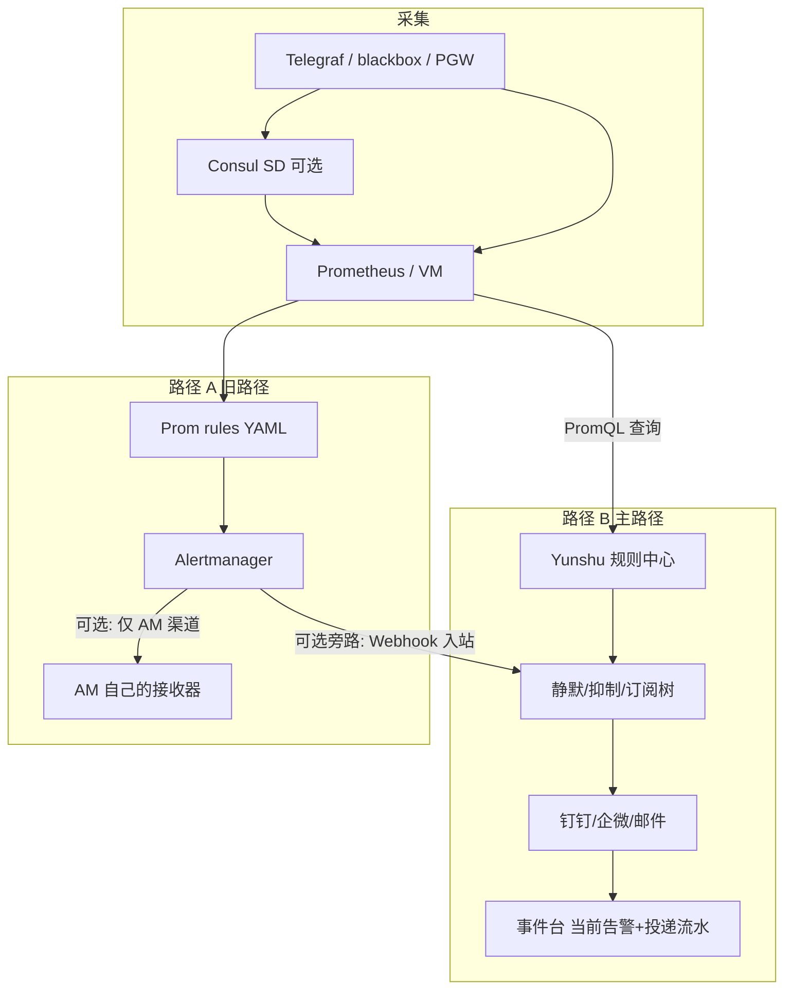
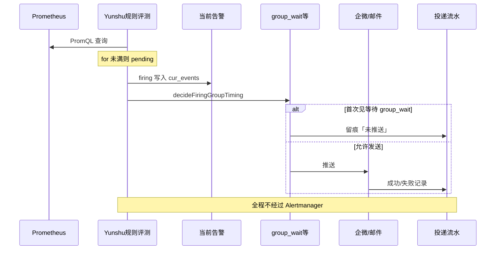
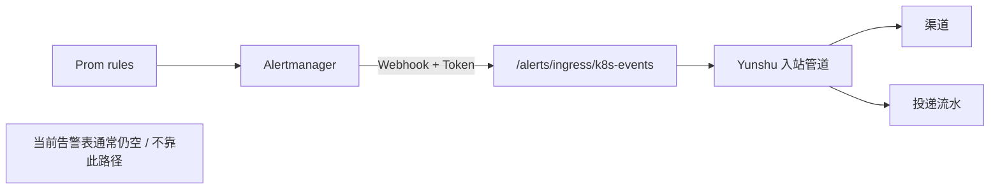

# 告警路径说明（必读）

> 夜莺式引擎：**Prometheus 只存指标；规则与通知在 Yunshu。**  
> 机房采集样例见本目录；产品整改见 [`docs/requirements/R-alert-platform-remediation-nightingale-consul.md`](../../docs/requirements/R-alert-platform-remediation-nightingale-consul.md)。

---

## 0. 事件台三个子页分别看什么

| 子页 | 数据从哪来 | 有记录说明什么 |
|------|------------|----------------|
| **当前告警** | `alert_cur_events`（平台规则 firing） | 规则中心已评测到触发；**不经过 Alertmanager** |
| **生命周期** | `alert_his_events` | 已恢复的历史实例 |
| **投递流水** | `alert_events`（通道发送审计） | 是否真正推到邮件/企微/钉钉（含「首次见等待」留痕） |

常见误解：

- 「当前告警有 2 条，但投递流水统计是 0」→ 可能选错项目过滤、时间窗，或仍在 `group_wait` 仅写了抑制留痕；点开 **投递流水** 列表并选对项目再查。  
- 「Prometheus Alerts 没有」→ **正常**，平台规则不会出现在 Prom Alerts 页。

---

## 1. 总览流程图

```text
                         【采集层】
  Telegraf / blackbox / Pushgateway
              │
              ▼
         Consul（可选 SD）
              │
              ▼
     Prometheus / VictoriaMetrics
         （只存指标 + scrape）
              │
      ┌───────┴────────────────────────┐
      │                                │
      ▼                                ▼
【路径 B · 主路径 · 推荐】        【路径 A · 旧/旁路】
Yunshu 规则中心                  Prom rules/*.yml
定时 PromQL 评测                      │
      │                          Alertmanager
      │                          group_wait 等
      │                                │
      │                     ┌──────────┴──────────┐
      │                     │ 仅 AM 自己通知？      │ 若配置 Yunshu 入站
      │                     ▼                      ▼
      │              钉钉/邮件等              POST Yunshu 入站 URL
      │              （不经 Yunshu）         （见 §3，非推荐主路径）
      ▼                                │
 静默 / 抑制 / 订阅树 ◄────────────────┘
      │
      ▼
 钉钉 / 企微 / 邮件
      │
      ▼
 Yunshu 事件台
 （当前告警 + 投递流水）
```



| | **路径 B（主）** | **路径 A（旧）** |
|--|------------------|------------------|
| 规则 | Yunshu「规则中心」 | `prometheus/rules/*.yml` |
| 评测 | Yunshu | Prometheus |
| 通知 | Yunshu 渠道 | Alertmanager；或旁路打进 Yunshu |
| 看结果 | **事件台** | Prom Alerts / AM UI；（旁路时也有投递流水） |
| 节流 | `config.yaml` → `alert.group_*` | `alertmanager.yml` |

**新建告警只用路径 B。** 两条互不同步。

---

## 2. 路径 B 详细流程（平台规则 · 不经 AM）

```text
① 指标进 Prometheus
② Yunshu 数据源指向 Prom（Ping OK）
③ 规则中心启用规则
     for_seconds          → 持续多久才算 firing
     eval_interval_seconds → 多久评测一次
④ 满足 for → 写入「当前告警」
⑤ decideFiringGroupTiming（config.yaml 的 group_wait 等）
     可能先出现「首次见等待 / 未推送」
⑥ 通道发送 →「投递流水」成功
```



---

## 3. 路径 A：若给 Alertmanager 配了 Yunshu「Webhook」会怎样？

### 3.1 当前代码事实（重要）

| 项 | 现状 |
|----|------|
| 专用 `POST .../webhook/alertmanager` | **已下线**，路由不存在 |
| 现有入站 | `POST /api/v1/alerts/ingress/k8s-events`（设计给 **K8s Event 转发**） |
| 载荷形态 | 仍兼容 **Alertmanager Webhook JSON**（传输格式复用） |

因此：

- **不是**「官方推荐再把 AM 接回 Yunshu」。  
- **但是**：若你在 `alertmanager.yml` 里把 receiver 指到上述入站地址，并带上 `X-Alert-Token` / Bearer（与字典 `alert_webhook_token` 一致），**Prometheus → AM 产生的告警可以进 Yunshu 投递流水**，再走订阅树与渠道。

```text
【旁路 · 不推荐当主路径】

  Prom rules/*.yml
        │
        ▼
  Alertmanager（group_wait 用 alertmanager.yml，如 30s）
        │
        │  webhook_configs:
        │    url: http://<yunshu>:8080/api/v1/alerts/ingress/k8s-events
        │    http_config / 头: X-Alert-Token: <token>
        ▼
  Yunshu ReceiveK8sEventIngress
        │  （按 AM 形态解析 → 静默/抑制/订阅/渠道）
        ▼
  事件台「投递流水」+ 渠道通知
        │
        ✗ 一般不会写入「当前告警」表
          （当前告警主要来自平台规则评测）
```



### 3.2 和路径 B 对比（避免「为什么没记录」）

| 现象 | 路径 B 平台规则 | 路径 A AM→入站 |
|------|-----------------|----------------|
| 当前告警 | 有（firing 时） | **通常没有**（不走规则评测写 cur） |
| 投递流水 | 有（含等待留痕） | **有**（进管道后） |
| Prom Alerts | 无 | **有** |
| 节流 | Yunshu `group_*` | **先** AM `group_wait`，进 Yunshu 后可能再按入口策略 |

你截图里「当前告警 (2)」而投递区统计为 0：优先查 **路径 B 的投递流水列表/项目过滤**；不要假设必须配 AM 才有平台记录。

### 3.3 建议

1. **主用路径 B**：规则只在 Yunshu 配。  
2. **不要**为了「让平台有记录」再把 AM webhook 接回来（双通道、双节流、难排障）。  
3. 若短期必须保留 Prom rules：可暂时 AM 自通知；或明确旁路接 `k8s-events` 入站，并在文档/变更里标明「遗留」。  
4. 迁完后关掉 Prom `rule_files` + AM。

---

## 4. 「等了约 5 分钟才发」从哪来？（仅路径 B）

| 项 | 配置 | 含义 |
|----|------|------|
| `for_seconds` | 规则中心 | 进 firing 前持续多久 |
| `eval_interval_seconds` | 规则中心 | 多久评测一次 |
| `group_wait_seconds` | `config.yaml` → `alert`（默认 15） | 首次同组等待 |
| AM `group_wait: 30s` | `alertmanager.yml` | **只管路径 A** |

体感 ≈5 分钟：常因 **评估间隔 300s**——`group_wait` 压住后，要等**下一轮评测**再发，不是 AM 的 30s。

---

## 5. 配置对照

```yaml
# configs/config.yaml —— 路径 B
alert:
  group_wait_seconds: 15
  group_interval_seconds: 60
  repeat_interval_seconds: 300
```

```yaml
# alertmanager.yml —— 仅路径 A；平台规则中心不用
route:
  group_wait: 30s
# 若旁路进 Yunshu（不推荐主用）：
# receivers:
#   - name: yunshu
#     webhook_configs:
#       - url: "http://<yunshu-host>:8080/api/v1/alerts/ingress/k8s-events"
#         http_config: ... # 配置 X-Alert-Token
```

---

## 6. 采集脚本跑在哪

| 类型 | 执行位置 |
|------|----------|
| Telegraf 注册 | **每台** Telegraf（`--type telegraf`） |
| ICMP/HTTP/TCP | **仅** 监控机 |
| 规则与通知 | Yunshu |

---

## 7. 验收清单

- [ ] 数据源 Ping 通  
- [ ] 规则启用后 **当前告警** 有记录（路径 B）  
- [ ] **投递流水** 有成功或「首次见等待」  
- [ ] 不以 Prom Alerts 判断平台规则  
- [ ] 不依赖 AM→Yunshu 作为主路径  

---

## 修订

| 日期 | 说明 |
|------|------|
| 2026-08-17 | 初版 |
| 2026-08-17 | 补充总览/序列图；澄清 AM Webhook 已下线与 k8s-events 旁路；事件台三栏 |
