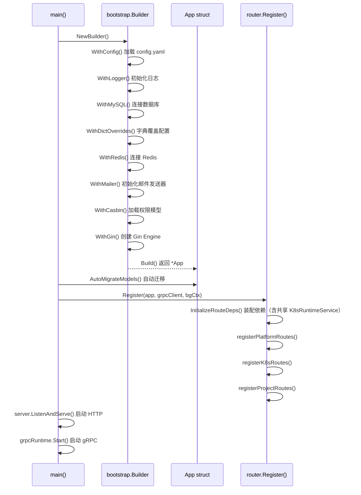
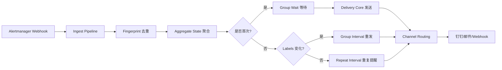
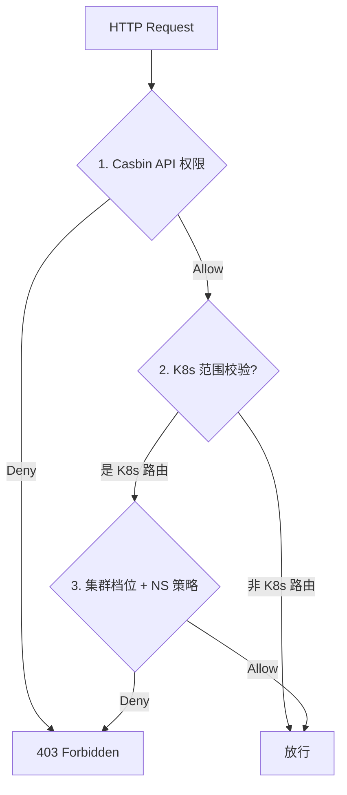
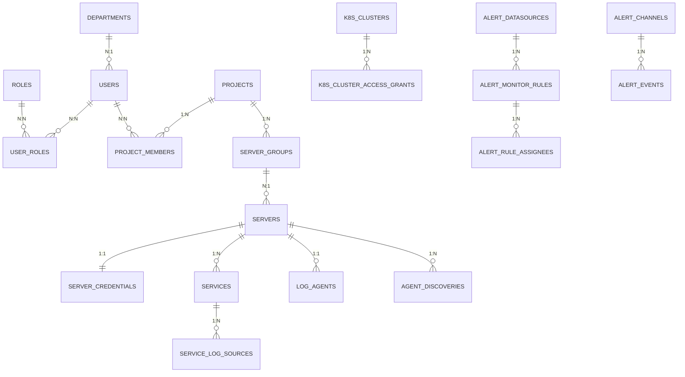
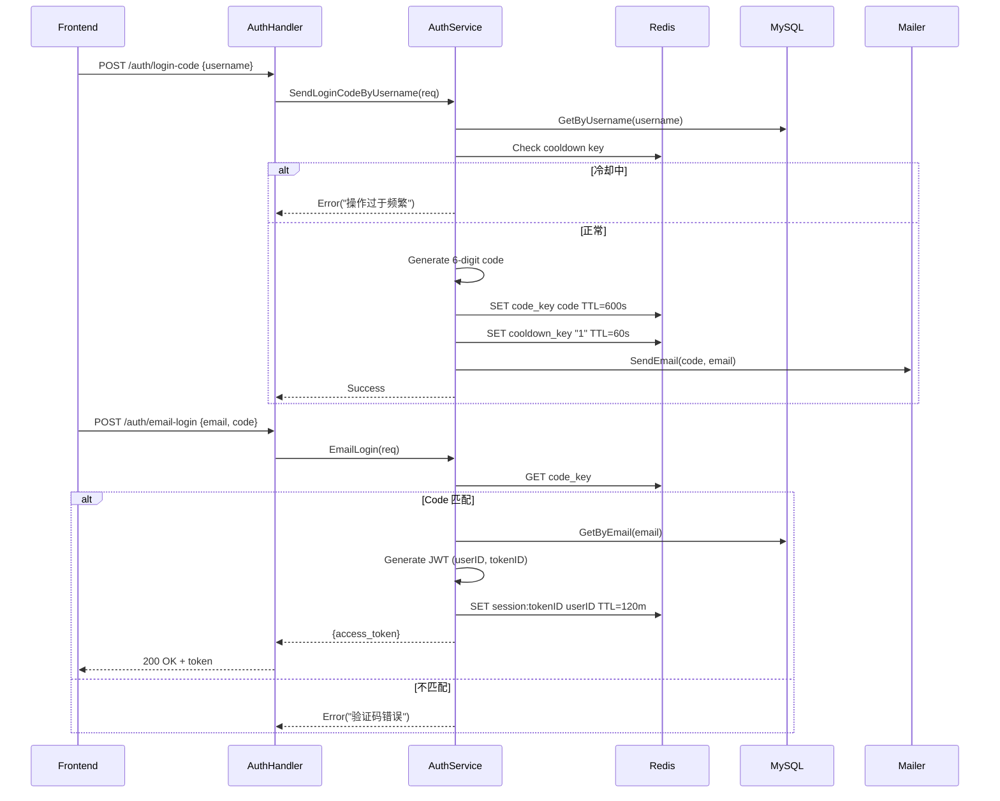
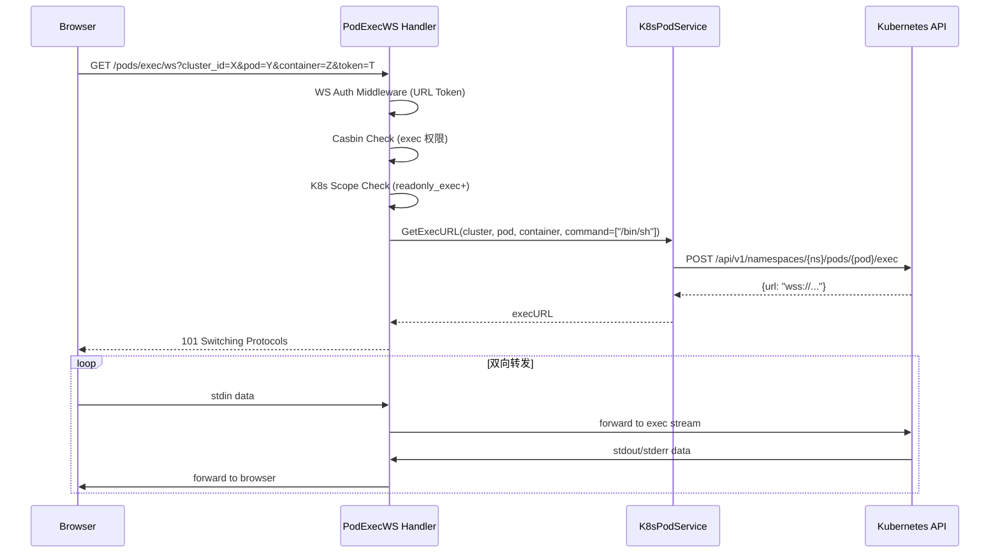

# Yunshu 后端代码完整技术文档

## 📋 目录

- [1. 项目概述](#1-项目概述)
- [2. 技术栈与依赖](#2-技术栈与依赖)
- [3. 系统架构设计](#3-系统架构设计)
  - [3.3 代码目录结构（2026-05 重构后）](#33-代码目录结构2026-05-重构后)
- [4. 核心模块详解](#4-核心模块详解)
  - [4.1 入口与启动流程](#41-入口与启动流程)
  - [4.2 配置管理](#42-配置管理)
  - [4.3 分层架构详解](#43-分层架构详解)
  - [4.4 中间件链路](#44-中间件链路)
  - [4.5 权限系统（三层鉴权）](#45-权限系统三层鉴权)
- [5. 数据模型设计](#5-数据模型设计)
- [6. API 路由设计](#6-api-路由设计)
- [7. 业务服务层](#7-业务服务层)
- [8. 关键技术实现](#8-关键技术实现)
- [9. 部署架构](#9-部署架构)
- [10. 扩展性与优化建议](#10-扩展性与优化建议)

---

## 1. 项目概述

**Yunshu** 是一个基于 Go 语言开发的云原生运维管理平台，采用前后端分离架构，提供：

### 核心能力

| 模块 | 功能描述 |
|------|----------|
| **系统管理** | 用户、角色、权限(Casbin RBAC)、菜单、组织架构、数据字典、审计日志 |
| **项目管理** | 多租户项目隔离、服务器管理、服务配置、云账号管理 |
| **Kubernetes 管理** | 多集群纳管、工作负载/网络/存储/RBAC/CRD 全资源管理 |
| **告警平台** | Prometheus 数据源、告警规则、值班排班、静默策略、多渠道通知(钉钉/邮件/Webhook) |
| **日志平台** | Agent 采集、SSE 实时日志流、文件发现、日志源配置 |
| **MySQL 备份** | 定时备份调度、远程归档、MinIO 对象存储 |

### 项目定位

- **目标用户**: DevOps 工程师、运维团队、SRE
- **应用场景**: Kubernetes 集群统一管控、告警集中处理、日志聚合分析
- **设计理念**: 项目化隔离 + 三层权限控制 + 插件化扩展

---

## 2. 技术栈与依赖

### 后端核心技术

```go
// go.mod 核心依赖 (Go 1.25.0)
github.com/gin-gonic/gin              // HTTP 框架 v1.12.0
gorm.io/gorm                          // ORM v1.31.1
gorm.io/driver/mysql                 // MySQL 驱动
github.com/casbin/casbin/v2          // 权限框架 v2.11.0
github.com/go-redis/redis/v9          // Redis 客户端 v9.18.0
google.golang.org/grpc                // gRPC 框架 v1.80.0
github.com/spf13/cobra               // CLI 框架 v1.10.2
github.com/spf13/viper               // 配置管理 v1.21.0
k8s.io/client-go                     // K8s 客户端 v0.35.4
github.com/weibaohui/kom             // K8s 多集群 SDK v0.2.71
github.com/golang-jwt/jwt/v5         // JWT 认证 v5.3.0
github.com/prometheus/client_golang  // Prometheus 监控集成
github.com/minio/minio-go/v7         // MinIO 对象存储
github.com/swaggo/gin-swagger        // API 文档
```

### 基础设施依赖

| 组件 | 版本 | 用途 |
|------|------|------|
| MySQL | 5.7+ | 主业务数据库 |
| Redis | 7.x | 缓存/会话/分布式锁 |
| MinIO | 最新 | 备份文件对象存储 |
| Kubernetes | 1.25+ | 被管集群 |
| Prometheus | 最新 | 告警数据源 |

---

## 3. 系统架构设计

### 3.1 整体架构图

```
┌─────────────────────────────────────────────────────────────────┐
│                        用户界面层 (Frontend)                      │
│  ┌──────────────┐  ┌──────────────┐  ┌──────────────────────┐   │
│  │  React SPA   │  │ Swagger UI   │  │  Log-Agent CLI       │   │
│  │  (Vite+AntD) │  │  (/swagger)  │  │  (独立二进制)         │   │
│  └──────┬───────┘  └──────┬───────┘  └──────────┬───────────┘   │
└─────────┼──────────────────┼─────────────────────┼──────────────┘
          │                  │                     │
          ▼                  ▼                     ▼
┌─────────────────────────────────────────────────────────────────┐
│                        接入层 (Gateway)                           │
│  ┌─────────────────────────────────────────────────────────┐    │
│  │  Nginx (反向代理 / 静态资源 / WebSocket 代理)            │    │
│  └─────────────────────────────────────────────────────────┘    │
└──────────────────────────────┬──────────────────────────────────┘
                               │
                               ▼
┌─────────────────────────────────────────────────────────────────┐
│                      应用服务层 (Backend)                         │
│  ┌─────────────┐  ┌─────────────┐  ┌────────────────────────┐  │
│  │ HTTP Server  │  │ gRPC Server │  │  Background Workers   │  │
│  │ (:8080/Gin)  │  │ (:18080)    │  │  (定时任务/事件转发)   │  │
│  └──────┬──────┘  └──────┬──────┘  └──────────┬─────────────┘  │
│         │                │                     │                │
│  ┌──────▼────────────────▼─────────────────────▼─────────────┐  │
│  │                    中间件链 (Middleware)                    │  │
│  │  Recovery → Logger → Auth → Casbin → K8sScope → Audit     │  │
│  └────────────────────────┬──────────────────────────────────┘  │
└────────────────────────────┼────────────────────────────────────┘
                             │
                             ▼
┌─────────────────────────────────────────────────────────────────┐
│                       业务逻辑层 (Service)                        │
│  ┌──────────┐ ┌──────────┐ ┌──────────┐ ┌──────────┐           │
│  │ AuthService│ │ProjectSvc│ │ K8sSvc   │ │ AlertSvc │ ...      │
│  └─────┬────┘ └─────┬────┘ └─────┬────┘ └─────┬────┘           │
│        │            │            │            │                  │
│  ┌─────▼────────────▼────────────▼────────────▼─────────────┐   │
│  │                    数据访问层 (Repository)                   │   │
│  │  UserRepository / ProjectRepository / K8sClusterRepo ...  │   │
│  └────────────────────────┬──────────────────────────────────┘   │
└────────────────────────────┼─────────────────────────────────────┘
                             │
                             ▼
┌─────────────────────────────────────────────────────────────────┐
│                       数据存储层 (Storage)                        │
│  ┌──────────┐  ┌──────────┐  ┌──────────┐  ┌──────────┐        │
│  │  MySQL   │  │  Redis   │  │  MinIO   │  │ K8s API  │        │
│  │ (主数据库)│  │ (缓存/会话)│ (对象存储)│ (集群管控)│        │
│  └──────────┘  └──────────┘  └──────────┘  └──────────┘        │
└─────────────────────────────────────────────────────────────────┘
```

### 3.2 分层职责

| 层级 | 职责 | 关键组件 |
|------|------|----------|
| **Handler 层** | HTTP 请求解析、参数校验、响应格式化 | `internal/handler/*.go` |
| **Service 层** | 业务逻辑编排、事务管理、跨模块协调 | `internal/service/<域>/` + 门面 `exports.go` |
| **Repository 层** | 数据库 CRUD 操作、查询构建 | `internal/repository/*.go` |
| **Model 层** | 数据结构定义、GORM 标签、表关系 | `internal/model/*.go` |

### 3.3 代码目录结构（2026-05 重构后）

> 详细阅读路线见 [CODEBASE-MAP.md](CODEBASE-MAP.md)。

```text
internal/
├── bootstrap/          # App 构建：DB、Redis、Casbin、Gin
├── providers/          # Wire：Config / Logger / DB / Redis
├── router/             # 路由注册、Wire 装配、repositories + route_services
├── handler/            # HTTP 处理器（薄层）
├── middleware/         # Auth、Casbin、K8sScope、ErrorHandler、审计
├── interfaces/         # Repository 接口定义
├── repository/         # GORM 仓储实现
├── model/              # 数据模型
├── grpc/               # gRPC 服务与 proto
├── pkg/
│   ├── errors/         # BizError（bizerrors），HTTP/gRPC 统一
│   ├── logutil/        # 组件化日志（HTTP/Service/Worker）
│   └── logger/         # 底层 Logger 与 GORM 日志
└── service/
    ├── exports.go      # 门面：handler 仍 import service，别名到子包
    ├── alert/          # 告警域
    ├── k8s/            # K8s 域
    │   └── eventforward/
    ├── project/        # 项目 / 云账号 / 日志源
    ├── system/         # 用户 / RBAC / 认证 / 字典
    ├── logplatform/    # Agent / 发现 / 日志 Broker
    ├── mysqlbackup/
    └── overview/
```

**设计要点**：

- **按域分包**（Package by Feature）+ **经典分层**（Handler → Service → Repository → Model）。
- `exports.go` 为过渡门面：新代码可优先 `import "yunshu/internal/service/alert"` 等子包；Handler 批量改 import 前保持 `service.Xxx`。
- **Wire**：基础设施与 `routeRepositories` 已接入；`buildRouteServices`（`route_services.go`）仍为手工 `NewXxx` 装配。

---

## 4. 核心模块详解

### 4.1 入口与启动流程

#### 主入口 ([main.go](main.go))

```go
func main() {
    cmd.Execute()  // Cobra CLI 入口
}
```

#### 启动命令 ([cmd/server.go](cmd/server.go))

**Builder 模式初始化依赖链**:



#### 生命周期管理

```go
// cmd/server.go 核心流程
1. 初始化全局依赖 (Config → Logger → DB → Redis → Mailer → Casbin → Gin)
2. 数据库自动迁移 (AutoMigrateModels)
3. 初始化只读演示用户 (initReadonlyDemoUser)
4. 创建 Repository 层实例
5. 创建 Service 层实例
6. 启动 gRPC Server (Agent 通信)
7. 注册所有 HTTP 路由 (router.Register)
8. 启动后台 Worker:
   - Agent 离线记录定时扫描 (45s 间隔)
   - MySQL 备份调度器
   - K8s Event 转发 Manager
9. 启动 HTTP Server (:8080)
10. 优雅关闭信号处理 (SIGINT/SIGTERM)
```

### 4.2 配置管理

#### 配置加载机制 ([internal/config/config.go](internal/config/config.go))

**多源配置优先级**:
```
环境变量 > config.yaml > 默认值
```

**配置结构体** ([Config](internal/config/config.go#L10)):

```go
type Config struct {
    App      AppConfig      // 应用基础配置 (名称/环境/端口)
    HTTP     HTTPConfig     // HTTP 超时参数
    GRPC     GRPCConfig     // gRPC 地址/消息大小限制
    Log      LogConfig      // 日志级别/格式/输出
    MySQL    MySQLConfig    // 数据库连接池
    Redis    RedisConfig    // 缓存配置
    Mail     MailConfig     // SMTP 邮件配置
    Auth     AuthConfig     // JWT 密钥/TTL
    Casbin   CasbinConfig   // 权限模型路径
    Alert    AlertConfig    // 告警平台参数 (聚合窗口/渠道限制等)
    Security SecurityConfig // 加密密钥
    Agent    AgentConfig    // Agent 注册密钥/发现根目录
}
```

**运行期动态配置** (数据字典覆盖):

部分配置支持从数据库 `dict_entries` 表动态读取，无需重启服务：

| 配置项 | 字典类型 Key | 说明 |
|--------|-------------|------|
| 邮件配置 | `mail_host`, `mail_port`, ... | SMTP 参数 |
| 告警 Token | `alert_webhook_token` | Webhook 鉴权 |
| Prometheus URL | `alert_enrich_prometheus_url` | 告警富化地址 |
| K8s Event 转发 | `k8s_event_forward_enabled`, ... | 事件转发开关 |

**关键默认值** ([config.go:183-261](internal/config/config.go#L183-L261)):

```go
JWT Token TTL:        120 分钟
邮箱验证码 TTL:       600 秒 (10分钟)
验证码冷却时间:       60 秒
告警去重 TTL:         86400 秒 (24小时)
Group Wait:           15 秒 (首次发送等待)
Group Interval:       60 秒 (变化后重发间隔)
Repeat Interval:      300 秒 (无变化重复提醒)
Aggregate TTL:        86400 秒 (聚合状态过期)
```

### 4.3 分层架构详解

#### Handler 层 (HTTP 处理器)

**位置**: [internal/handler/](internal/handler/)

**设计模式**: 泛型封装减少样板代码 ([serve.go](internal/handler/serve.go))

```go
// 泛型 Handler 封装示例
func ServeQuery[T any, R any](c *gin.Context, fn func(context.Context, T) (R, error))
func ServeJSON[T any, R any](c *gin.Context, fn func(context.Context, T) (R, error))
func ServeDelete(c *gin.Context, fn func(context.Context, uint) error, idParam string)
func ServePatch[Req any, Resp any](c *gin.Context, fn func(context.Context, uint, Req) (Resp, error), idParam string)
```

**核心 Handler 分类**:

| 类别 | 文件 | 职责 |
|------|------|------|
| 认证 | [auth_handler.go](internal/handler/auth_handler.go) | 登录/注册/邮箱验证码/Token 刷新 |
| 系统管理 | [user_handler.go](internal/handler/user_handler.go), [role_handler.go](internal/handler/role_handler.go), ... | 用户/角色/部门/菜单/字典 CRUD |
| 项目管理 | [project_handler.go](internal/handler/project_handler.go) | 项目/成员/服务器/服务/日志源 |
| K8s 资源 | [pod_handler.go](internal/handler/pod_handler.go), [workload_handler.go](internal/handler/workload_handler.go), ... | Pod/Deployment/Service/Ingress 等 |
| 告警平台 | [alert_handler.go](internal/handler/alert_handler.go), [alert_platform_handler.go](internal/handler/alert_platform_handler.go) | 渠道/规则/静默/值班 |
| 日志平台 | [log_agent_handler.go](internal/handler/log_agent_handler.go) | Agent 注册/心跳/发现 |
| WebSocket | [pod_exec_ws.go](internal/handler/pod_exec_ws.go), [project_terminal_ws.go](internal/handler/project_terminal_ws.go) | 终端交互 |

#### Service 层 (业务逻辑)

**位置**: [internal/service/](internal/service/) — **按域子目录**；Handler 通过 [exports.go](internal/service/exports.go) 访问。域划分见 [CODEBASE-MAP.md](CODEBASE-MAP.md) §2。

**核心服务分类**:

##### 4.3.1 认证与授权服务

**AuthService** ([system/auth_service.go](internal/service/system/auth_service.go)):
- 邮箱验证码发送/验证 (Redis 存储 + 冷却机制)
- JWT Token 生成/刷新 (golang-jwt/v5)
- 密码哈希 (bcrypt)
- 登录状态管理 (Redis Session 白名单)

**Casbin 同步** ([system/casbin_sync.go](internal/service/system/casbin_sync.go)):
- 用户角色变更同步到 Casbin 策略表
- 批量策略更新优化

##### 4.3.2 项目管理服务

**ProjectMgmtService** ([project/project_mgmt_core.go](internal/service/project/project_mgmt_core.go)):
- 项目 CRUD + 成员管理 (RBAC 隔离)
- 服务器/服务/日志源 CRUD
- 云账号管理 (阿里云/腾讯云/京东云 SDK，见 `project/cloud_provider_*.go`)

**LogAgentService** ([logplatform/log_agent_service.go](internal/service/logplatform/log_agent_service.go)):
- Agent 注册/认证 (register_secret 校验)
- 心跳超时检测 (离线记录)
- Token 轮换机制

##### 4.3.3 Kubernetes 服务集群

**K8sClusterService** ([k8s/k8s_cluster_service.go](internal/service/k8s/k8s_cluster_service.go)):
- 多集群管理 (kubeconfig / direct 直连模式)
- Kom SDK 集成 (weibaohui/kom)
- 集群健康检查 / 组件状态查询

**工作负载服务**（均在 `internal/service/k8s/`）:
- [k8s_workload_deployment.go](internal/service/k8s/k8s_workload_deployment.go): Deployment 扩缩容/重启/滚动更新
- [k8s_workload_statefulset.go](internal/service/k8s/k8s_workload_statefulset.go): StatefulSet 管理
- [k8s_workload_daemonset.go](internal/service/k8s/k8s_workload_daemonset.go): DaemonSet 管理
- [k8s_workload_cronjob.go](internal/service/k8s/k8s_workload_cronjob.go): CronJob 定时任务
- [k8s_workload_job.go](internal/service/k8s/k8s_workload_job.go): Job 任务管理

**Pod 高级操作** ([k8s/k8s_pod_service.go](internal/service/k8s/k8s_pod_service.go)):
- 日志流 (SSE / 下载)
- 文件浏览/上传/下载 (exec into container)
- 容器执行命令 (WebSocket 交互式终端)
- Pod 诊断 (Events/状态分析)

##### 4.3.4 告警平台服务

**Alert 核心流水线**:



**关键服务文件**:

| 服务 | 文件 | 功能 |
|------|------|------|
| 告警摄入 | [alert/alert_ingest_pipeline.go](internal/service/alert/alert_ingest_pipeline.go) | Webhook 解析/标准化 |
| 指纹去重 | [alert/alert_fingerprint.go](internal/service/alert/alert_fingerprint.go) | Labels Hash 计算 |
| 聚合引擎 | [alert/alert_aggregate_state.go](internal/service/alert/alert_aggregate_state.go) | GroupKey 状态机 |
| 投递核心 | [alert/alert_delivery_core.go](internal/service/alert/alert_delivery_core.go) | 通道选择/模板渲染 |
| 邮件通知 | [alert/alert_delivery_email.go](internal/service/alert/alert_delivery_email.go) | SMTP 发送/HTML 模板 |
| 规则评估 | [alert/alert_monitor_evaluator.go](internal/service/alert/alert_monitor_evaluator.go) | PromQL 定时查询 |
| 值班服务 | [alert/alert_duty_service.go](internal/service/alert/alert_duty_service.go) | 值班排班/轮换 |
| 静默管理 | [alert/alert_silence_service.go](internal/service/alert/alert_silence_service.go) | 维护窗口抑制 |
| 订阅路由 | [alert/alert_subscription_service.go](internal/service/alert/alert_subscription_service.go) | 树形路由匹配 |
| 抑制规则 | [alert/alert_inhibition_service.go](internal/service/alert/alert_inhibition_service.go) | 告警依赖抑制 |
| Redis 状态 | [alert/state_redis.go](internal/service/alert/state_redis.go) | 去重/聚合 Redis 实现 |

##### 4.3.5 日志平台服务

**日志采集链路**:

```
Log-Agent (目标机器)
    ↓ gRPC :18080
Platform gRPC Server
    ↓ 写入
MySQL (logs 表)
    ↓ SSE 流式推送
Browser (React Frontend)
```

**关键服务**:
- [project/project_mgmt_logs.go](internal/service/project/project_mgmt_logs.go): 日志查询/SSE 流/导出
- [logplatform/agent_discovery_service.go](internal/service/logplatform/agent_discovery_service.go): 日志文件发现

##### 4.3.6 MySQL 备份服务

**备份流程** ([mysqlbackup/mysql_backup_service.go](internal/service/mysqlbackup/mysql_backup_service.go)):

```bash
mysqldump → gzip 压缩 → 上传 MinIO → 记录元数据到 DB
```

**调度器** ([mysqlbackup/mysql_backup_scheduler.go](internal/service/mysqlbackup/mysql_backup_scheduler.go)):
- Cron 表达式解析 (robfig/cron)
- 分布式锁防重复执行 (Redis SETNX)
- 备份保留策略

#### Repository 层 (数据访问)

**位置**: [internal/repository/](internal/repository/)

**设计模式**: 接口抽象 + GORM 实现

```go
// 示例: UserRepository
type UserRepository struct {
    db *gorm.DB
}

func (r *UserRepository) GetByID(ctx context.Context, id uint) (*model.User, error) {
    var user model.User
    err := r.db.WithContext(ctx).
        Preload("Roles").
        Preload("Groups").
        Preload("Department").
        First(&user, id).Error
    return &user, err
}
```

**分页封装** ([pagination_helper.go](internal/repository/pagination_helper.go)):
- 统一分页参数解析 (page/page_size)
- 总数统计 + 列表查询
- 响应格式标准化

#### Model 层 (数据模型)

**位置**: [internal/model/](internal/model/)

**核心实体关系**:

```
User (用户)
 ├── UserRole (用户角色关联) ←→ Role (角色)
 ├── UserGroupUser (用户组关联) ←→ UserGroup (用户组)
 └── Department (部门)

Project (项目)
 ├── ProjectMember (项目成员) ←→ User
 ├── ServerGroup (服务器组)
 │   └── Server (服务器)
 │       ├── ServerCredential (服务器凭据)
 │       └── Service (服务)
 │           └── ServiceLogSource (日志源)
 ├── CloudAccount (云账号)
 ├── LogAgent (日志代理)
 └── AgentDiscovery (代理发现)

K8sCluster (K8s 集群)
 └── K8sClusterAccessGrant (集群访问授权)

AlertDatasource (告警数据源)
 ├── AlertMonitorRule (监控规则)
 │   ├── AlertRuleAssignee (规则负责人)
 │   └── AlertDutyBlock (值班块)
 └── AlertEvent (告警事件)
     └── AlertChannel (告警渠道)
```

### 4.4 中间件链路

**位置**: [internal/middleware/](internal/middleware/)

**执行顺序** (从外到内):

```go
engine := gin.New()
engine.Use(middleware.Recovery(logger))        // 1. 异常恢复
engine.Use(middleware.RequestLogger(logger))    // 2. 请求日志

// 路由组级别中间件
api.Use(authMiddleware)        // 3. JWT 认证
api.Use(authorize)            // 4. Casbin 权限校验
api.Use(k8sScopeAuthorize)    // 5. K8s 集群范围鉴权 (仅 K8s 路由)
api.Use(opAudit)              // 6. 操作审计日志
```

#### 各中间件详解

##### 4.4.1 Recovery 中间件 ([recovery.go](internal/middleware/recovery.go))
- 捕获 panic，返回 500 错误
- 记录错误堆栈到日志
- 避免服务崩溃

##### 4.4.2 RequestLogger 中间件 ([request_logger.go](internal/middleware/request_logger.go))
- 记录请求方法/路径/状态码/耗时
- 结构化日志输出 (JSON/Text 可切换)
- 支持慢请求阈值告警

##### 4.4.3 Auth 中间件 ([auth.go](internal/middleware/auth.go))
- **JWT Token 解析** (Bearer Token)
- **Session 白名单校验** (Redis 存储 TokenID)
- **用户状态检查** (禁用用户拒绝访问)
- **上下文注入** (CurrentUser → gin.Context)

```go
// 认证流程
1. 提取 Authorization Header
2. 解析 Bearer Token (JWT)
3. 验证 Session 是否在 Redis 中存在
4. 查询用户信息 (含角色/组/部门)
5. 注入 CurrentUser 到 Context
```

##### 4.4.4 Casbin 中间件 ([casbin.go](internal/middleware/casbin.go))
- **API 级权限校验**
- 从路由提取: 方法(GET/POST...) + 路径(/api/v1/users)
- 调用 `enforcer.Enforce(role, path, method)`
- 无权限返回 403 Forbidden

**权限模型** ([configs/casbin_model.conf](configs/casbin_model.conf)):
```
[request_definition]
r = sub, obj, act

[policy_definition]
p = sub, obj, act

[role_definition]
g = _, _

[policy_effect]
e = some(where (p.eft == allow))

[matchers]
m = g(r.sub, p.sub) && r.obj == p.obj && r.act == p.act
```

##### 4.4.5 K8s Scope Authorize 中间件 ([k8s_scope_authorize.go](internal/middleware/k8s_scope_authorize.go))
- **集群范围鉴权** (仅 K8s 相关路由生效)
- 检查用户/角色在指定 cluster_id 上的访问档位
- **档位等级**: readonly < readonly_exec < admin
- **命名空间过滤**: 黑名单优先 + 白名单例外

```go
// 鉴权逻辑
1. 从 Query/Body 提取 cluster_id
2. 查询 K8sClusterAccessGrant (主体类型 + 主体Ref + ClusterID)
3. 匹配请求方法与档位要求:
   - GET → readonly 及以上
   - POST/PUT (exec/logs) → readonly_exec 及以上
   - DELETE/Apply → admin
4. 检查 Namespace 黑/白名单
5. 通过则注入 K8s Client 到 Context
```

##### 4.4.6 Operation Audit 中间件 ([operation_audit.go](internal/middleware/operation_audit.go))
- **操作日志记录**
- 记录: 用户/IP/方法/路径/请求体/响应状态
- 异步写入数据库 (避免影响主流程)
- 敏感字段脱敏 (密码/Token 等)

##### 4.4.7 Rate Limit 中间件 ([rate_limit.go](internal/middleware/rate_limit.go))
- **接口限流** (基于 Redis 令牌桶)
- 主要用于注册接口防刷
- 可配置窗口期/请求数

##### 4.4.8 Project Access 中间件 ([project_access.go](internal/middleware/project_access.go))
- **项目成员权限校验**
- 检查当前用户是否为项目成员
- 非 super-admin 必须有成员关系才能访问项目资源

##### 4.4.9 WebSocket Auth 中间件 ([ws_auth.go](internal/middleware/ws_auth.go))
- **WebSocket 特殊认证**
- 浏览器无法设置 Authorization Header；客户端先 `POST /api/v1/auth/ws-ticket` 换取短效一次性 ticket
- 握手 URL 仅接受 `?ticket=<uuid>`，消费后校验 Redis 会话并注入用户上下文

### 4.5 权限系统（三层鉴权）

#### 三道闸门设计



#### 权限配置示例

**场景**: 让角色 `dev` 只读访问集群 1 的 `default` 命名空间

1. **Casbin 策略** (`casbin_rule` 表):
   ```sql
   INSERT INTO casbin_rule (ptype, v0, v1, v2) VALUES ('p', 'dev', '/api/v1/pods', 'GET');
   ```

2. **集群档位** (`k8s_cluster_access_grants` 表):
   ```sql
   INSERT INTO k8s_cluster_access_grants (principal_kind, principal_ref, cluster_id, preset)
   VALUES ('role', 'dev', 1, 'readonly');
   ```

3. **命名空间白名单** (`k8s_namespace_allow_rules` 表):
   ```sql
   INSERT INTO k8s_namespace_allow_rules (cluster_id, namespace_pattern, principal_kind, principal_ref)
   VALUES (1, 'default', 'role', 'dev');
   ```

#### 档位能力矩阵

| 操作 | readonly | readonly_exec | admin |
|------|----------|---------------|-------|
| 列表/详情 (GET) | ✅ | ✅ | ✅ |
| Pod 日志查看 | ❌ | ✅ | ✅ |
| Exec 终端 | ❌ | ✅ | ✅ |
| Apply/Create | ❌ | ❌ | ✅ |
| Delete/Scale | ❌ | ❌ | ✅ |
| Ingress-Nginx 重启 | ❌ | ❌ | ✅ (需 confirm:true) |

---

## 5. 数据模型设计

### 5.1 核心表结构

#### 系统管理域

| 表名 | 用途 | 关键字段 |
|------|------|----------|
| `users` | 用户 | username/email/password/status/department_id |
| `roles` | 角色 | code/name/description |
| `user_roles` | 用户角色关联 (多对多) | user_id/role_id |
| `user_groups` | 用户组 | code/name |
| `user_group_users` | 组员关联 | group_id/user_id |
| `departments` | 组织架构 | name/parent_id (树形) |
| `menus` | 菜单 | name/path/icon/parent_id/sort_order |
| `permissions` | API 权限点 | resource/action/method/path |
| `dict_entries` | 数据字典 | dict_type/dict_key/dict_value (敏感值加密) |
| `login_log` | 登录日志 | user_id/ip/user_agent/success |
| `operation_log` | 操作日志 | user_id/method/path/request_body |
| `registration_requests` | 注册申请 | username/email/status/reviewer_id |

#### 项目管理域

| 表名 | 用途 | 关键字段 |
|------|------|----------|
| `projects` | 项目 | name/code/description/owner_department_id |
| `project_members` | 项目成员 | project_id/user_id/role (owner/member/guest) |
| `server_groups` | 服务器组 | name/project_id/parent_id (树形) |
| `servers` | 服务器 | hostname/ip/port/project_id/group_id |
| `server_credentials` | 服务器凭据 (AES加密) | server_id/auth_type/username/password/key |
| `services` | 服务 | name/project_id/server_id |
| `service_log_sources` | 日志源 | service_id/source_type/file_path/command |
| `cloud_accounts` | 云账号 | provider(alibaba/tencent/jd)/credentials(JSON) |
| `log_agents` | 日志代理 | server_id/token/status/last_heartbeat |
| `agent_discoveries` | 发现项 | server_id/file_path/discovered_at |

#### Kubernetes 域

| 表名 | 用途 | 关键字段 |
|------|------|----------|
| `k8s_clusters` | K8s 集群 | name/kubeconfig(加密)/connection_mode/status/owning_project_id |
| `k8s_cluster_access_grants` | 集群授权 | principal_kind(role/user)/principal_ref/cluster_id/preset(readonly/readonly_exec/admin) |
| `k8s_namespace_allow_rules` | NS 白名单 | cluster_id/namespace_pattern/principal_kind/principal_ref |
| `k8s_namespace_deny_rules` | NS 黑名单 | cluster_id/namespace_pattern |
| `k8s_event_forward_rules` | Event 转发规则 | event_type/namespace_filter/cluster_id |

#### 告警平台域

| 表名 | 用途 | 关键字段 |
|------|------|----------|
| `alert_channels` | 告警渠道 | type(dingding/email/webhook)/config(JSON) |
| `alert_datasources` | 数据源 | project_id/prometheus_url/token |
| `alert_monitor_rules` | 监控规则 | datasource_id/promql_expr/severity/enabled |
| `alert_rule_assignees` | 规则负责人 | monitor_rule_id/user_id/notify_channel |
| `alert_duty_blocks` | 值班块 | monitor_rule_id/start_time/end_time/user_ids(JSON) |
| `alert_silences` | 静默规则 | matchers(JSON)/start_time/end_time/created_by |
| `alert_events` | 告警事件 | fingerprint/status(firing/resolved)/labels(JSON)/channel_id |
| `alert_subscriptions` | 订阅路由树 | parent_id/matchers(JSON)/receiver_group_id/is_default |
| `alert_receiver_groups` | 接收组 | name/member_user_ids(JSON) |
| `alert_inhibition_rules` | 抑制规则 | source_matchers/target_matchers(JSON) |
| `cloud_expiry_rules` | 云到期规则 | cloud_account_id/cron_expr/threshold_days |
| `alert_firing_deliveries` | 发送记录 (内存/短留存) | group_key/channel_id/last_sent_at |

#### 运维工具域

| 表名 | 用途 | 关键字段 |
|------|------|----------|
| `mysql_backup_instances` | 备份实例 | project_id/server_id/database/host/port/credential_id/cron_expr |
| `mysql_backup_jobs` | 备份任务 | instance_id/status/started_at/completed_at/file_url/size_bytes |

### 5.2 ER 关系图 (简化版)



---

## 6. API 路由设计

### 6.1 路由分组结构

所有 API 统一前缀 `/api/v1`，按业务域分为三大路由组：

#### 平台管理路由 ([register_platform_routes.go](internal/router/register_platform_routes.go))

```
/api/v1
├── health                              # 健康检查
├── auth/                               # 认证模块
│   ├── POST   verification-code        # 发送邮箱验证码
│   ├── POST   login-code               # 发送登录验证码
│   ├── POST   password-login-code      # 发送密码登录验证码
│   ├── POST   login                    # 账号密码登录
│   ├── POST   email-login              # 邮箱验证码登录
│   ├── POST   register                 # 注册申请 (限流)
│   ├── POST   logout                   # 登出 (需认证)
│   ├── GET    me                       # 当前用户信息
│   ├── PUT    me                       # 更新个人信息
│   └── PUT    password                 # 修改密码
├── users/                              # 用户管理 (CRUD + 导入导出 + 角色分配)
├── departments/                        # 部门管理 (树形 CRUD)
├── roles/                              # 角色管理 (CRUD)
├── user-groups/                        # 用户组管理 (CRUD + 成员分配)
├── permissions/                        # 权限点管理 (CRUD)
├── policies/                           # Casbin 策略管理 (授予/撤销)
├── k8s-policies/                       # K8s 集群档位管理
│   ├── GET    actions                  # 档位动作列表
│   ├── GET    paths                    # 受保护路径列表
│   ├── GET                            # 按角色查询授权
│   ├── GET    cluster-auth-matrix      # 集群授权矩阵
│   ├── GET    user-cluster-auth        # 用户集群权限
│   ├── POST   grant-preset             # 授予预设档位
│   ├── DELETE cluster-grants/:id       # 删除单条授权
│   └── POST   cluster-grants/batch-delete  # 批量删除
├── k8s-namespace-deny-rules/           # NS 黑名单 (CRUD)
├── k8s-namespace-allow-rules/          # NS 白名单 (CRUD)
├── registrations/                      # 注册审核 (列表 + 审核)
├── security/                           # 安全管理 (super-admin)
│   ├── GET    banned-ips               # IP 封禁列表
│   └── POST   banned-ips/unban         # 解封 IP
├── menus/                              # 菜单管理 (树形 CRUD + 批量状态)
├── dict/entries/                       # 数据字典 (CRUD + 明文查看)
├── dict/options/:dictType              # 字典选项下拉
├── alerts/                             # 告警平台
│   ├── POST   webhook/alertmanager     # Alertmanager Webhook 入口
│   ├── channels/                       # 告警渠道 (CRUD + 测试 + 模板预览)
│   ├── events/                         # 告警事件列表
│   ├── history/stats                   # 历史统计
│   ├── datasources/                    # 数据源 (CRUD + Ping + PromQL 查询)
│   ├── silences/                       # 静默规则 (CRUD + 批量)
│   ├── monitor-rules/                  # 监控规则 (CRUD + 负责人)
│   ├── duty-blocks/                    # 值班块 (CRUD)
│   ├── subscriptions/                  # 订阅路由树 (CRUD + 移动 + 迁移 + 克隆)
│   ├── inhibition-rules/               # 抑制规则 (CRUD + 缓存刷新)
│   ├── receiver-groups/                # 接收组 (CRUD)
│   └── cloud-expiry-rules/             # 云到期规则 (CRUD + 立即评估)
├── login-logs/                         # 登录日志 (导出 + 批删)
└── operation-logs/                     # 操作日志 (导出 + 批删)
```

#### Kubernetes 资源路由 ([register_k8s_routes.go](internal/router/register_k8s_routes.go))

```
/api/v1
├── clusters/                           # 集群管理 (CRUD + 状态 + 命名空间 + 组件 + API Resources)
├── k8s/event-forward/                  # K8s Event 转发规则 (CRUD + 设置)
├── pods/                               # Pod 管理
│   ├── GET    list/detail/diagnose/events/logs/files/file
│   ├── POST   exec/restart/create(yaml/simple)/update-simple/delete
│   ├── GET    logs/download             # 日志下载
│   ├── GET    logs/stream               # SSE 日志流
│   ├── POST   file/upload/delete        # 文件操作
│   └── GET    exec/ws                   # WebSocket 终端
├── namespaces/                         # 命名空间 (列表/详情/apply/delete)
├── nodes/                              # 节点 (列表/详情/调度性/污点)
├── deployments/                        # Deployment (列表/详情/apply/scale/重启/删除/Pods)
├── statefulsets/                       # StatefulSet (同上)
├── daemonsets/                         # DaemonSet (同上)
├── cronjobs/                           # CronJob (列表/V2/详情/Pods/apply/挂起/触发/删除)
├── jobs/                               # Job (列表/详情/Pods/重跑/apply/删除)
├── configmaps/                         # ConfigMap (列表/详情/apply/删除)
├── secrets/                            # Secret (同上)
├── persistentvolumes/                  # PV (列表/详情/apply/删除)
├── persistentvolumeclaims/             # PVC (同上)
├── storageclasses/                     # StorageClass (同上)
├── k8s-services/                       # Service (列表/详情/apply/删除)
├── ingresses/                          # Ingress (列表/详情/apply/删除/Nginx重启/Classes)
├── network-policies/                   # NetworkPolicy (列表/详情/apply/删除)
├── horizontal-pod-autoscalers/         # HPA (列表/详情/apply/删除)
├── k8s/resource-watch/stream           # SSE 资源变更监听
├── events/                             # 事件列表
├── crds/                               # CRD (列表/详情/apply/删除)
├── crs/                                # CR (自定义资源, 列表/资源/详情/apply/删除)
├── rbac/                               # K8s RBAC (Roles/Bindings/ClusterRoles/ClusterRoleBindings)
└── serviceaccounts/                    # ServiceAccount (列表/详情/apply/删除)
```

#### 项目管理路由 ([register_project_routes.go](internal/router/register_project_routes.go))

```
/api/v1
├── projects/                           # 项目管理
│   ├── GET    list                     # 项目列表
│   ├── POST   create                   # 创建项目
│   ├── PUT    :id                      # 更新项目 (需成员权限)
│   ├── DELETE :id                      # 删除项目 (需成员权限)
│   ├── members/                        # 成员管理 (增删改查)
│   ├── servers/                        # 服务器管理 (CRUD + 导入/测试/批量测试/云操作/同步)
│   ├── server-groups/                  # 服务器组 (树形 CRUD)
│   ├── cloud-accounts/                 # 云账号 (CRUD + 更新 + 同步)
│   ├── services/                       # 服务配置 (CRUD)
│   ├── log-sources/                    # 日志源 (CRUD)
│   ├── agents/list                     # Agent 列表
│   ├── agents/:agentId                 # Agent 删除
│   ├── agents/heartbeat-refresh        # 批量刷新心跳
│   ├── agents/status                   # Agent 状态汇总
│   ├── agents/bootstrap                # 引导安装
│   ├── agents/rotate-token             # Token 轮换
│   ├── discovery/                      # 发现列表
│   ├── logs/stream                     # SSE 日志流
│   ├── logs/export                     # 日志导出
│   ├── log-files                       # 日志文件列表
│   ├── log-units                       # 日志单元列表
│   ├── mysql-backup/                   # MySQL 备份
│   │   ├── mysqldump-options           # 选项列表
│   │   ├── instances                   # 备份实例 (CRUD + Ping + 远程检查 + 执行)
│   │   └── jobs                        # 备份任务 (列表 + 签名下载)
│   └── servers/:serverId/terminal/ws   # WebSocket 终端
├── agents/                             # 公开接口 (无需认证)
│   ├── POST   register                 # Agent 注册 (需 register_secret)
│   ├── GET    runtime-config           # 运行时配置下发
│   ├── POST   public-register          # 公开注册
│   ├── POST   health/report            # 心跳上报
│   └── POST   discovery/report         # 发现结果上报
└── overview/                           # 概览面板
    ├── GET    ""                       # 总览数据
    └── GET    trends                   # 趋势统计
```

### 6.2 响应格式规范

**成功响应**:
```json
{
  "code": 0,
  "message": "success",
  "data": { ... }
}
```

**错误响应**:
```json
{
  "code": 40001,
  "message": "参数校验失败",
  "data": null
}
```

**分页响应**:
```json
{
  "code": 0,
  "data": {
    "list": [...],
    "total": 100,
    "page": 1,
    "page_size": 20
  }
}
```

---

## 7. 业务服务层

### 7.1 认证服务流程



### 7.2 告警处理流水线

**完整告警生命周期**:

```
1. Alertmanager Webhook 触发
   ↓
2. Ingest Pipeline 解析标准化
   ↓
3. Fingerprint 计算 (Labels Hash)
   ↓
4. Redis 去重检查 (TTL 24h)
   ↓
5. Aggregate State Machine:
   - Pending → Firing (Group Wait 15s)
   - Firing → Firing (Labels 变化, Group Interval 60s)
   - Firing → Firing (无变化, Repeat Interval 300s)
   - Firing → Resolved (Alertmanager resolve)
   ↓
6. Delivery Core:
   - 查询匹配的订阅路由树节点
   - 解析接收组 (值班人 + 负责人)
   - 渲染渠道模板 (HTML/Markdown/DingTalk JSON)
   - 异步投递 (Worker Pool)
   ↓
7. Channel Delivery:
   - 钉钉: Webhook + 签名
   - 邮件: SMTP + HTML 模板
   - Webhook: 自定义回调
   ↓
8. Record History (DB)
```

#### 告警域数据访问策略（Repository）

告警模块已 **全面仓储化**（2026-05 重构）。Service 通过 `interfaces.*Repository` 访问数据；`AlertService` 构造时注入各 Repo，**不再持有 `*gorm.DB` 字段**。

| 数据类型 | 访问方式 | 说明 |
|----------|----------|------|
| 告警事件 | `interfaces.AlertEventRepository` | `persistAlertEvent` 统一写历史 |
| 通知渠道 | `interfaces.AlertChannelRepository` | 渠道 CRUD 与投递加载 |
| 静默 / 抑制 / 订阅 / 值班 / 处理人 / 接收组 / 监控规则 / 数据源 | 对应 `interfaces.*Repository` | 各 `alert/*_service.go` |
| 云到期规则 | `interfaces.CloudExpiryRuleRepository` | 含定时评估 |
| Redis 聚合状态 | `alert.NewRedisAlertStateService` | 去重/聚合 TTL |

**原则**：新告警相关表访问必须新增或扩展 `interfaces` + `repository`；禁止在 `alert` 包内新增裸 `gorm.DB` 查询。

`internal/service/alert/` 为告警**完整实现包**（非骨架）；Webhook 主路径：`AlertService` → `RunIngressPipeline` / `persistAlertEvent` → 投递子模块。

#### K8s 运行时与 Event 转发

`K8sRuntimeService` 在 `router/route_services.go` 装配时创建**唯一实例**，供 K8s API Handler 与 [k8s/eventforward.Manager](internal/service/k8s/eventforward/manager.go) 共用，保证 kom 集群注册与连接状态一致。

### 7.3 日志采集链路

**Agent 侧** ([cmd/logagent/main.go](cmd/logagent/main.go)):

```go
// Agent 启动流程
1. 连接 Platform gRPC Server (:18080)
2. 使用 server_id + token 认证
3. 拉取 Runtime Config (日志源配置/发现根目录)
4. 启动 File Collector (tail -f 日志文件)
5. 通过 gRPC Stream 上传日志行
6. 定期上报心跳 (30s 间隔)
7. 定期执行 Discovery (扫描新文件, 默认 30m)
8. 上报发现结果到 Platform
```

**Platform 侧** ([grpc/server/log_platform_server.go](internal/grpc/server/log_platform_server.go)):

```go
// gRPC 服务定义
service LogPlatform {
    // Agent 调用
    rpc Register(LogAgentRegisterRequest) returns (LogAgentRegisterResponse);
    rpc Heartbeat(stream LogAgentHeartbeatRequest) returns (stream LogAgentHeartbeatResponse);
    rpc Ingest(stream LogIngestRequest) returns (LogIngestResponse);
    rpc ReportDiscovery(AgentDiscoveryReportRequest) returns (AgentDiscoveryReportResponse);

    // Frontend 调用
    rpc StreamLogs(LogStreamRequest) returns (stream LogStreamResponse);  // SSE
    rpc ListLogFiles(ListLogFilesRequest) returns (ListLogFilesResponse);
}
```

### 7.4 K8s 资源操作流程

**Pod Exec (WebSocket)**:



---

## 8. 关键技术实现

### 8.1 敏感数据加密

**AES-GCM 加密** ([internal/pkg/crypto/aesgcm.go](internal/pkg/crypto/aesgcm.go)):

```go
// 用于加密: 服务器 SSH 凭据、Kubeconfig、云账号密钥等
func Encrypt(plaintext []byte, key []byte) ([]byte, error)
func Decrypt(ciphertext []byte, key []byte) ([]byte, error)

// 密钥来源: config.yaml security.encryption_key (32 bytes base64)
```

### 8.2 会话管理

**Redis Session 白名单** ([internal/store/session_redis.go](internal/store/session_redis.go)):

```go
// 登录时写入
func StoreAccessToken(ctx context.Context, rdb *redis.Client, tokenID string, userID uint, ttl time.Duration)

// 每次请求校验
func ValidateAccessTokenSession(ctx context.Context, rdb *redis.Client, tokenID string) error

// 登出时删除
func RevokeAccessToken(ctx context.Context, rdb *redis.Client, tokenID string)

// Key 格式: session:access:{tokenID} → {userID} TTL=120m
```

### 8.3 分布式锁

**Redis SETNX 实现** (用于备份调度器防重复):

```go
func AcquireLock(ctx context.Context, rdb *redis.Client, key string, ttl time.Duration) (bool, string, error)
func ReleaseLock(ctx context.Context, rdb *redis.Client, key string, token string) error
```

### 8.4 事件驱动

**内部 EventBus** ([internal/pkg/eventbus/bus.go](internal/pkg/eventbus/bus.go)):

```go
// 用于解耦模块间通信 (如: 告警状态变更 → 通知审计)
type Bus struct {
    subscribers map[string][]EventHandler
}

func (b *Bus) Publish(event string, data interface{})
func (b *Bus) Subscribe(event string, handler EventHandler)
```

### 8.5 日志系统

**结构化日志** ([internal/pkg/logger/](internal/pkg/logger/) + [logutil](internal/pkg/logutil/logutil.go)):

```go
// 底层 Logger（bootstrap 初始化）
logger.Infow("user login", "username", "admin", "ip", "192.168.1.1")

// 组件化日志（推荐：HTTP / Service / Worker）
logutil.HTTP("http.auth").Warn("token expired", "token_id", "abc")
logutil.Worker("alert").Infow("Scheduled cloud expiry rule evaluation", "rule_id", id)

// GORM SQL 日志 (单独 Level 控制)
logger.SQL.Info("SELECT * FROM users...")
```

**已移除**：`internal/service/svclog`（逻辑并入 `logutil`）。

### 8.6 错误处理

**统一错误码** ([internal/pkg/constants/biz_reason.go](internal/pkg/constants/biz_reason.go)):

```go
const (
    ErrSuccess               = 0
    ErrInvalidParams         = 40001
    ErrUnauthorized          = 40101
    // ...
)
```

**业务错误** ([internal/pkg/errors/](internal/pkg/errors/)) — 包别名 `bizerrors`:

```go
// Service 层
return bizerrors.Pass(ctx, "user", "GetByID", err)
return bizerrors.Internalf(ctx, "k8s.dynamic", "list_crd", err, msgFmt, args...)

// HTTP：middleware.ErrorHandler + handler.abortService
response.Abort(c, bizerrors.Ensure(err))

// gRPC
return nil, bizerrors.ToGRPCStatus(err)
```

**已移除**：`internal/pkg/apperror`、`internal/service/svcerr`。

### 8.7 分页实现

**通用分页器** ([internal/pkg/pagination/pagination.go](internal/pkg/pagination/pagination.go)):

```go
type PaginateQuery struct {
    Page     int `form:"page" binding:"min=1"`
    PageSize int `form:"page_size" binding:"min=1,max=100"`
}

type PaginateResult[T any] struct {
    List     []T   `json:"list"`
    Total    int64 `json:"total"`
    Page     int   `json:"page"`
    PageSize int   `json:"page_size"`
}

func Paginate[T any](db *gorm.DB, query PaginateQuery, dest *[]T) (*PaginateResult[T], error)
```

### 8.8 数据字典系统

**运行期配置热更新** ([internal/dictconfig/](internal/dictconfig/)):

```go
// 字典类型定义
var DefaultMailDictTypes = []string{
    "mail_host", "mail_port", "mail_username", "mail_password",
    "mail_from_email", "mail_from_name", "mail_use_tls",
}

// 解析优先级: 数据库 > YAML 默认值
func ResolveMailConfig(ctx context.Context, db *gorm.DB, yamlBase config.MailConfig, dictTypes []string) config.MailConfig
```

**敏感值保护**:
- 密码/Token 类字典项使用 AES 加密存储
- API 返回时自动脱敏 (显示 `****`)
- 仅管理员可点击"明文查看"临时解密

---

## 9. 部署架构

### 9.1 Docker Compose 编排

**服务拓扑** ([docker-compose.yml](docker-compose.yml)):

```yaml
services:
  mysql:
    image: mysql:5.7
    ports: ["3306:3306"]
    volumes: ["mysql_data:/var/lib/mysql"]

  redis:
    image: redis:7-alpine
    ports: ["6379:6379"]

  backend:
    build:
      context: .
      dockerfile: Dockerfile.backend
    ports: ["8080:8080"]
    depends_on: [mysql, redis]
    volumes: ["./configs:/app/configs", "./logs:/app/logs"]

  frontend:
    build:
      context: ./web
      dockerfile: Dockerfile.frontend
    ports: ["80:80"]
    depends_on: [backend]

volumes:
  mysql_data:
```

### 9.2 生产部署建议

**资源规划**:

| 组件 | CPU | 内存 | 磁盘 |
|------|-----|------|------|
| Backend (Go) | 2-4 核 | 2-4 GB | 日志 10GB+ |
| MySQL | 4-8 核 | 8-16 GB | 数据 100GB+ |
| Redis | 2-4 核 | 4-8 GB | - |
| MinIO (可选) | 2 核 | 4 GB | 备份 500GB+ |
| Frontend (Nginx) | 1 核 | 512 MB | - |

**高可用方案**:
- Backend: 多副本 + K8s Deployment + HPA
- MySQL: 主从复制 / MGR 集群
- Redis: Sentinel / Cluster 模式
- MinIO: 分布式模式 (4+ 节点)

**安全加固**:
1. 修改所有默认密码 (MySQL/Redis/JWT/EncryptionKey/AgentSecret)
2. 启用 HTTPS (Nginx SSL Termination)
3. 配置防火墙规则 (仅开放 80/443)
4. 定期备份数据库 (内置 MySQL Backup 功能)
5. 启用 Casbin 最小权限原则
6. Kubeconfig 加密存储 + API 脱敏返回

---

## 10. 扩展性与优化建议

### 10.1 已有的扩展点

| 扩展方向 | 实现方式 | 位置 |
|----------|----------|------|
| 新增告警渠道 | 实现 `AlertChannel` 接口 | [alert/alert_channel_registry.go](internal/service/alert/alert_channel_registry.go) |
| 新增云厂商 | 实现 `CloudProvider` 接口 | [project/cloud_provider_alibaba.go](internal/service/project/cloud_provider_alibaba.go) 等 |
| 新增 K8s 资源 | 注册 CRD/CR Handler | [k8s/k8s_crd_service.go](internal/service/k8s/k8s_crd_service.go) |
| 自定义中间件 | 注入到 Gin Engine | [bootstrap/app.go](internal/bootstrap/app.go) |
| 字典配置扩展 | 新增 DictType | [system/dict_entry_service.go](internal/service/system/dict_entry_service.go) |

### 10.2 性能优化建议

**短期优化**:
1. **数据库索引优化**: 为高频查询字段添加复合索引
2. **Redis 缓存热点**: 菜单树/字典选项/用户权限缓存
3. **连接池调优**: 根据 QPS 调整 MySQL/Redis 连接数
4. **日志异步**: Operation Audit 改为 Channel + 批量写入
5. **Gin 模式**: 生产环境启用 `gin.ReleaseMode`

**中期优化**:
1. **读写分离**: MySQL 主从, 读走从库
2. **API 网关**: 统一限流/熔断/鉴权 ( Kong / APISIX )
3. **CDN 加速**: 静态资源/Swagger 文档
4. **Prometheus 监控**: 内置 Metrics 暴露 (/metrics)
5. **链路追踪**: OpenTelemetry 集成

**长期优化**:
1. **微服务拆分**: 告警平台/K8s 控制台/日志平台独立部署
2. **事件驱动架构**: Kafka/RabbitMQ 解耦告警流水线
3. **多租户增强**: 数据库 Schema 隔离 / Row-Level Security
4. **GraphQL API**: 前端灵活查询, 减少 N+1 问题
5. **Serverless Agent**: Agent 改为轻量级 eBPF/Wasm 方案

### 10.3 代码质量提升

1. **测试覆盖率**: 目标 80%+ (当前已有部分单元测试)
2. **API Contract Testing**: Pact / OpenAPI Validation
3. **Lint 规范**: golangci-lint + 自定义规则
4. **CI/CD Pipeline**: GitHub Actions (Lint/Test/Build/Deploy)
5. **文档自动化**: Swaggo 注释 → Swagger UI 同步

---

## 附录 A: 关键文件索引

### 入口与配置
- [main.go](main.go) - 程序入口
- [cmd/root.go](cmd/root.go) - CLI 根命令
- [cmd/server.go](cmd/server.go) - HTTP/gRPC 服务启动
- [configs/config.yaml](configs/config.yaml) - 主配置文件

### 核心框架
- [internal/bootstrap/app.go](internal/bootstrap/app.go) - 依赖注入 Builder
- [internal/router/router.go](internal/router/router.go) - 路由注册入口
- [internal/router/router_deps.go](internal/router/router_deps.go) - 依赖装配

### 中间件
- [internal/middleware/auth.go](internal/middleware/auth.go) - JWT 认证
- [internal/middleware/casbin.go](internal/middleware/casbin.go) - Casbin 权限
- [internal/middleware/k8s_scope_authorize.go](internal/middleware/k8s_scope_authorize.go) - K8s 范围鉴权
- [internal/middleware/operation_audit.go](internal/middleware/operation_audit.go) - 审计日志

### 业务服务 (精选)
- [internal/service/system/auth_service.go](internal/service/system/auth_service.go) - 认证服务
- [internal/service/alert/alert_delivery_core.go](internal/service/alert/alert_delivery_core.go) - 告警投递核心
- [internal/service/k8s/k8s_pod_service.go](internal/service/k8s/k8s_pod_service.go) - Pod 管理
- [internal/service/project/project_mgmt_core.go](internal/service/project/project_mgmt_core.go) - 项目管理
- [internal/service/logplatform/log_agent_service.go](internal/service/logplatform/log_agent_service.go) - Agent 服务
- [internal/service/exports.go](internal/service/exports.go) - Service 门面（type alias）

### 工具包
- [internal/pkg/response/response.go](internal/pkg/response/response.go) - 统一响应格式
- [internal/pkg/errors/](internal/pkg/errors/) - BizError（bizerrors）
- [internal/pkg/pagination/pagination.go](internal/pkg/pagination/pagination.go) - 分页组件
- [internal/pkg/crypto/aesgcm.go](internal/pkg/crypto/aesgcm.go) - 加密工具
- [internal/pkg/logutil/](internal/pkg/logutil/) - 组件化日志
- [internal/pkg/logger/](internal/pkg/logger/) - 底层 Logger

---

## 附录 B: 常用命令速查

```bash
# 开发环境
go run . migrate          # 数据库迁移
go run . seed             # 种子数据
go run . server           # 启动服务 (HTTP:8080 + gRPC:18080)
go run . log-agent --help # 查看 Agent 参数

# 测试
go test ./...             # 运行全部测试
go test ./internal/service/alert/... -short   # 告警域单测
go test ./internal/service/k8s/... -short     # K8s 域单测

# 构建
go build -o yunshu-server ./main.go
go build -o log-agent ./cmd/logagent

# 代码质量
gofmt -w ./.
golint ./...
golangci-lint run

# Docker
docker compose up -d --build
docker compose logs -f backend
docker compose down -v
```

---

## 附录 C: 环境变量清单

| 变量名 | 说明 | 默认值 | 必须 |
|--------|------|--------|------|
| `MYSQL_HOST` | MySQL 地址 | yunshu-mysql | ✅ |
| `MYSQL_PORT` | MySQL 端口 | 3306 | ✅ |
| `MYSQL_USER` | MySQL 用户 | root | ✅ |
| `MYSQL_PASSWORD` | MySQL 密码 | - | ✅ |
| `REDIS_ADDR` | Redis 地址 | yunshu-redis:6379 | ✅ |
| `REDIS_PASSWORD` | Redis 密码 | - | ✅ |
| `JWT_SECRET` | JWT 签名密钥 | - | ✅ (生产) |
| `ENCRYPTION_KEY` | AES 加密密钥 | - | ✅ (生产) |
| `APP_PORT` | HTTP 端口 | 8080 | ❌ |
| `APP_ENV` | 运行环境 | prod | ❌ |
| `LOG_LEVEL` | 日志级别 | debug | ❌ |

---

**文档版本**: v1.1  
**最后更新**: 2026-05-22  
**适用版本**: Yunshu Backend（Service 按域分包 + 仓储化 + bizerrors）  
**维护者**: Yunshu Team  
**代码地图**: [CODEBASE-MAP.md](CODEBASE-MAP.md)
