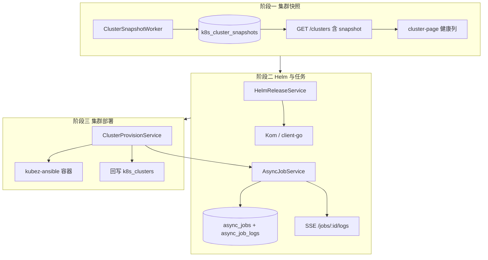
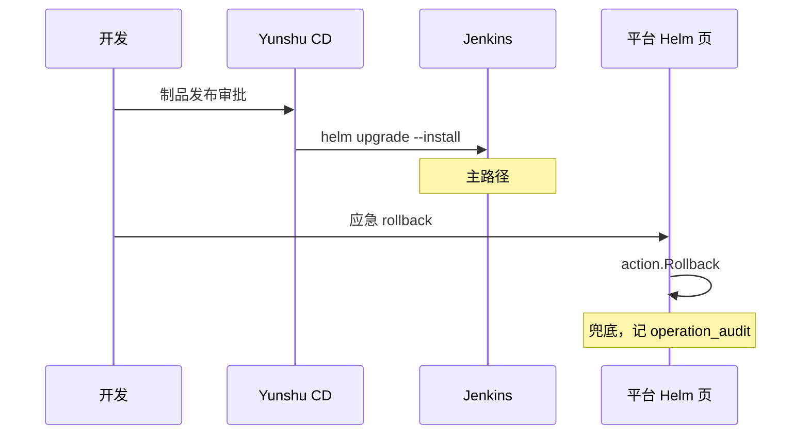
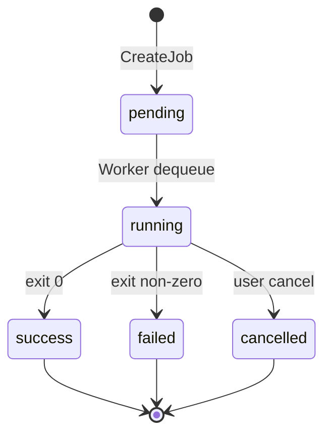
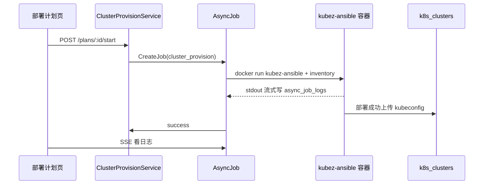

# K8s 平台增强设计草图（借鉴 Pixiu，分三阶段）

> **状态**：设计草图 v0.1 · 未实施  
> **关联**：`internal/service/k8s`、`internal/plugins/k8s`、`web/src/pages/cluster-page.tsx`  
> **参考**：[Pixiu](https://github.com/caoyingjunz/pixiu)（Plan / cluster-syncer / Helm UI）

---

## 0. 目标与边界

| 目标 | 说明 |
|------|------|
| 集群列表「开箱即见健康」 | 减少每次打开 `/clusters` 对 N 个集群逐条 `GET .../status` |
| 平台内 Helm 只读 → 可写 | 运维应急入口，与 Jenkins CD 并存 |
| 通用长任务框架 | 为后续「集群部署计划」、批量脚本复用 |
| 可选集群安装器 | 远期插件，对接 kubez-ansible / 自有 playbook |

**不做**：用 Pixiu 替换 yunshu K8s 资源层；不合并两套权限模型。

---

## 1. 总体架构（三阶段）



---

## 2. 阶段一：集群健康快照（优先实施）

### 2.1 问题

- 现状：`cluster-page` 加载列表后 **逐集群** 调 `GET /api/v1/clusters/:id/status`（见 `getClusterStatus`）。
- 总览页 `overview` 每次请求仍 **实时 List Pod**（8s 总超时），与集群列表探测逻辑重复。
- Pixiu `cluster_syncer` 每 30s 写 DB，列表 O(1) 读缓存。

### 2.2 数据模型

新增表 `k8s_cluster_snapshots`（1:1 集群，可嵌入 `k8s_clusters` 扩展列；**建议独立表**便于历史可选扩展）：

```go
// internal/model/k8s_cluster_snapshot.go
type K8sClusterSnapshot struct {
    ClusterID           uint      `gorm:"primaryKey"`
    ConnectionState     string    `gorm:"size:32"`   // ok / degraded / unreachable
    ServerVersion       string    `gorm:"size:64"`
    NodeTotal           int
    NodeReady           int
    NodeNotReady        int
    NotReadyNodeNames   string    `gorm:"type:text"` // JSON []string，控制长度
    PodRunning          int       `gorm:"default:-1"` // -1 表示未采集
    PodFailed           int
    LastSyncAt          time.Time
    LastSyncError       string    `gorm:"type:text"`
    SyncDurationMs      int
}
```

`ConnectionState` 枚举与现有 `K8sClusterStatusResponse.connection_state` 对齐（复用 `runtime.CheckClusterHeartbeat`）。

### 2.3 Worker 设计

| 项 | 约定 |
|----|------|
| 挂载点 | `internal/plugins/k8s/plugin.go` → `StartWorkers` 增加 `clustersnapshot.RunWorker` |
| 调度 | 字典 `k8s_cluster_snapshot_*`（与 `mysql_backup_scheduler_*` 同模式） |
| 默认节拍 | `*/30 * * * * *`（30s） |
| 并发 | 每 tick 对 **status=1 的集群** goroutine 并行，`errgroup` + 单集群 timeout 5s |
| 采集内容 | ① heartbeat ② List Node 统计 Ready ③（可选）List Pod 仅计数 Running/Failed |
| 失败策略 | 写 `connection_state=unreachable` + `last_sync_error`，不删旧快照 |

```text
ClusterSnapshotWorker.tick()
  → repo.ListEnabledClusters(all)   // 不受用户 ctx 限制，系统级
  → for each cluster (parallel, timeout 5s):
       CheckClusterHeartbeat
       List Nodes → node_ready / node_not_ready
       (optional) aggregate pod phase counts via kom
       upsert k8s_cluster_snapshots
```

### 2.4 API 变更

**方案 A（推荐）**：列表接口直接带快照，减少前端改动。

```http
GET /api/v1/clusters?page=1&page_size=10
```

`K8sClusterItem` 扩展：

```json
{
  "id": 1,
  "name": "prod",
  "status": 1,
  "snapshot": {
    "connection_state": "ok",
    "server_version": "v1.28.x",
    "node_ready": 3,
    "node_total": 3,
    "last_sync_at": "2026-07-03T10:00:00+08:00",
    "stale": false
  }
}
```

`stale`：`now - last_sync_at > 2 * tick_interval` 时为 true，提示「快照过期，点刷新探测」。

**保留** `GET /api/v1/clusters/:id/status` 作为 **强制实时探测**（手动刷新按钮）。

### 2.5 前端（cluster-page）

| 列 | 展示 |
|----|------|
| 连接 | Tag：ok 绿 / degraded 橙 / unreachable 红 |
| 节点 | `3/3 Ready` 或 `2/3 Ready（not-ready: node2）` Tooltip |
| 版本 | `server_version` |
| 同步时间 | `last_sync_at` + stale 警告 |

移除或降级「列表加载后 N 次 status 请求」；保留行内「探测」按钮调 realtime status。

### 2.6 权限与性能

- Worker 使用 **系统身份**，不经过 Casbin；仅读 K8s API。
- 列表 API 仍走现有 `ensureClusterOwningProjectAccess`。
- 预期：100 集群 × 30s ≈ 3.3 QPS 均摊到 worker，可接受；单 tick 并发上限可字典配置 `max_parallel=10`。

### 2.7 字典种子

| dict_type | label | 默认 value |
|-----------|-------|------------|
| `k8s_cluster_snapshot_enabled` | 启用集群快照 Worker | `true` |
| `k8s_cluster_snapshot_tick_spec` | 同步 Cron | `*/30 * * * * *` |
| `k8s_cluster_snapshot_pod_counts` | 是否采集 Pod 计数 | `false` |

### 2.8 文件清单（预估）

```text
internal/model/k8s_cluster_snapshot.go
internal/repository/k8s_cluster_snapshot_repository.go
internal/interfaces/k8s_cluster_snapshot_repository.go
internal/service/k8s/k8s_cluster_snapshot_worker.go
internal/service/k8s/k8s_cluster_snapshot.go      // 读快照合并到 List
internal/plugins/k8s/plugin.go                    // StartWorkers 注册
internal/service/system/dict_entry_service.go       // seed
web/src/pages/cluster-page.tsx
web/src/services/clusters.ts
docs/handbook/requirements/menus/menu-clusters.md
```

---

## 3. 阶段二 A：Helm Release 管理（只读 → 可写）

### 3.1 定位

- **Jenkins CD**：流水线发布、审批、制品（主路径不变）。
- **平台 Helm**：运维查看/回滚/改 values 的 **兜底控制台**。

### 3.2 路由与菜单

| 路由 | 组件 | 插件 |
|------|------|------|
| `/helm/releases` | `helm-releases-page` | `k8s` |
| `/helm/repositories` | `helm-repositories-page` | `k8s`（二期） |

菜单挂在「Kubernetes 容器管理」下，与 `/deployments` 同级。

### 3.3 API 设计

前缀：`/api/v1/clusters/:clusterId/helm`（走 `k8sScopeAuthorize` + 命名空间策略）。

| 方法 | 路径 | 说明 | 阶段 |
|------|------|------|------|
| GET | `/releases?ns=&keyword=` | List Helm releases（helm list -A 或按 ns） | 2A |
| GET | `/releases/:release/history?ns=` | history | 2A |
| GET | `/releases/:release/values?ns=` | 当前 values | 2A |
| POST | `/releases/:release/rollback?ns=` | rollback revision | 2B |
| PUT | `/releases/:release/values?ns=` | upgrade --reuse-values | 2B |
| GET | `/repositories` | 平台登记的 Chart 仓库 | 2C |
| POST | `/repositories` | CRUD 仓库 | 2C |

**权限建议**（Casbin 新 API 种子）：

- `GET .../helm/*` → 与 deployment 读权限同档（`readonly` preset 含）
- `POST/PUT .../helm/*` → 需 `admin` preset 或独立 `helm:write`

### 3.4 服务层

```text
internal/service/k8s/k8s_helm_service.go
  - 复用 K8sRuntimeService.GetClusterKubectl → rest.Config
  - helm.sh/helm/v3/pkg/action（参考 Pixiu pkg/controller/helm）
  - 每次请求 new action.Configuration（或 clusterId 级缓存 Configuration，注意并发）
```

**不存 Release 副本到 DB**（阶段 2A）：实时读集群 Secret（helm storage driver=secret，与 Pixiu 默认一致）。

阶段 2C 可选表 `helm_chart_repositories`（name, url, username, password_enc, cluster_scope）。

### 3.5 前端草图

```text
┌─ Helm Releases ────────────────────────────────────────┐
│ 集群 [prod ▼]  命名空间 [cityos ▼]  搜索 [____]  刷新   │
├────────────────────────────────────────────────────────┤
│ Release      Chart           Namespace  Rev  Status     │
│ springboot   springboot-1.0  cityos    3    deployed   │
│   [历史] [Values] [回滚]                                │
└────────────────────────────────────────────────────────┘
```

Values 用 Drawer + Monaco 只读；回滚二次确认 + 写 operation_audit。

### 3.6 与 CD 关系



---

## 4. 阶段二 B：通用异步任务 + SSE 日志

### 4.1 适用场景

| 场景 | job_type |
|------|----------|
| 集群部署（阶段三） | `cluster_provision` |
| 批量备份触发 | `mysql_backup_batch` |
| 未来 Ansible | `ansible_playbook` |

### 4.2 数据模型

```go
type AsyncJob struct {
    ID          uint
    JobType     string    // cluster_provision | ...
    Title       string
    Status      string    // pending|running|success|failed|cancelled
    Progress    int       // 0-100
    ClusterID   *uint
    ProjectID   *uint
    CreatedBy   uint
    PayloadJSON string    // 类型相关参数
    ResultJSON  string
    StartedAt   *time.Time
    FinishedAt  *time.Time
}

type AsyncJobLog struct {
    ID        uint
    JobID     uint
    Seq       int64
    Level     string    // info|warn|error
    Message   string    `gorm:"type:longtext"`
    CreatedAt time.Time
}
```

### 4.3 执行模型



- 队列：`internal/pkg/workqueue` 或 DB `SELECT ... FOR UPDATE SKIP LOCKED`（与现有 MySQL 栈一致，**推荐 DB 锁**避免新依赖）。
- 日志：Worker 写 `async_job_logs`；前端 `GET /api/v1/async-jobs/:id/logs/stream` SSE（复用 logplatform SSE 模式 + nginx 配置）。
- Pixiu 对标：`WatchTaskLog` → 我们统一为 `AsyncJobLog` SSE。

### 4.4 API

| 方法 | 路径 |
|------|------|
| GET | `/api/v1/async-jobs?job_type=&status=` |
| GET | `/api/v1/async-jobs/:id` |
| GET | `/api/v1/async-jobs/:id/logs?tail=500` |
| GET | `/api/v1/async-jobs/:id/logs/stream` |
| POST | `/api/v1/async-jobs/:id/cancel` |

权限：创建者 + 项目管理员 + 超管可读；取消仅创建者/管理员。

### 4.5 插件挂载

```go
// internal/plugins/k8s/plugin.go 或独立 plugins/asyncjob
func (m *module) StartWorkers(bgCtx context.Context, rt *plugin.Runtime) {
    asyncjob.RunDispatcher(bgCtx, rt.DB, handlers map[string]JobHandler)
}
```

---

## 5. 阶段三：集群部署计划（可选插件 `cluster_provision`）

### 5.1 产品形态

对标 Pixiu Plan：**页面填节点 → 选 K8s 版本/CNI → 一键部署 → 自动纳管**。

与 yunshu 差异：部署完成后写入 `k8s_clusters`，`OwningProjectID` 可选绑定项目。

### 5.2 数据模型（精简）

```text
cluster_provision_plans
  id, name, project_id, status, k8s_version, cni, created_by, ...

cluster_provision_nodes
  id, plan_id, name, ip, ssh_port, role(master|worker), ssh_user, ssh_password_enc

cluster_provision_tasks
  id, plan_id, async_job_id, action(install|destroy), status
```

### 5.3 执行流



### 5.4 Worker 实现选项

| 方案 | 优点 | 缺点 |
|------|------|------|
| A. Docker kubez-ansible（Pixiu 同款） | 成熟 | 需 yunshu 宿主机 docker.sock，安全边界大 |
| B. SSH 调现有 Ansible 控制机 | 与 CMDB SSH 能力复用 | 需维护 playbook 仓库 |
| C. 仅生成 inventory + 脚本，人工执行 | 实现快 | 非「点点点」 |

**建议**：阶段三先做 **C（半自动）** 验证流程，再评估 A/B。

### 5.5 配置（config.yaml 扩展）

```yaml
cluster_provision:
  enabled: false
  worker_image: ""           # kubez-ansible 镜像，空则禁用
  work_dir: /var/lib/yunshu/provision
  default_pause_image: harbor.deploy.local/registry/pause:3.9
```

---

## 6. 实施顺序与工作量（粗估）

| 阶段 | 内容 | 后端 | 前端 | 风险 |
|------|------|------|------|------|
| **1** | 集群快照 Worker + 列表展示 | 3~4d | 1d | 低 |
| **2A** | Helm Release 只读 | 2~3d | 2d | 中（helm SDK 权限） |
| **2B** | Helm rollback/upgrade | 2d | 1d | 中 |
| **2C** | Chart 仓库 CRUD | 2d | 1d | 低 |
| **2B'** | AsyncJob + SSE 框架 | 4~5d | 2d | 中 |
| **3** | 集群部署计划 | 10d+ | 5d+ | 高 |

**推荐迭代**：

1. 阶段一（立刻价值，改动面小）
2. 阶段 2A Helm 只读（运维可见性）
3. 阶段 2B' AsyncJob（为 CD 构建日志统一打基础，可选与 2A 并行）
4. 阶段 2B Helm 写操作
5. 阶段三按需求开关

---

## 7. 测试要点

### 阶段一

- 禁用集群 `status=0` 不参与 sync
- kubeconfig 失效 → snapshot `unreachable`，列表仍秒开
- 项目隔离：用户 A 看不到用户 B 集群的快照字段（随 List 权限）
- Worker panic 单集群不影响其他集群

### 阶段二 Helm

- 无 namespace 权限的用户不能通过 helm API 绕过 K8sScope
- rollback 产生 operation_audit 记录
- 与 Jenkins 连续 deploy 不冲突（Helm 3 乐观锁）

---

## 8. 开放问题（评审时定）

1. 快照是否 **持久化历史**（时序表）供总览趋势？阶段一可只做最新一行。
2. Pod 计数是否默认开启？大集群 List Pod 成本高，建议默认关。
3. Helm 写操作是否 **必须走审批**（对接现有 cicd approval）？建议阶段 2B 先 audit-only。
4. 集群部署是否独立插件 `cluster_provision`，避免 k8s 插件过重？

---

## 9. 修订记录

| 版本 | 日期 | 说明 |
|------|------|------|
| v0.1 | 2026-07-03 | 初稿：三阶段草图 |
