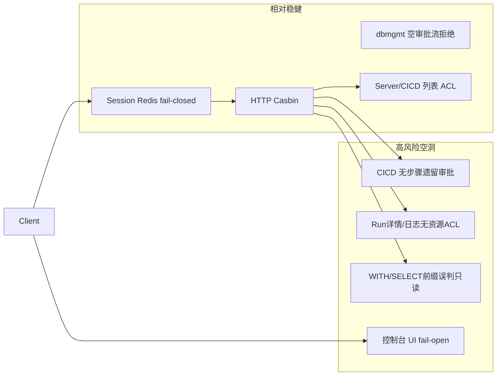

# Yunshu 项目核查报告

**核查视角**：资深后端工程师 / 前端工程师 / 测试工程师  
**范围**：`internal/`、`web/src/`、测试与 CI 配置（只读抽查 + 交叉验证）  
**日期**：2026-08-05  
**结论用途**：缺陷与风险登记、修复优先级排期；本报告不包含业务代码变更

---

## 1. 总评

| 维度 | 结论 |
|------|------|
| 鉴权底座 | Session + Casbin + Redis **失败关闭**设计合理；项目资源 ACL（服务器/CICD 列表）近期有加固 |
| 最大空洞 | **CICD 遗留审批可被任意项目成员通过**；**构建/发布详情与日志存在资源 ACL IDOR**；SQL 控制台「只读」判定可被绕过 |
| 前端 | UI **非权限门禁**（登录即可深链）；控制台权限 **fail-open**；JWT 存 localStorage |
| 测试/质量门禁 | **无仓库内 CI**；前端 **零测试**；关键路径（auth/WS/工单 FSM/审批）基本无覆盖；alert 包曾存在编译阻断风险需再验 |
| 流程 | dbmgmt 空审批流已禁止自动通过；**自审自批**仍允许（此前产品明确保留，记为流程风险非强制缺陷） |

---

## 2. 高危（P0）— 建议立刻修

### B-H1 CICD 无审批步骤时，任意成员可「审批」发布

| 项 | 内容 |
|----|------|
| **证据** | [`internal/service/cicd/release_approval.go`](../internal/service/cicd/release_approval.go)：`ApproveReleaseRun` 在 `!hasSteps` 时走 `approveLegacySingleStep`，**无** `userCanApproveStep` / 角色校验，仅项目成员中间件 |
| **影响** | 未配置 CICD 审批流的项目，普通成员可把待审发布推到 `pending_execution` |
| **建议** | 遗留路径至少要求项目 admin/owner，或强制要求启用审批流（与 dbmgmt「禁止空流自动过」对齐） |

### B-H2 CICD 构建/发布详情与日志绕过资源 ACL（IDOR）

| 项 | 内容 |
|----|------|
| **证据** | 列表用 `visibleCicdServiceScope`；`GetBuildRun` / `GetBuildRunLog` / `GetReleaseRunLog` / `GetReleaseRunDetail` **仅** `project_id + runId`，无 Actor / `AssertCicdAccess`（见 [`service.go`](../internal/service/cicd/service.go)、[`release_detail.go`](../internal/service/cicd/release_detail.go)） |
| **影响** | 无 CICD 授权的项目成员，知悉 runId 可读 Jenkins 日志、发布元数据、部署主机等 |
| **建议** | 详情/日志与触发路径统一做 service 级 ACL |

### B-H3 SQL 控制台「只读」前缀判定可绕过

| 项 | 内容 |
|----|------|
| **证据** | [`internal/service/dbmgmt/sql_guard.go`](../internal/service/dbmgmt/sql_guard.go)：`reRead` 把以 `WITH`/`SELECT` 开头一律当读；`WITH ... DELETE`、`SELECT ... INTO OUTFILE` 等可漏判 |
| **影响** | 有 query 权限用户可能执行写副作用（取决于 DB 账号权限） |
| **建议** | 解析器/白名单；显式拒绝 CTE 内 DML、`INTO OUTFILE/DUMPFILE`、多语句 |

### F-H1 / F-H2 服务器控制台、DB 控制台权限 fail-open

| 项 | 内容 |
|----|------|
| **证据** | [`web/src/pages/server-console-page.tsx`](../web/src/pages/server-console-page.tsx)：`useState(true)` 作为 `canExec` 初值；access 失败时 `can_view: true`。[`web/src/pages/dbmgmt-console-page.tsx`](../web/src/pages/dbmgmt-console-page.tsx)：`!perm \|\| ...` 使 `perm == null` 时仍可走查询/写判断 |
| **影响** | 权限探针完成前可点连接/执行；后端若有漏洞则窗口放大 |
| **建议** | 默认 `false`；loading 期间禁用全部操作；失败 fail-closed |

### T-H1 无 CI + 关键包可能无法编译进质量门禁

| 项 | 内容 |
|----|------|
| **证据** | 仓库无 `.github/workflows`；探测 `go test ./internal/...` 曾因 alert 包 BOM 失败；Docker 仅 `go build` |
| **影响** | 回归可静默进生产镜像 |
| **建议** | PR 门禁 `go test ./... -short` + `go vet`；修复编译阻断；前端至少加 lint/build |

---

## 3. 中危（P1）

| ID | 域 | 问题 | 位置/说明 |
|----|----|------|-----------|
| B-M1 | 流程/安全 | **自审自批**（提交人在审批组即可过） | dbmgmt / CICD `userCanApproveStep`；产品曾要求保留 → **已知接受**，建议可配置 SoD |
| B-M2 | 安全 | 告警出站 Webhook **无 SSRF 防护** | [`internal/service/alert/alert_delivery_channels.go`](../internal/service/alert/alert_delivery_channels.go) |
| B-M3 | 可靠 | 告警 Redis 去重 **fail-open**（风暴/重复通知） | [`internal/service/alert/state_redis.go`](../internal/service/alert/state_redis.go) |
| B-M4 | 授权 | 菜单 Casbin **空绑定放行**；Enforce 错误 continue | [`internal/menu/access.go`](../internal/menu/access.go) |
| B-M5 | 密钥 | Dict `RevealValue` 仅依赖 Casbin，无二次角色门 | dict_entry 路由 |
| B-M6 | ACL | DB grant `database_name` 空 → 元数据 unrestricted | [`internal/service/dbmgmt/metadata_acl.go`](../internal/service/dbmgmt/metadata_acl.go) |
| B-M7 | 账号 | 用户导入默认密码 `123456` 且错误被吞 | [`internal/service/system/user_service.go`](../internal/service/system/user_service.go) |
| B-M8 | 体验/审计 | 批量审批只计 `err==nil`，失败被掩盖 | CICD / dbmgmt batch |
| F-M1 | 安全 | JWT 存 **localStorage**（XSS=会话窃取） | [`web/src/services/storage.ts`](../web/src/services/storage.ts) |
| F-M2 | 授权 UX | 路由仅校验登录；**PATH_COMPONENT_FALLBACK** 绕过菜单 | [`web/src/app/app-routes.tsx`](../web/src/app/app-routes.tsx)、[`web/src/pages/dynamic-menu-page.tsx`](../web/src/pages/dynamic-menu-page.tsx) |
| F-M3 | XSS | 日志 `highlight` 未消毒直接 `dangerouslySetInnerHTML` | [`web/src/pages/project-logs-page.tsx`](../web/src/pages/project-logs-page.tsx) |
| F-M4 | 可维护 | alert-monitor `platform-provider` ~2500 行 + `any` | 回归风险高 |
| T-M1 | 覆盖 | auth/Casbin/WS ticket/工单 FSM/审批流/handler **近 0 测** | middleware、system、handler |
| T-M2 | 覆盖 | 前端无 Vitest/Playwright；CONTRIBUTING 提 lint 但 package 无 lint 脚本 | `web/package.json` |

---

## 4. 低危 / 体验与工程债（P2）

- `RequireProjectMemberAccess` 在 `:id` 为空时直接 `Next()`（依赖路由始终绑参）。
- K8s GET 可走 cluster DB grant 绕过 Casbin 读（设计意图，但扩大 blast radius）。
- WS ticket `silentErrorToast` + 泛化错误文案，排障困难。
- Vite/Loggie 硬编码 `127.0.0.1:8080`。
- Wire 生成物与 ACL 服务需保持提交一致，避免环境 DI 漂移。
- goInception **仅 MySQL 直连**（PG / SSH 隧道不支持）——能力边界，文档已写，流程上勿对 PG 工单承诺同等审核。

---

## 5. 流程不合理处（产品/运营）

1. **CICD「未配置审批流」仍可点审批且无审批人校验** — 与 dbmgmt「必须有阶段」不一致，合规口径分裂。
2. **自审自批默认允许** — 适合小团队，不符合大厂职责分离；建议环境级开关（生产强制 SoD）。
3. **列表有 ACL、详情无 ACL** — 用户以为「看不见=没权限」，实则 IDOR 可读。
4. **菜单隐藏 ≠ 无权限** — 前端深链 + fallback 让「关菜单」形同虚设。
5. **控制台先可点再探针** — 操作顺序与「先鉴权再暴露能力」相反。
6. **告警主路径依赖 AM webhook，平台 PromQL 为辅** — 合理；但出站 URL 无内网隔离时，渠道配置权限过宽即等于内网探测能力。
7. **质量门禁缺失** — 种子/文档要求本地 `go test`，但无强制流水线，与「生产分支直推」组合风险高。

---

## 6. 已做对的地方（避免误报）

- dbmgmt：空审批流提交拒绝；`RequireTicketForDML` 全写强制工单；表级 ACL / 元数据过滤近期加固。
- Session Redis 故障拒绝请求；入站告警 webhook 要求 token。
- 服务器/CICD **列表** ACL + 授权管理需 admin；WS 用一次性 ticket（非 JWT 挂查询串）。
- 请求日志对 password/token 类字段有脱敏。

---

## 7. 建议修复节奏

### Sprint P0（1–3 天）

1. 堵住 CICD legacy 审批 + Run 详情/日志 ACL
2. 收紧 `sql_guard` 只读判定
3. 控制台 FE fail-closed
4. 修编译阻断 + 加最小 CI（`go test -short` + `web build`）

### Sprint P1

SSRF 防护、日志 XSS、菜单/路由权限元数据、dict reveal 收紧、导入弱密码、关键路径单测（auth / WS ticket / ticket FSM）

### Sprint P2

SoD 可配置、alert-monitor 拆分、Vitest + 一条 Playwright、Redis 告警降级可观测

---

## 8. 测试覆盖缺口摘要（QA）

| 域 | 现状 | 关键缺口 |
|----|------|----------|
| Auth / ACL | 几乎无中间件单测 | Session、Casbin、项目成员中间件 |
| dbmgmt | 包覆盖约 3%（辅助函数） | 工单 FSM、SQL guard、goInception |
| CICD | 包覆盖约 9.6% | 审批流、资源 ACL、详情 IDOR |
| Alerts | 单测较多 | 需确认编译；重 mock，缺集成 |
| WebSocket 终端 | 无 | ticket 生命周期、exec ACL |
| Frontend | **零测试框架** | ws-auth、控制台门禁、审批 UI |
| CI | **仓库内无流水线** | Docker build ≠ test gate |

---

## 9. 修复进度（2026-08-05）

| ID | 状态 | 说明 |
|----|------|------|
| B-H1 | 已修 | 无审批步骤时仅项目管理员可审批/驳回 |
| B-H2 | 已修 | Run 详情/日志增加 `AssertCicdAccess(view)` |
| B-H3 | 已修 | 收紧 WITH/INTO OUTFILE 只读判定 + 单测 |
| F-H1/H2 | 已修 | 服务器/DB 控制台权限 fail-closed |
| T-H1 | 已修 | 去除 alert BOM；新增 `.github/workflows/ci.yml` |
| B-M2 | 已修 | 出站 Webhook 禁止 localhost/元数据地址 |
| B-M4 | 已修 | 菜单 Enforce 错误改为失败关闭 |
| B-M6 | 已修 | 空 `database_name` 不再等同 manage 级 unrestricted |
| B-M7 | 已修 | 导入用户使用随机临时密码，错误上抛 |
| B-M8 | 已修 | 批量审批失败返回首个错误 |
| F-M3 | 已修 | 日志 highlight 仅允许 `<mark>` |
| P2 空 `:id` | 已修 | 项目成员中间件拒绝空 id |
| B-M1 | 保留 | 自审自批（产品明确接受） |
| F-M1/F-M2/F-M4/T-M* | 未做 | JWT httpOnly、路由权限元数据、alert-monitor 拆分、前端测试框架等仍待排期 |
