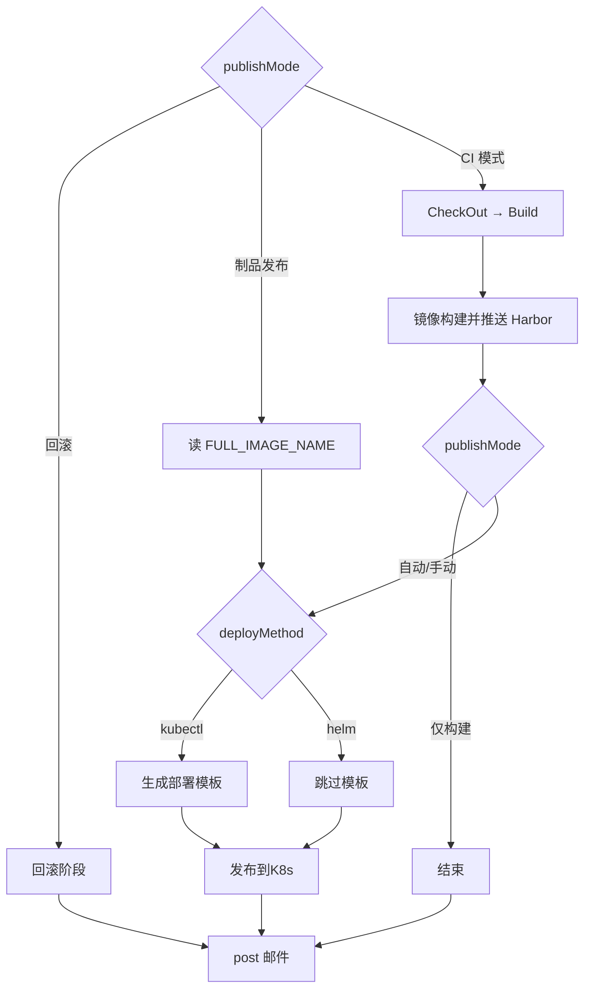
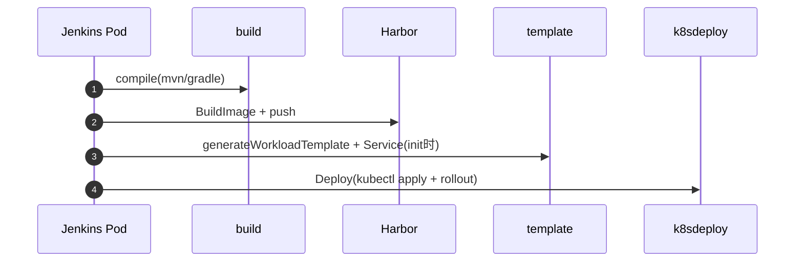

# 企业级 K8s 容器化部署方案：Jenkins + Harbor + Helm/kubectl + Gitee + Jenkinsfile 自动化实践

> 本文档基于 `jenkinsfileTest/cigroovy.jenkinsfile` 及共享库 `jenkinslib` 编写，描述 Java 微服务从 Maven/Gradle 编译、Docker 镜像推送 Harbor，到 K8s 集群部署（kubectl 动态模板 / Helm Chart）、初始化与服务更新、版本回滚的完整 CI/CD 流程。

---

## 一、方案架构

### 1.1 组件说明

| 组件 | 角色 | 说明 |
|------|------|------|
| Gitee | 代码仓库 | SSH 拉取，含 Dockerfile |
| Jenkins (K8s Agent Pod) | CI/CD | mvn/docker/kubectl/helm 容器内执行 |
| Harbor | 镜像 / Chart 仓库 | Docker 镜像；Helm 模式存 Chart |
| Kubernetes | 运行环境 | Deployment / DaemonSet / StatefulSet |
| SkyWalking | 链路追踪 | skywalking 模板 initContainer 注入 Agent |
| jenkinslib | 共享库 | 构建、Harbor、模板、K8s 部署、公共流水线 |

### 1.2 两条 CD 路径

| 路径 | deployMethod | 说明 |
|------|--------------|------|
| **kubectl**（默认） | kubectl | Jenkins 动态生成 YAML → kubectl apply |
| **Helm** | helm | 仓库 helm/ Chart → helm upgrade --install |

构建阶段（CheckOut → Build → 镜像推送 Harbor）相同，差异在部署阶段。

### 1.3 流水线与共享库

| 文件 | 说明 |
|------|------|
| `cigroovy.jenkinsfile` | K8s CI/CD 入口 |
| `vars/k8s.groovy` + `k8s.groovy` | Slave Pod（mvn/docker/kubectl/helm） |
| `pipeline.groovy` | checkout、发布门禁 |
| `build.groovy` | compile(mvn/gradle) |
| `Harbor.groovy` | docker build/push（校验 Dockerfile） |
| `template.groovy` | K8s YAML 模板生成 |
| `k8sdeploy.groovy` | kubectl / Helm 部署与回滚 |
| `resources/k8s-skywalking-*.yaml` | SkyWalking 通用微服务模板 |
| `resources/k8s-basic-*.yaml` | 基础精简模板 |

---

## 二、发布模式（publishMode）

| publishMode | 行为 |
|-------------|------|
| 自动发布（默认） | 镜像推送后自动部署到 K8s |
| 手动发布 | input 确认后部署 |
| 仅构建 | 仅编译 + 推镜像，不生成 YAML、不部署 |
| **制品发布** | **Yunshu CD 发布**：跳过 Checkout/Build/推镜像，用参数 `FULL_IMAGE_NAME` 直接生成模板并部署 |
| 回滚 | kubectl rollout undo 或 Helm 回滚 |

> **Yunshu 与 Jenkins 分工：** CI「打包」用 自动发布/手动发布/仅构建；CD「容器化发布」传 `publishMode=制品发布` + `FULL_IMAGE_NAME=已选 CI 镜像`。详见仓库 `jenkinslib/K8S-CD-ARTIFACT-DEPLOY.md`。



---

## 三、时序图

### 3.1 kubectl 自动发布



### 3.2 Helm 发布

- 跳过「生成部署模板」
- `PackageAndPushChart` → `helm upgrade --install --atomic --wait`
- **注意**：Helm 模式下 Jenkins 侧 `deployConfigType/Template` 参数不生效，由仓库 Chart 决定

### 3.3 初始化部署 vs 服务更新

| deployAction | 生成 Service | kubectl apply |
|--------------|--------------|---------------|
| 初始化部署 | 是 | 工作负载 + Service |
| 服务更新 | 否 | 仅工作负载 |

---

## 四、部署配置

### 4.1 部署配置类型（deployConfigType）

| 参数值 | 输出文件 | K8s 资源 |
|--------|----------|----------|
| 使用deployment模板 | deployment.yaml | Deployment |
| 使用daemonset模板 | daemonset.yaml | DaemonSet |
| 使用statefulset模板 | statefulset.yaml | StatefulSet |

### 4.2 部署配置模板（deployConfigTemplate）

| 参数值 | 资源前缀 | 特性 |
|--------|----------|------|
| 通用微服务含skywalking | k8s-skywalking-* | initContainer Agent、探针、JAVA_OPTS/APOLLO_OPTS |
| 基础模板 | k8s-basic-* | 精简，无 SkyWalking/探针 |

占位符：`{{PRONAME}}` `{{FULL_IMAGE_NAME}}` `{{NAMESPACE}}` `{{REPLICAS}}` `{{CONTAINER_PORT}}` 及 CPU/Memory、Apollo、SkyWalking 等。

---

## 五、环境准备

### 5.1 Jenkins K8s 云

Slave Pod 容器：mvn、docker（挂载 docker.sock）、kubectl、helm。

### 5.2 Harbor

```text
镜像：{HARBOR_URL}/{PROJECT_GROUP}/{imageName}:{imageTag}_{Tenv}_{BUILD_TIME}
示例：harbor.jdicity.local/registry/order-service:v1.0_prod_20250618_143022
```

### 5.3 K8s 凭据（config.K8S_CLUSTER_CREDENTIALS）

| Tenv | 默认凭据 ID |
|------|-------------|
| prod | k8s-prod-config |
| test | k8s-test-config |
| dev | k8s-dev-config |

可用 `K8S_CREDENTIAL_ID` 覆盖。

### 5.4 集群前置条件

- Namespace 已创建
- `registry-secret` imagePullSecrets
- SkyWalking 模板：OAP、Apollo Meta 集群内可达
- 应用暴露 `/actuator/health/*`（skywalking 模板探针）

### 5.5 Helm 额外要求

- 仓库根目录 `helm/Chart.yaml`
- Harbor Chart 仓库已启用

---

## 六、Jenkins 参数

### 6.1 基础参数

| 参数名 | 说明 |
|--------|------|
| `Tenv` | dev/test/prod（邮件标题含环境） |
| `publishMode` | **必配**：自动发布/手动发布/仅构建/回滚 |
| `SrcURL` / `branchName` | 仓库与分支 |
| `buildType` | mvn / gradle |
| `buildshell` | 如 clean package -DskipTests |
| `imageName` / `imageTag` | 镜像名与 tag 前缀 |
| `k8s_ns` | Namespace |
| `replicas` / `ContainerPort` | 副本数、端口 |
| `waitMins` / `emailUser` | 手动超时、邮件 |

### 6.2 部署参数

| 参数名 | 说明 |
|--------|------|
| `deployMethod` | kubectl（默认）/ helm |
| `deployAction` | 初始化部署 / 服务更新 |
| `deployConfigType` | Deployment/DaemonSet/StatefulSet 模板 |
| `deployConfigTemplate` | skywalking / 基础模板 |

### 6.3 SkyWalking 模板资源参数

`containerCpuLimits`、`containerMemoryLimits`、`containerCpuRequests`、`containerMemoryRequests`、`APOLLO_*`、`skywalkingAgentImage`、`skywalkingCollector`、`JAVA_OPTS`、`APOLLO_OPTS`

### 6.4 环境变量

| 变量 | 默认 |
|------|------|
| `HARBOR_URL` | harbor.jdicity.local |
| `PROJECT_GROUP` | registry |
| `K8S_CREDENTIAL_ID` | 覆盖 kubeconfig |

---

## 七、流水线阶段

| 阶段 | 条件 | 说明 |
|------|------|------|
| CheckOut | publishMode ∉ {回滚, 制品发布} | pipeline.checkoutCode |
| Build | 同上 | container(mvn) → build.compile |
| 镜像构建并推送 | 同上 | 打 tag + harbor.BuildImage（含 Dockerfile 校验） |
| 生成部署模板 | auto/manual/**制品发布** 且 kubectl | template.generateWorkload/Service，镜像用 `FULL_IMAGE_NAME` |
| 发布到K8s | auto/manual/**制品发布** | pipeline.runPublish → k8sdeploy.RunDeploy（制品发布无 input） |
| 回滚 | rollback | kubectl Rollback 或 HelmRollback |
| post | always | sendPost（notifyCtx 含 tenv） |

**邮件规则：** SUCCESS 且曾 `mark`（镜像构建/部署/回滚）时通知；**任意阶段失败均发 FAILURE 告警**（CheckOut、Build、推送 Harbor 等未 mark 也会发，`emailUser` 必填）。

---

## 八、Helm 在 CI/CD 中的作用

| 能力 | 说明 |
|------|------|
| Chart 版本化 | helm package，BUILD_NUMBER 为版本，推 Harbor |
| Release 管理 | helm upgrade --install {imageName}-{Tenv} |
| 参数化 | --set image.repository/tag/replicas/containerPort |
| 原子部署 | --atomic --wait |
| 回滚 | helm history + upgrade --reuse-values |

**kubectl vs Helm 选型：**

- 动态 SkyWalking YAML、多工作负载类型 → **kubectl**
- 稳定 Chart、Release 级管理 → **Helm**

---

## 九、共享库 API

### pipeline.groovy

同前后端：`checkoutCode`、`runPublish`、`selectRollbackVersion`

### k8sdeploy.groovy

| 方法 | 说明 |
|------|------|
| `RunDeploy(config)` | 按 deployMethod 分发 |
| `Deploy(...)` | kubectl apply + rollout（含 DaemonSet） |
| `PackageAndPushChart` / `HelmDeploy` | Helm 路径 |
| `Rollback` / `HelmRollback` | 回滚 |

### build.groovy

```groovy
build.compile(buildType, buildshell)  // mvn / gradle 统一入口
```

---

## 十、典型场景

| 场景 | publishMode | 其他 |
|------|-------------|------|
| 首次 SkyWalking 上线 | 自动发布 | deployAction=初始化部署，deployConfigTemplate=skywalking |
| 日常发版 | 自动发布 | deployAction=服务更新 |
| 只打镜像不部署 | 仅构建 | — |
| DaemonSet 日志 agent | 自动发布 | deployConfigType=daemonset |
| Helm 发版 | 自动发布 | deployMethod=helm，仓库含 helm/ |
| kubectl 回滚 | 回滚 | deployMethod=kubectl |

---

## 十一、排错

| 现象 | 处理 |
|------|------|
| Dockerfile 不存在 | 仓库根目录添加 Dockerfile |
| Gradle 构建失败 | buildType=gradle，Build 已统一支持 |
| libraryResource 失败 | 确认 jenkinslib/resources/k8s-*.yaml 已发布 |
| 探针失败 | 改用基础模板或调整 actuator 路径 |
| Helm 参数不生效 | deployConfigType 仅 kubectl 有效 |
| 仅构建仍部署 | publishMode 应为仅构建 |
| CD 成功但无 Deployment | publishMode=制品发布 时 jenkinsfile 未改，部署阶段被 skip；见 `jenkinslib/K8S-CD-ARTIFACT-DEPLOY.md` |
| CD 又跑了一遍 CI | 同上，Checkout/Build 未跳过 |
| 邮件无环境 | 已修复：notifyCtx.tenv |
| CheckOut/编译失败无邮件 | 已修复：FAILURE 时 sendPost 不依赖 mark |

---

## 十二、快速检查清单

- [ ] K8s 云 kubernetes 已配置，Slave Pod 正常
- [ ] 凭据 HARBOR_ID、环境 kubeconfig 已创建
- [ ] publishMode、deployMethod 已配置
- [ ] kubectl 路径：SkyWalking OAP、registry-secret 就绪
- [ ] helm 路径：helm/Chart.yaml 存在
- [ ] SMTP、emailUser 已配置

---

## 附录：DevOps 三条路径对照

| 维度 | 前端 | 后端 | K8s |
|------|------|------|-----|
| Jenkinsfile | front.jenkinsfile | backend.jenkinsfile | cigroovy.jenkinsfile |
| 制品 | tar.gz | JAR | Docker 镜像 |
| 仓库 | MinIO | MinIO | Harbor |
| 部署 | SSH 解压 | SSH + launch.sh | kubectl / Helm |
| 保留策略 | artifactRetainCount | MinIO + 目标机 JAR | — |
| 发布模式 | publishMode | publishMode | publishMode |
| 公共库 | pipeline.groovy | pipeline.groovy | pipeline.groovy |
