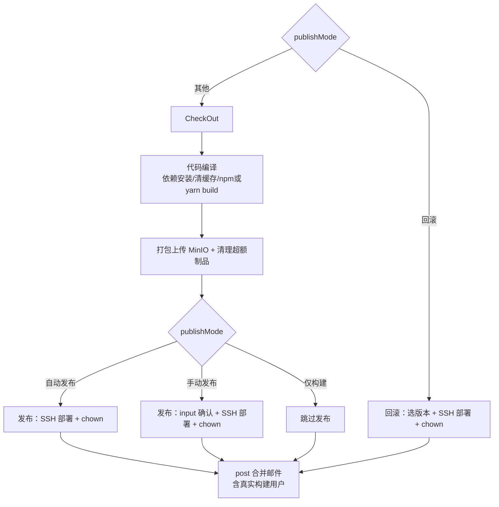
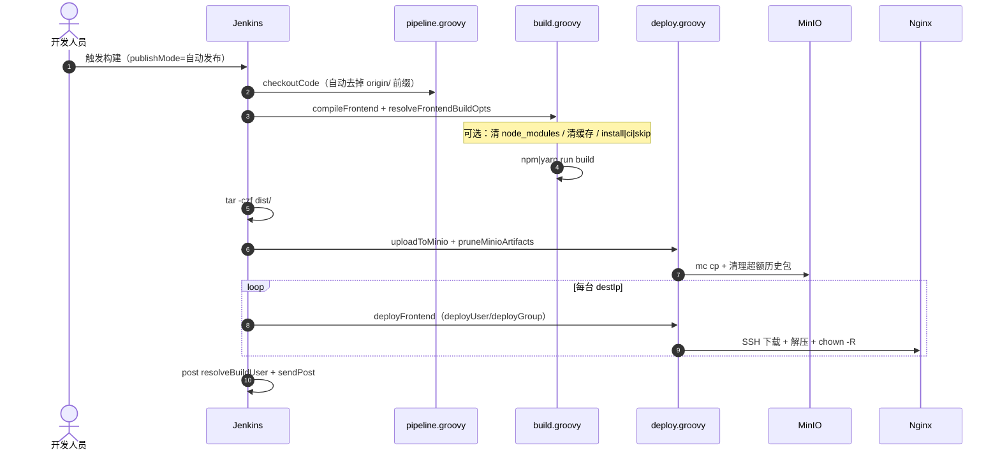
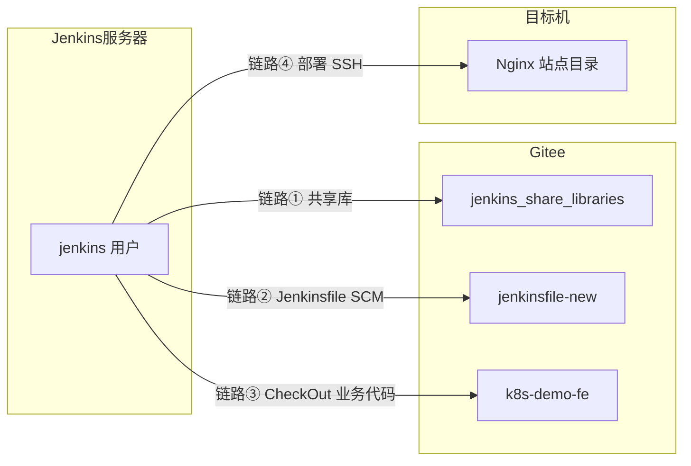

# 企业级前端部署方案：Jenkins + MinIO + SSH + Gitee + Jenkinsfile 自动化实践

> 本文档基于工程 `front.jenkinsfile` 及共享库 `jenkinslib`（Gitee: [jenkins_share_libraries](https://gitee.com/wxd_ops/jenkins_share_libraries)）编写，涵盖 **Jenkins 服务器安装**、**Gitee SSH 配置**、**四条 SSH 链路打通**、前端构建部署与回滚的完整 CI/CD 流程。  
> 流水线文件托管于 [jenkinsfile-new](https://gitee.com/wxd_ops/jenkinsfile-new) 仓库，Jenkins Job 通过 **Pipeline script from SCM** 引用 `./front.jenkinsfile`。

**文档导航：** [四、Jenkins 安装](#四jenkins-服务器安装与初始化) · [五、Gitee 配置](#五gitee-配置) · [六、SSH 打通](#六ssh-打通四条链路) · [6.3 分支选择 Active Choices](#分支选择自动从-srcurl-仓库获取) · [八、Job 配置](#八jenkins-job-配置) · [十五、排错](#十五排错手册) · [十六、检查清单](#十六快速检查清单)

---

## 一、方案架构

### 1.1 组件说明


| 组件               | 角色       | 说明                            |
| ---------------- | -------- | ----------------------------- |
| Gitee            | 代码仓库     | 业务代码 + 共享库 + Jenkinsfile 分仓管理 |
| Jenkins (master) | CI/CD 调度 | 编译、打包、上传 MinIO、SSH 部署、邮件通知    |
| MinIO            | 制品仓库     | 存储带版本号的 tar.gz，自动清理超额历史包      |
| Nginx 服务器        | 运行节点     | SSH 从 MinIO 拉包、解压到站点目录并 chown |
| jenkinslib       | 共享库      | 构建、部署、公共流水线、通知                |


### 1.2 仓库规划


| Gitee 仓库                          | 用途     | Jenkins 引用方式                   |
| --------------------------------- | ------ | ------------------------------ |
| `wxd_ops/jenkins_share_libraries` | 共享库源码  | Global Pipeline Libraries      |
| `wxd_ops/jenkinsfile-new`         | 流水线文件  | Job → Pipeline script from SCM |
| `wxd_ops/k8s-demo-fe`（示例）         | 前端业务代码 | Job 参数 `SrcURL`                |


### 1.3 服务器规划（实践示例）


| IP / 主机                        | 部署组件                           | 说明                      |
| ------------------------------ | ------------------------------ | ----------------------- |
| `10.10.10.103`（k8s-master）     | Jenkins、Node.js、MinIO、mc、Nginx | 单机验证环境（麒麟 V10 + Java 8） |
| `/export/frontend/k8s-demo-fe` | 前端站点目录                         | 部署目标路径示例                |


> 文档后续以 `10.10.10.103`、`frontend-artifacts` 桶为例；可按实际环境替换 IP 与路径。

### 1.4 流水线与共享库文件


| 文件                                              | 说明                                                             |
| ----------------------------------------------- | -------------------------------------------------------------- |
| `front.jenkinsfile`                             | 前端流水线入口（薄层，约 140 行）                                            |
| `jenkinslib/src/org/devops/pipeline.groovy`     | 公共：checkout、发布门禁、回滚选版、分支名解析（Git Parameter / Active Choices 兼容） |
| `jenkinslib/src/org/devops/build.groovy`        | `compileFrontend()`：npm/yarn 安装、清缓存、构建                         |
| `jenkinslib/src/org/devops/deploy.groovy`       | MinIO 上传/清理、SSH 部署、部署目录 chown                                  |
| `jenkinslib/src/org/devops/notification.groovy` | 合并邮件（一次构建一封）                                                   |
| `jenkinslib/src/org/devops/tools.groovy`        | 日志、`resolveBuildUser`、`resolveFrontendBuildOpts`               |
| `jenkinslib/src/org/devops/config.groovy`       | 凭据 ID、MinIO 地址、mc 路径、默认保留数                                     |


---

## 二、发布模式（publishMode）

统一使用 `**publishMode`** 控制流水线行为：


| publishMode | 行为                                                                    |
| ----------- | --------------------------------------------------------------------- |
| `自动发布`（默认）  | 构建上传后自动 SSH 部署                                                        |
| `手动发布`      | 构建上传后 input 确认再部署                                                     |
| `仅构建`       | 仅构建并上传 MinIO，不部署                                                      |
| `**制品发布**`  | **Yunshu CD 发布**：跳过编译，**直接使用参数 `selectedVersion` 部署**，不在 Jenkins 弹窗选包 |
| `回滚`        | 跳过构建，**在 Jenkins UI 从 MinIO 历史列表选手动回滚**                               |


> **Yunshu 与 Jenkins 分工：** CI「打包」用 自动发布/手动发布/仅构建；CD「发布」传 `publishMode=制品发布` + `selectedVersion=文件名`。勿再用 `回滚` 代替 Yunshu 发布。

### Yunshu 对接：`front.jenkinsfile` 必改片段

在 Gitee `jenkinsfile-new` 仓库的 `front.jenkinsfile` 中：

**1. 跳过编译/upload 的条件**（Checkout / 代码编译 / 打包并上传至 minio）增加 `制品发布`：

```groovy
when {
  expression {
    def mode = org.devops.tools.normalizePublishMode(params.publishMode ?: env.publishMode)
    mode != '回滚' && mode != '制品发布'
  }
}
```

**2. 新增「制品发布」阶段**（与回滚共用 deploy 逻辑，但禁止 input）：

```groovy
stage('制品发布') {
  when {
    expression {
      org.devops.tools.normalizePublishMode(params.publishMode ?: env.publishMode) == '制品发布'
    }
  }
  steps {
    script {
      def ver = (params.selectedVersion ?: env.selectedVersion)?.trim()
      if (!ver) {
        error('制品发布须指定 selectedVersion（由 Yunshu CD 传入）')
      }
      echo "[DEPLOY] Yunshu 指定制品: ${ver}"
      // 与回滚阶段相同的 deployFrontend + chown 调用，ver 作为制品文件名
    }
  }
}
```

**3. `tools.groovy` 的 `normalizePublishMode`** 增加对 `制品发布` 的识别。

**4. 回滚阶段**仍保留 `selectRollbackVersion()`；若未来也支持 API 传入，可在 `selectedVersion` 非空时跳过 input：

```groovy
def ver = (params.selectedVersion ?: env.selectedVersion)?.trim()
if (!ver) {
  ver = pipeline.selectRollbackVersion(...)
}
```

### 阶段总览




---

## 三、时序图

### 3.1 自动发布（publishMode=自动发布）




### 3.2 手动发布 / 仅构建 / 回滚

- **手动发布**：上传 MinIO 后 `pipeline.runPublish()` 弹出 input，确认后部署。
- **仅构建**：上传 MinIO 后 `runPublish()` 直接跳过部署。
- **回滚**：`pipeline.selectRollbackVersion()` 列出 MinIO 中 `*.tar.gz`，选定后走相同 SSH 部署 + chown 逻辑。

---

## 四、Jenkins 服务器安装与初始化

### 4.1 版本与系统要求

实践环境为 **麒麟 V10（ky10）+ Java 8**。Jenkins 与 JDK 版本须匹配：


| Java 版本  | 支持的 Jenkins                     |
| -------- | ------------------------------- |
| Java 8   | 最高 **2.346.x**（最后支持 JDK8 的 LTS） |
| Java 11+ | Jenkins 2.387+                  |
| Java 17+ | 当前 Jenkins LTS 推荐               |


> 若系统 `java -version` 为 1.8，请使用 **Jenkins 2.346.3**，勿用 yum 直接装最新版 Jenkins（会因 JDK 不匹配启动失败）。

### 4.2 安装 Jenkins（RPM 示例）

```shell
# 查看 Java 版本
java -version

# 安装 Jenkins 2.346.3（按实际下载地址替换）
rpm -ivh jenkins-2.346.3-1.1.noarch.rpm

# 启动并设置开机自启
systemctl start jenkins
systemctl enable jenkins

# 查看初始管理员密码
cat /var/lib/jenkins/secrets/initialAdminPassword
```

浏览器访问 `http://<Jenkins_IP>:8080`，按向导完成初始化。

### 4.3 必装插件


| 插件                             | 用途                                 |
| ------------------------------ | ---------------------------------- |
| Pipeline                       | 流水线核心                              |
| Git plugin                     | SCM 拉取 Jenkinsfile / 代码            |
| **Active Choices**（Uno-Choice） | **推荐**：从业务仓库 `SrcURL` 动态列出分支       |
| Git Parameter Plugin           | 分支下拉（Pipeline from SCM 场景受限，见 6.3） |
| Pipeline: Groovy Libraries     | 共享库                                |
| SSH Agent / SSH Credentials    | SSH 私钥凭据                           |
| Extended Email Notification    | 邮件通知                               |
| AnsiColor                      | 彩色构建日志                             |
| Credentials Binding            | withCredentials 绑定凭据               |


安装路径：**Manage Jenkins → Manage Plugins → Available**

### 4.4 Jenkins 全局工具

路径：**Manage Jenkins → Global Tool Configuration**


| 工具名      | 说明           | 与 Job 参数关系                        |
| -------- | ------------ | --------------------------------- |
| `npm`    | Node 自带 npm  | `buildType=npm` 时 `tool('npm')`   |
| `yarn`   | Yarn 可执行文件   | `buildType=yarn` 时 `tool('yarn')` |
| `nodejs` | Node.js 安装目录 | 可与 npm 配合安装                       |


> 工具 **名称** 必须与 Jenkinsfile / 共享库中 `tool('npm')`、`tool('yarn')` 完全一致。

### 4.5 节点标签

流水线默认 `agent { label 'master' }`。

1. **Manage Jenkins → Manage Nodes and Clouds → Built-In Node → Configure**
2. 在 **Labels** 中添加 `master`（空格分隔多个标签）
3. 或修改 Jenkinsfile 为 `agent any`

### 4.6 Groovy 沙箱（首次构建）

共享库使用了 `script.env[key]` 等动态访问，可能触发沙箱拦截。


| 环境   | 建议                                                                         |
| ---- | -------------------------------------------------------------------------- |
| 验证环境 | Job 配置中取消勾选「Use Groovy Sandbox」，或 Pipeline 选项 `skipDefaultCheckout` 同页关闭沙箱 |
| 生产环境 | **Manage Jenkins → In-process Script Approval** 逐条批准；或管理员预批准共享库            |


---

## 五、Gitee 配置

本方案涉及 **三个 Gitee 仓库**，Jenkins 均需通过 **SSH** 访问。

### 5.1 仓库清单


| 仓库       | SSH 地址                                              | 用途                             |
| -------- | --------------------------------------------------- | ------------------------------ |
| 共享库      | `git@gitee.com:wxd_ops/jenkins_share_libraries.git` | Global Pipeline Libraries      |
| 流水线      | `git@gitee.com:wxd_ops/jenkinsfile-new.git`         | Job → Pipeline script from SCM |
| 业务代码（示例） | `git@gitee.com:wxd_ops/k8s-demo-fe.git`             | Job 参数 `SrcURL`，CheckOut 阶段拉取  |


### 5.2 Gitee 端：添加 SSH 公钥

在 **Jenkins 服务器**上为 `jenkins` 用户生成密钥（若已有可复用）：

```shell
# 切换到 jenkins 用户
sudo su - jenkins

# 生成密钥（一路回车即可，或设置 passphrase）
ssh-keygen -t ed25519 -C "jenkins-ci@gitee" -f ~/.ssh/id_ed25519_gitee

# 查看公钥
cat ~/.ssh/id_ed25519_gitee.pub
```

将公钥添加到 Gitee，有两种方式：


| 方式                | 适用            | 操作路径                        |
| ----------------- | ------------- | --------------------------- |
| **账户 SSH 公钥**     | 同一密钥访问多个私有仓库  | Gitee 头像 → 设置 → SSH 公钥 → 添加 |
| **仓库 Deploy Key** | 每仓库单独授权，权限最小化 | 仓库 → 管理 → 部署公钥 → 添加         |


> 实践建议：验证阶段用**账户公钥**一次配齐三个仓库；生产可按仓库分别添加 Deploy Key。

### 5.3 Gitee 主机指纹（Host Key）

Jenkins 通过 SSH 连接 Gitee 时，除私钥外还需信任 `gitee.com` 主机指纹。

**路径：Manage Jenkins → Security → Git Host Key Verification Configuration**


| 策略                                | 说明                            |
| --------------------------------- | ----------------------------- |
| **Manually provided keys**（生产推荐）  | 手动录入 gitee.com 的 ECDSA/RSA 指纹 |
| **Accept first connection**（验证环境） | 首次连接自动信任，最快                   |


选手动录入时，在 Jenkins 服务器执行：

```shell
sudo su - jenkins
ssh-keyscan -t ecdsa,rsa gitee.com >> ~/.ssh/known_hosts
# 或首次手动连接一次
ssh -T git@gitee.com
# 出现 Hi xxx! You've successfully authenticated... 即表示成功
```

常见报错与含义：

```text
Host key verification failed          → 未配置 Git Host Key Verification
No ECDSA host key is known for gitee.com → known_hosts 中无 gitee.com 记录
```

### 5.4 Jenkins 凭据：Gitee SSH

路径：**Manage Jenkins → Credentials → System → Global credentials → Add Credentials**

创建 **SSH Username with private key** 类型凭据（可按用途建多条，也可共用一条）：


| 字段          | 共享库凭据示例                                   | 业务代码凭据示例                     |
| ----------- | ----------------------------------------- | ---------------------------- |
| ID          | `jenkins_share`                           | `gitee_registry_ssh`         |
| Username    | `git`                                     | `git`                        |
| Private Key | Enter directly，粘贴 `id_ed25519_gitee` 私钥内容 | 同上或单独密钥                      |
| Description | 共享库拉取                                     | Gitee 业务仓库 / Jenkinsfile SCM |


> Gitee SSH 克隆时 Username 固定填 `**git`**，不是 Gitee 登录账号。

### 5.5 验证 Gitee SSH（在 Jenkins 服务器）

```shell
sudo su - jenkins

# 使用指定私钥测试（与凭据中私钥一致）
ssh -i ~/.ssh/id_ed25519_gitee -T git@gitee.com

# 测试能否 ls-remote 共享库
GIT_SSH_COMMAND="ssh -i ~/.ssh/id_ed25519_gitee" \
  git ls-remote git@gitee.com:wxd_ops/jenkins_share_libraries.git

# 测试业务仓库
GIT_SSH_COMMAND="ssh -i ~/.ssh/id_ed25519_gitee" \
  git ls-remote git@gitee.com:wxd_ops/k8s-demo-fe.git
```

期望输出含 `You've successfully authenticated` 或返回 `refs/heads/main` 等分支信息。

---

## 六、SSH 打通（四条链路）

前端流水线涉及 **四条 SSH 相关链路**，需分别打通：




### 6.1 链路①：Jenkins → Gitee（共享库）

**用途：** 构建开始时加载 `@Library("jenkins_share_libraries")`

**Jenkins 配置：** 系统管理 → Global Pipeline Libraries


| 配置项                                       | 值                                                             |
| ----------------------------------------- | ------------------------------------------------------------- |
| Name                                      | `jenkins_share_libraries`（与 Jenkinsfile `@Library("...")` 一致） |
| Default version                           | `main`                                                        |
| Retrieval method                          | Modern SCM                                                    |
| Source Code Management                    | Git                                                           |
| Project Repository                        | `git@gitee.com:wxd_ops/jenkins_share_libraries.git`           |
| Credentials                               | `jenkins_share`                                               |
| Include @Library changes in build changes | 按需勾选                                                          |


**成功标志（构建日志）：**

```text
Loading library jenkins_share_libraries@main
Cloning repository git@gitee.com:wxd_ops/jenkins_share_libraries.git
```

### 6.2 链路②：Jenkins → Gitee（Jenkinsfile SCM）

**用途：** Job 从 Git 拉取 `front.jenkinsfile` 本身

**Job 配置 → Pipeline → Definition：Pipeline script from SCM**


| 字段                | 值                                           |
| ----------------- | ------------------------------------------- |
| SCM               | Git                                         |
| Repository URL    | `git@gitee.com:wxd_ops/jenkinsfile-new.git` |
| Credentials       | `gitee_registry_ssh` 或 `jenkins_share`      |
| Branches to build | `*/main`                                    |
| Script Path       | `front.jenkinsfile`                         |


> **注意：** 此处 SCM 拉的是 **流水线定义文件**；业务代码由参数 `SrcURL` 在 CheckOut 阶段再次 clone，两者不要混淆。

### 6.3 链路③：Jenkins → Gitee（业务代码 CheckOut）

**用途：** 流水线 `CheckOut` 阶段编译前端源码

**Job 参数：**


| 参数           | 示例                                                 |
| ------------ | -------------------------------------------------- |
| `SrcURL`     | `git@gitee.com:wxd_ops/k8s-demo-fe.git`            |
| `branchName` | `main`（由 Active Choices 动态列出；不要用 `origin/main` 前缀） |


**凭据：** 使用 `gitee_registry_ssh`（config.groovy 中 `GIT_CREDENTIAL_ID` 默认值）

#### 分支选择（自动从 SrcURL 仓库获取）

> **背景：** Job 使用 **Pipeline script from SCM**（只拉 `jenkinsfile-new`），Git Parameter **看不到** 业务仓 `SrcURL` 的分支。  
> 流水线 `tools.resolveBranchName()` 已兼容 Active Choices / String。完整脚本与排错见 [《后端部署方案》分支选择](./《企业级后端部署方案：Jenkins+MinIO+SSH+Gitee+Jenkinsfile自动化实践》.md#分支选择自动从仓库获取)。

**前端推荐：** 固定仓 Job（如 k8s-demo-fe）用 **Active Choices Parameter**（非 Reactive）；`branchName` 紧挨 `SrcURL` 下一行。

---

**方案 A（推荐）：Active Choices Parameter — 固定业务仓**

1. 安装插件：**Active Choices**（Uno-Choice）
2. 删除 Job 里现有的 Git Parameter `branchName`（若有）
3. `**branchName` 紧挨在 `SrcURL` 下面**（不要放在页面最底部）
4. Add Parameter → **Active Choices Parameter**（**非** Reactive）：


| 字段                 | 值                     |
| ------------------ | --------------------- |
| Name               | `branchName`          |
| Choice Type        | **Single Select**     |
| Script             | Groovy Script（见下方）    |
| Fallback Script    | `return ['main']`     |
| Use Groovy Sandbox | **取消勾选**（Fallback 同样） |


**方案 B：Active Choices Reactive — 仅当同一 Job 常换 SrcURL**

参数类型改为 Reactive，Referenced parameters = `SrcURL`，其余同方案 A。

**Groovy Script（`DEFAULT_REPO` 与 Job 的 `SrcURL` 默认一致）：**

```groovy
import com.cloudbees.plugins.credentials.CredentialsProvider
import com.cloudbees.jenkins.plugins.sshcredentials.impl.BasicSSHUserPrivateKey
import jenkins.model.Jenkins

def DEFAULT_REPO = 'git@gitee.com:wxd_ops/k8s-demo-fe.git'

def repo = DEFAULT_REPO
try {
    def s = binding.hasVariable('SrcURL') ? binding.getVariable('SrcURL') : null
    if (s?.toString()?.trim() && s.toString().trim() != 'null') {
        repo = s.toString().trim()
    }
} catch (ignored) {}

def cred = CredentialsProvider.lookupCredentials(
    BasicSSHUserPrivateKey.class, Jenkins.instance, null, null
).find { it.id == 'gitee_registry_ssh' }
if (!cred) {
    return ['main']
}

def keyFile = File.createTempFile('jgit', '.key')
keyFile.deleteOnExit()
keyFile.text = cred.privateKey
['chmod', '600', keyFile.absolutePath].execute().waitForOrKill(5000)

try {
    def pb = new ProcessBuilder('git', 'ls-remote', '--heads', repo)
    pb.redirectErrorStream(true)
    pb.environment().put('GIT_SSH_COMMAND',
        "ssh -i ${keyFile.absolutePath} -o StrictHostKeyChecking=accept-new -o BatchMode=yes")
    def proc = pb.start()
    def output = proc.inputStream.text
    proc.waitFor()

    def branches = output.readLines().collect { line ->
        def parts = line.tokenize()
        if (parts.size() >= 2 && parts[1].startsWith('refs/heads/')) {
            return parts[1].substring('refs/heads/'.length())
        }
        return null
    }.findAll { it }

    return branches ? branches.sort() : ['main']
} catch (Exception e) {
    return ['main']
} finally {
    keyFile.delete()
}
```

> **要点：** 不用 `awk $2` / `bash|sed`；私钥 `chmod 600`；拉分支凭据=`gitee_registry_ssh`（≠ `SSH_KEY_CREDENTIAL_ID`）；失败至少返回 `['main']`。

**排错：** ① Script 临时改为 `return ['main','test']` 验证参数类型 ② jenkins 用户 `git ls-remote --heads <SrcURL>` ③ Script Approval。

---

**方案 C：Git Parameter（不推荐 Pipeline from SCM）**

Git Parameter **不会在参数页提供独立的 Repository URL + Credentials**；「高级 → 已选仓库」是正则匹配 Pipeline 里已声明的 git 仓库，**不能**单独指向 `SrcURL` 业务仓。详见 [git-parameter-plugin#330](https://github.com/jenkinsci/git-parameter-plugin/issues/330)。

若仍要用：需在 Jenkinsfile 里 `properties { parameters { gitParameter(...) } }` 声明业务仓库，且第一次构建分支列表可能为空。

---

**方案 D：String 参数（手工维护）** — 分支少、不想装 Active Choices 时用，默认值填 `main`。

### 6.4 链路④：Jenkins → 目标机（SSH 部署）

**用途：** `deployFrontend()` 通过 SSH 登录目标机，下载 MinIO 制品并解压部署。

#### 6.4.1 目标机准备

```shell
# 在目标机（如 10.10.10.103）创建站点目录
mkdir -p /export/frontend/k8s-demo-fe

# 安装部署依赖
yum install -y curl openssl tar
```

#### 6.4.2 配置 SSH 互信

在 **Jenkins 服务器**生成部署专用密钥（可与 Gitee 密钥分开，便于权限隔离）：

```shell
sudo su - jenkins
ssh-keygen -t ed25519 -C "jenkins-deploy" -f ~/.ssh/id_ed25519_deploy
cat ~/.ssh/id_ed25519_deploy.pub
```

将公钥写入 **目标机**（示例：root 用户）：

```shell
# 在目标机执行
mkdir -p ~/.ssh && chmod 700 ~/.ssh
echo "<粘贴 id_ed25519_deploy.pub 内容>" >> ~/.ssh/authorized_keys
chmod 600 ~/.ssh/authorized_keys
```

#### 6.4.3 验证部署 SSH

```shell
# 在 Jenkins 服务器、jenkins 用户下
ssh -i ~/.ssh/id_ed25519_deploy root@10.10.10.103 "hostname && whoami"
```

期望返回目标机主机名和 `root`（或你配置的用户名）。

#### 6.4.4 Jenkins 部署凭据


| 字段          | 值                                 |
| ----------- | --------------------------------- |
| Kind        | **SSH Username with private key** |
| ID          | `target-server-credential`        |
| Username    | `root`（或 `jenkins`，见下方说明）         |
| Private Key | 粘贴 `id_ed25519_deploy` 私钥         |


**Job 环境变量（必配）：**

```
SSH_KEY_CREDENTIAL_ID=target-server-credential
```

共享库 `deploy.withDeployCredentials()` 优先读取该变量；若未设置，会回退到 `target-server-credential` 的 **Username with password** 类型（sshpass），**不能把 SSH 私钥凭据当密码凭据用**。

#### 6.4.5 部署 SSH 用户选择


| Username  | 解压后初始属主 | chown 到 root | 推荐场景         |
| --------- | ------- | ------------ | ------------ |
| `root`    | root    | ✅ 直接可用       | 生产推荐         |
| `jenkins` | jenkins | ❌ 需 sudo     | 仅当不能用 root 时 |


流水线部署命令使用 `StrictHostKeyChecking=accept-new`，首次连目标机会自动接受主机密钥。

#### 6.4.6 单机自部署（Jenkins 与 Nginx 同机）

实践环境 `destIp=10.10.10.103` 时，Jenkins 通过 SSH **连本机**部署：

```shell
# 将 deploy 公钥加入本机 root 的 authorized_keys
# destIp 填 127.0.0.1 或本机内网 IP 均可，须与 ssh 测试一致
```

### 6.5 SSH 打通检查表


| 链路            | 验证命令 / 现象                           | 凭据 ID                                                |
| ------------- | ----------------------------------- | ---------------------------------------------------- |
| ① 共享库         | 构建日志 `Loading library ...` 成功       | `jenkins_share`                                      |
| ② Jenkinsfile | Job 配置页 SCM 连接测试 / 首次构建能解析 Pipeline | `gitee_registry_ssh`                                 |
| ③ 业务代码        | CheckOut 阶段 `git rev-parse` 成功      | `gitee_registry_ssh`                                 |
| ④ 目标机部署       | `ssh -i ... root@destIp whoami` 成功  | `target-server-credential` + `SSH_KEY_CREDENTIAL_ID` |


---

## 七、环境准备（MinIO 与节点依赖）

### 7.1 MinIO

```shell
# jenkins 用户下配置 mc 别名（路径见 config.MC_BIN，默认 /export/server/minio/mc）
/export/server/minio/mc config host add myminio http://10.10.10.103:9000 MinIO 'Admin@2021'
/export/server/minio/mc mb myminio/frontend-artifacts
```

制品路径：

```text
frontend-artifacts/<JOB_NAME>/<JOB_NAME>-<BUILD_TIME>-<GIT_COMMIT>.tar.gz
```

### 7.2 Jenkins 节点其他依赖


| 依赖            | 说明                                                    |
| ------------- | ----------------------------------------------------- |
| mc            | MinIO 客户端；`jenkins` 用户配置 `myminio` 别名；Job 可设 `MC_BIN` |
| ssh / sshpass | 部署 SSH；密钥模式用 ssh，密码模式用 sshpass                        |
| 目标机           | curl、openssl、tar、id、chown                             |


---

## 八、Jenkins Job 配置

### 8.1 共享库（摘要，详见 6.1）

Global Pipeline Libraries 名称 `**jenkins_share_libraries**` 必须与 Jenkinsfile 中 `@Library("...")` 完全一致。

### 8.2 Job 类型与 SCM（摘要，详见 6.2）


| 配置项         | 值                                           |
| ----------- | ------------------------------------------- |
| 类型          | Pipeline                                    |
| Definition  | Pipeline script from SCM                    |
| SCM         | `git@gitee.com:wxd_ops/jenkinsfile-new.git` |
| Script Path | `./front.jenkinsfile`                       |


### 8.3 凭据汇总


| 凭据 ID                      | 类型                                | 用途                                                   |
| -------------------------- | --------------------------------- | ---------------------------------------------------- |
| `gitee_registry_ssh`       | SSH Username with private key     | Gitee 拉业务代码 / Jenkinsfile SCM                        |
| `jenkins_share`            | SSH Username with private key     | 共享库拉取                                                |
| `minio-credentials`        | Username with password            | MinIO AK/SK（Username=`MinIO`, Password=`Admin@2021`） |
| `target-server-credential` | **SSH Username with private key** | 目标机 SSH 部署                                           |


**部署凭据注意：**

- 必须设置 Job 环境变量 `**SSH_KEY_CREDENTIAL_ID=target-server-credential`**
- SSH 登录用户决定解压后文件初始属主；最终属主由 `deployUser`/`deployGroup` 控制（见第十节）

### 8.4 参数化构建（完整）


| 参数名                   | 类型                          | 示例                                      | 说明                                                     |
| --------------------- | --------------------------- | --------------------------------------- | ------------------------------------------------------ |
| `Tenv`                | Choice                      | dev / test / prod                       | 目标环境（邮件标题前缀）                                           |
| `publishMode`         | Choice                      | **自动发布** / 手动发布 / 仅构建 / 回滚              | **必配**                                                 |
| `SrcURL`              | String                      | `git@gitee.com:wxd_ops/k8s-demo-fe.git` | 业务仓库 SSH 地址                                            |
| `branchName`          | **Active Choices** / String | `main`                                  | 构建分支（**推荐非 Reactive**，见 [6.3 节](#分支选择自动从-srcurl-仓库获取)） |
| `buildType`           | Choice                      | **npm** / **yarn**                      | 包管理器（见第九节）                                             |
| `buildshell`          | String                      | `run build`                             | 构建命令（**不要**写 `npm run` 前缀）                             |
| `destPath`            | String                      | `/export/frontend/k8s-demo-fe`          | 目标机站点目录                                                |
| `destIp`              | String                      | `10.10.10.103`                          | 部署服务器，逗号分隔多机                                           |
| `deployUser`          | String                      | `root`                                  | 部署目录**属主**，默认 `root`                                   |
| `deployGroup`         | String                      | `root`                                  | 部署目录**属组**，默认与 `deployUser` 相同                         |
| `npmInstallMode`      | Choice                      | install / ci / skip                     | 依赖安装方式（npm/yarn 通用）                                    |
| `cleanNpmCache`       | Choice                      | false / true                            | 构建前清包管理器缓存                                             |
| `cleanNodeModules`    | Choice                      | false / true                            | 构建前删除 `node_modules`                                   |
| `artifactRetainCount` | String                      | `10`                                    | MinIO 保留制品个数                                           |
| `waitMins`            | String                      | `60`                                    | 手动发布 input 超时（分钟）                                      |
| `emailUser`           | String                      | `dev@company.com`                       | 邮件接收人                                                  |


### 8.5 可选环境变量


| 变量                      | 默认值                       | 说明                               |
| ----------------------- | ------------------------- | -------------------------------- |
| `MINIO_ENDPOINT`        | config 默认                 | 覆盖为 `http://10.10.10.103:9000` 等 |
| `MINIO_BUCKET`          | `frontend-artifacts`      | 制品桶                              |
| `SSH_KEY_CREDENTIAL_ID` | 空                         | **必配**为 SSH 私钥凭据 ID              |
| `MC_BIN`                | `/export/server/minio/mc` | mc 可执行文件路径                       |
| `MC_ALIAS`              | `myminio`                 | mc 别名                            |
| `GIT_CREDENTIAL_ID`     | `gitee_registry_ssh`      | 覆盖 Git 凭据                        |


> `MINIO_BUCKET` 须在 `pipeline {}` 之前预计算后写入 `environment {}`，避免 environment 块内自引用导致空值。

---

## 九、前端构建（npm / yarn）

### 9.1 构建流程

`build.compileFrontend()` 按以下顺序执行（由 `tools.resolveFrontendBuildOpts()` 解析 Job 参数）：


| 步骤             | 条件                       | npm                       | yarn                             |
| -------------- | ------------------------ | ------------------------- | -------------------------------- |
| 清 node_modules | `cleanNodeModules=true`  | `rm -rf node_modules`     | 同左                               |
| 清缓存            | `cleanNpmCache=true`     | `npm cache clean --force` | `yarn cache clean`               |
| 安装依赖           | `npmInstallMode=install` | `npm install`             | `yarn install`                   |
| CI 安装          | `npmInstallMode=ci`      | `npm ci`                  | `yarn install --frozen-lockfile` |
| 跳过安装           | `npmInstallMode=skip`    | 跳过                        | 跳过                               |
| 构建             | 始终                       | `npm ${buildshell}`       | `yarn ${buildshell}`             |


参数别名（任选其一，效果相同）：


| 推荐名                  | 兼容旧名             |
| -------------------- | ---------------- |
| `packageInstallMode` | `npmInstallMode` |
| `cleanPackageCache`  | `cleanNpmCache`  |


### 9.2 典型配置

**日常 npm 构建：**

```
buildType=npm  buildshell=run build  npmInstallMode=install
cleanNpmCache=false  cleanNodeModules=false
```

**yarn 项目：**

```
buildType=yarn  buildshell=run build:prod  npmInstallMode=install
```

**依赖异常排查：**

```
cleanNpmCache=true  和/或  cleanNodeModules=true
```

**有 lock 文件的 CI 场景：**

```
npmInstallMode=ci
```

**仅重新打包（node_modules 已缓存）：**

```
npmInstallMode=skip
```

### 9.3 Node 工具 PATH

共享库通过 `withEnv(["PATH+TOOL=${binDir}"])` 将 Jenkins Global Tool 的 `bin` 目录加入 PATH，解决沙箱/Agent 中 `npm: command not found` 问题。

---

## 十、SSH 部署与目录属主

### 10.1 部署步骤（deployFrontend）

目标机远程脚本依次执行：

1. `mkdir -p` 站点目录
2. 清空目录内容
3. 使用 MinIO V2 签名通过 curl 下载 tar.gz
4. 解压 `dist/` 到站点根目录
5. `**chown -R deployUser:deployGroup**` 修正属主属组

### 10.2 为何会出现 jenkins:jenkins

SSH 凭据的 **Username**（如 `jenkins`）是远程执行用户，解压后文件初始属主即为该用户。若 Nginx 以 `root` 或其他用户读静态文件，需通过 Job 参数指定：

```
deployUser=root
deployGroup=root
```

### 10.3 chown 权限要求


| SSH 登录用户 | chown 目标 | 是否可行           |
| -------- | -------- | -------------- |
| root     | 任意用户     | ✅              |
| jenkins  | jenkins  | ✅（默认，无需 chown） |
| jenkins  | root     | ❌ 需 sudo 或未配置  |


**推荐：** 部署凭据使用 **root** 的 SSH 密钥，或通过 sudoers 授权 `jenkins` 执行 `chown`。

---

## 十一、邮件通知与构建用户

### 11.1 合并邮件

- 构建/部署/回滚阶段成功时调用 `notify.mark()` 记录摘要
- `post { always }` 中调用 `notify.sendPost()`，**一次构建只发一封邮件**

**发送规则：**


| 构建结果                                                       | 是否发邮件             |
| ---------------------------------------------------------- | ----------------- |
| **SUCCESS** 且曾 `mark`（上传 MinIO / 部署 / 回滚成功）                | 发（成功通知）           |
| **SUCCESS** 但未 `mark`                                      | 不发                |
| **FAILURE / UNSTABLE / ABORTED**（含 CheckOut、编译、打包、部署任一步失败） | **发告警**（即使未 mark） |


早期阶段失败时，邮件「执行摘要」会显示红色 **失败阶段** 及 Jenkins 失败原因摘要；`emailUser` 未配置则跳过发送。

### 11.2 构建用户显示 null 的修复

Pipeline 默认**没有** `env.BUILD_USER`。共享库 `tools.resolveBuildUser()` 从 Jenkins 构建原因 `UserIdCause` 解析触发用户：

```groovy
// front.jenkinsfile post 阶段
notifyCtx.buildUser = tools.resolveBuildUser(this)
notify.sendPost(this, notifyCtx)
```


| 触发方式        | 邮件中显示          |
| ----------- | -------------- |
| 用户手动点击构建    | 对应 Jenkins 用户名 |
| 定时任务 / 上游触发 | `SYSTEM`       |


首次运行若沙箱拦截 `getBuildCauses`，在 **Manage Jenkins → In-process Script Approval** 中批准即可。也可选装 **Build User Vars Plugin** 作为补充。

---

## 十二、流水线阶段说明


| 阶段           | 条件                       | 说明                                                             |
| ------------ | ------------------------ | -------------------------------------------------------------- |
| CheckOut     | publishMode ∉ {回滚, 制品发布} | `pipeline.checkoutCode()`                                      |
| 代码编译         | 同上                       | `compileFrontend()` …                                          |
| 打包并上传至 MinIO | 同上                       | `uploadToMinio()` …                                            |
| 发布           | 自动发布 / 手动发布              | `runPublish()` → `deployFrontend()`                            |
| **制品发布**     | **制品发布**                 | **读 `selectedVersion`，直接 `deployFrontend()`，无 input**          |
| 回滚           | 回滚                       | `selectRollbackVersion()`（Jenkins UI 选历史包）→ `deployFrontend()` |
| post         | always                   | `resolveBuildUser()` + `sendPost()`                            |


### 制品保留策略

上传成功后，`pruneMinioArtifacts()` 按文件名排序，**仅保留最新 N 个**（N = `artifactRetainCount`，默认 10），删除 MinIO 中更旧的历史包。回滚列表来自当前 MinIO 中仍存在的 `*.tar.gz`。

---

## 十三、共享库 API 速查

### pipeline.groovy

```groovy
flow.checkoutCode(script, [branch: branch, srcURL: srcURL])
flow.runPublish(script, [publishMode: mode, tenv: Tenv, waitMins: waitMins], deployClosure)
flow.selectRollbackVersion(script, [listVersions: { deployer.listMinioArtifacts(...) }])
```

### build.groovy

```groovy
// 第 4 参数为 Map 或 Boolean（兼容旧 skipInstall）
build.compileFrontend(script, buildType, buildshell, tools.resolveFrontendBuildOpts(script))

// opts Map 字段：skipInstall / cleanCache / cleanModules / useCi
```

### deploy.groovy


| 方法                                                       | 说明                                            |
| -------------------------------------------------------- | --------------------------------------------- |
| `uploadToMinio(script, file, bucket, path, retainCount)` | 上传并可选清理                                       |
| `listMinioArtifacts(script, bucket, path)`               | 回滚版本列表（`awk '{print $NF}'` 取文件名）              |
| `deployFrontend(script, servers, config)`                | 多机 SSH 部署；config 含 `deployUser`、`deployGroup` |


### tools.groovy


| 方法                                 | 说明                 |
| ---------------------------------- | ------------------ |
| `resolveBuildUser(script)`         | 解析邮件中的构建用户         |
| `resolveFrontendBuildOpts(script)` | 解析 npm/yarn 前置构建选项 |
| `normalizePublishMode(raw)`        | 发布模式四选一            |
| `parseServerList(destIp)`          | 逗号分隔 IP 列表         |


---

## 十四、典型场景


| 场景          | publishMode | 关键参数                                            |
| ----------- | ----------- | ----------------------------------------------- |
| 日常自动发版      | 自动发布        | buildshell=`run build`，deployUser=`root`        |
| yarn 项目发版   | 自动发布        | buildType=`yarn`，buildshell=`run build:prod`    |
| 依赖安装失败排查    | 自动发布        | cleanNpmCache=`true` 或 cleanNodeModules=`true`  |
| 构建后人工确认     | 手动发布        | waitMins=60                                     |
| 只打制品不部署     | 仅构建         | —                                               |
| 回滚历史版本      | 回滚          | destIp/destPath 与线上一致                           |
| 限制 MinIO 存储 | 任意          | artifactRetainCount=5                           |
| 修正站点文件属主    | 任意          | deployUser=`root`，deployGroup=`root`，SSH 用 root |


---

## 十五、排错手册


| 现象                                            | 原因                                    | 处理                                                                     |
| --------------------------------------------- | ------------------------------------- | ---------------------------------------------------------------------- |
| 找不到共享库 / Library not found                    | `@Library` 名称与 Global Library 不一致     | 两边改为同一名称并重新加载                                                          |
| Git Host key verification failed              | 未信任 gitee.com Host Key                | Jenkins → Git Host Key Verification 手动添加                               |
| Groovy 沙箱报错                                   | 共享库方法未通过 `script.xxx()` 调用            | Jenkinsfile 中 `this` 传入 script；`PrintMsg(this,...)` 等                  |
| npm: command not found                        | Global Tool 未加入 PATH                  | 已内置 `PATH+TOOL`；确认 Global Tool 名称与 buildType 一致                        |
| mc: command not found                         | mc 不在默认 PATH                          | 设置 `MC_BIN=/export/server/minio/mc`                                    |
| curl exit code 22                             | MinIO 凭据 AK/SK 错误                     | 检查 `minio-credentials` 与 MinIO 实际账号                                    |
| SSH 凭据类型错误                                    | SSH 密钥当成了密码凭据                         | 使用 `SSH_KEY_CREDENTIAL_ID` 绑定 SSH 私钥凭据                                 |
| 回滚列表为空                                        | `mc ls` 解析字段错误 / 制品被清理                | 已修复为 `awk '{print $NF}'`；调大 `artifactRetainCount`                      |
| 分支 checkout 失败（origin/main）                   | Git Parameter 带 `origin/` 前缀          | 共享库已自动 `replaceFirst(/^origin\//,'')`                                  |
| 部署目录属主是 jenkins                               | SSH 登录用户为 jenkins                     | 设置 `deployUser`/`deployGroup`；SSH 用 root 或 sudo                        |
| chown: Operation not permitted                | 非 root 用户无法 chown 到其他用户               | SSH 改用 root 或配置 sudo                                                   |
| 邮件构建用户为 null                                  | 使用了不存在的 `env.BUILD_USER`              | 已改用 `resolveBuildUser()`；批准脚本签名                                        |
| 未收到邮件                                         | emailUser 未配 / SMTP 未配 / 仅构建成功但未 mark | 失败任意阶段应告警；成功需执行到 mark 阶段；检查 Extended Email                             |
| 找不到 dist                                      | 构建输出目录不是 dist                         | 调整项目构建配置或 buildshell                                                   |
| Permission denied (publickey)                 | 目标机未授权 Jenkins 公钥                     | 检查 `authorized_keys`；用 jenkins 用户手动 ssh 测试                             |
| Git Parameter 分支列表失败 / 只有 Jenkinsfile 分支      | Pipeline from SCM 无法单独配业务仓 URL        | 改用 **Active Choices Parameter**（[6.3 节](#分支选择自动从-srcurl-仓库获取)）         |
| Active Choices 下拉空白                           | 脚本异常 / Sandbox / 无 Fallback           | Fallback=`return ['main']`；取消 Sandbox；先用静态 `return ['main','test']` 验证 |
| Active Choices 只有 main                        | git 或凭据失败                             | jenkins 用户 `git ls-remote --heads <SrcURL>`；核对 `gitee_registry_ssh`    |
| branchName 不在 SrcURL 下方                       | Reactive 首屏读不到 SrcURL                 | **把 branchName 移到 SrcURL 下一行**；或改用非 Reactive + `DEFAULT_REPO`          |
| 混淆部署凭据与 Git 凭据                                | SSH_KEY 不能拉 Gitee                     | 拉分支=`gitee_registry_ssh`；部署=`SSH_KEY_CREDENTIAL_ID`                    |
| your known_hosts file does not exist          | Jenkins 未信任 gitee.com                 | 见第五节 Git Host Key Verification                                         |
| Permission denied (publickey,gssapi...) gitee | Gitee 未添加公钥或凭据私钥错误                    | 重新核对公钥与 Jenkins 凭据内容                                                   |


---

## 十六、快速检查清单

### SSH 与 Gitee

- Jenkins 服务器 `jenkins` 用户已生成 SSH 密钥，公钥已添加到 Gitee
- `ssh -T git@gitee.com`（jenkins 用户）测试成功
- Git Host Key Verification 已配置 gitee.com 指纹
- 凭据 `jenkins_share`、`gitee_registry_ssh`：类型 **SSH Username with private key**，Username=`git`
- 部署密钥公钥已写入目标机 `~/.ssh/authorized_keys`
- `ssh -i <deploy_key> root@destIp whoami` 测试成功
- Job 环境变量 `SSH_KEY_CREDENTIAL_ID=target-server-credential`

### Jenkins 与流水线

- 共享库 Gitee `jenkins_share_libraries` 已推送最新代码
- Global Pipeline Libraries 名称与 `@Library("...")` 一致
- Job 使用 Pipeline script from SCM → `jenkinsfile-new` / `front.jenkinsfile`
- Jenkins 2.346.x + Java 8 版本匹配；必装插件已安装
- mc 别名 `myminio` 已在 **jenkins 用户**下配置；`MC_BIN` 路径正确
- 凭据：`minio-credentials`、SSH 部署私钥
- Job 参数：`SrcURL` → `**branchName`（Active Choices，非 Reactive 优先）** → 其余；Fallback=`return ['main']`
- Built-In Node 有 `master` 标签（或 Jenkinsfile 改为 `agent any`）
- Global Tool：`npm` / `yarn` 名称与 `buildType` 一致
- destPath / destIp 与线上一致；目标机有 curl、openssl、tar
- emailUser、SMTP、Extended Email 插件已配置
- Script Approval 已批准 `getBuildCauses`（若启用沙箱）

---

## 十七、版本记录（实践演进）


| 能力                                | 说明                                                   |
| --------------------------------- | ---------------------------------------------------- |
| Jenkins + Gitee SSH               | 共享库 / Jenkinsfile / 业务代码三条 Git 链路 + 部署 SSH 链路        |
| Git Host Key                      | gitee.com 主机指纹手动配置或 Accept first connection          |
| 发布模式统一                            | `publishMode` 四选一                                    |
| MinIO 制品保留                        | 上传后自动 prune                                          |
| SSH 密钥部署                          | `SSH_KEY_CREDENTIAL_ID` + 私钥凭据                       |
| 部署目录 chown                        | `deployUser` / `deployGroup`                         |
| 构建用户邮件                            | `resolveBuildUser()`                                 |
| npm/yarn 前置构建                     | install / ci / skip + 清缓存                            |
| Git Parameter / Active Choices 兼容 | `resolveBranchName()` 自动去除 `origin/` 前缀              |
| Active Choices 动态分支               | 标准 Groovy 脚本、非 Reactive 优先、排错三步法（见 6.3）              |
| 任意阶段失败邮件告警                        | FAILURE/UNSTABLE/ABORTED 均 sendPost，CheckOut/编译失败也通知 |
| 回滚列表修复                            | `mc ls` 取 `$NF`                                      |


