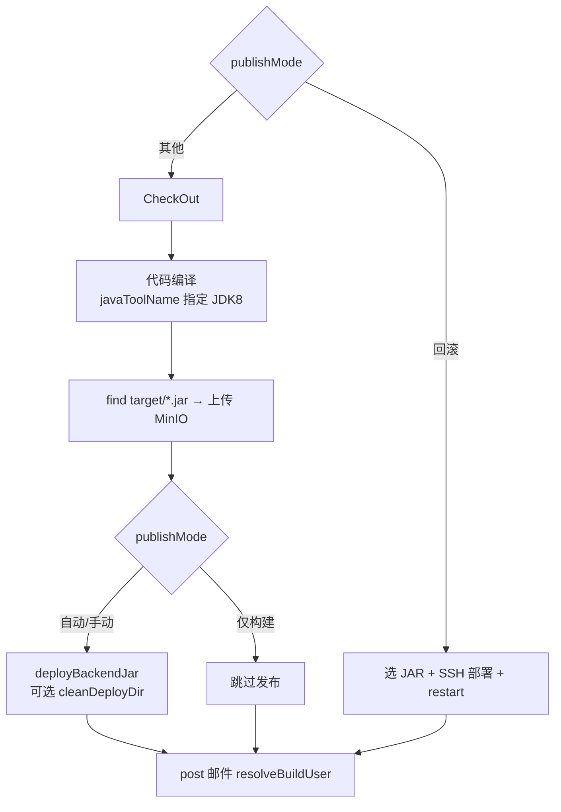
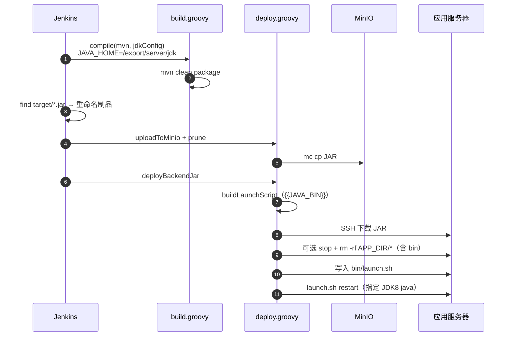

# 企业级后端部署方案：Jenkins + MinIO + SSH + Gitee + Jenkinsfile 自动化实践

> 本文档基于 `backend.jenkinsfile` 及共享库 `jenkinslib` 编写，描述 **Java / Python / Golang** 后端从编译、制品入库、多机 SSH 部署（launch.sh 模板/自定义、运行时指定、目录清理）到回滚的完整 CI/CD 流程。  
> 流水线文件托管于 [jenkinsfile-new](https://gitee.com/wxd_ops/jenkinsfile-new) 仓库，Job 通过 **Pipeline script from SCM** 引用 `./backend.jenkinsfile`。  
> **Jenkins 安装、Gitee SSH、MinIO/mc、目标机 SSH 四条链路** 请先完成 [《企业级前端部署方案》](./《企业级前端部署方案：Jenkins+MinIO+SSH+Gitee+Jenkinsfile自动化实践》.md) 第四～八节，本文从后端 Job 配置起笔。

**文档导航：** [快速上手](#快速上手5-分钟) · [四B、Python/Golang](#四bpython-与-golang-服务) · [五、启动脚本](#五启动脚本) · [Golang 自定义脚本](#golang-自定义脚本yunshu-示例) · [七、分支选择 Active Choices](#分支选择自动从仓库获取) · [十一、排错](#十一排错手册)

---

## 快速上手（5 分钟）

**前置：** Jenkins Global Tool 已配置 `mvn`（`/export/maven/`）、`jdk8`（`/export/server/jdk`）；凭据 `gitee_registry_ssh`、`minio-credentials`、`target-server-credential` 已就绪；MinIO 桶 `backend-artifacts` 与 mc 别名已配置。


| 步骤  | 操作                                                                                           |
| --- | -------------------------------------------------------------------------------------------- |
| 1   | 新建 **Pipeline** Job（勿选 Maven 项目），SCM → `jenkinsfile-new`，Script Path = `backend.jenkinsfile` |
| 2   | 勾选 **参数化构建**，按 [7.3 节](#73-参数化构建完整) 添加参数；或复制前端 Job 后按 [7.6 节](#76-从复制前端-job-创建后端-job) 改造     |
| 3   | 首次构建选 `publishMode=仅构建`，确认 MinIO 出现 `{projectName}/{projectName}-*.{jar|tar.gz|bin}`         |
| 4   | 改 `publishMode=自动发布`，`cleanDeployDir=true`，触发构建                                              |
| 5   | 目标机验证：`ps -ef | grep java`，java 路径应为 `/export/server/jdk/bin/java`                           |


**springboot-demo 推荐参数（可直接对照填写）：**


| 参数                      | 推荐值                                           |
| ----------------------- | --------------------------------------------- |
| `Tenv`                  | dev                                           |
| `publishMode`           | 自动发布（首次建议 仅构建）                                |
| `SrcURL`                | `git@gitee.com:wxd_ops/springboot-demo.git`   |
| `branchName`            | **Active Choices**（见 [分支选择](#分支选择自动从仓库获取)） |
| `projectName`           | springboot-demo                               |
| `buildType`             | mvn                                           |
| `buildshell`            | clean package -DskipTests                     |
| `buildPath`             | target                                        |
| `destPath`              | `/export/icity/springboot-demo`               |
| `destIp`                | `10.10.10.103`（多台逗号分隔；非 22 端口写 `host:2222`）   |
| `javaToolName`          | jdk8                                          |
| `serverPort`            | 8088                                          |
| `runUser`               | root（或 app/backend，须存在且有 sudo）                |
| `startScriptType`       | 脚本模板                                          |
| `cleanDeployDir`        | true                                          |
| `artifactRetainCount`   | 1                                             |
| `JVM_OPTS`              | 见 [5.5 节](#55-通用-jvm_optsjava-8--spring-boot) |
| `SSH_KEY_CREDENTIAL_ID` | target-server-credential                      |
| `MINIO_BUCKET`          | backend-artifacts                             |


---

## 一、方案架构

### 1.1 组件说明


| 组件               | 角色    | 说明                                             |
| ---------------- | ----- | ---------------------------------------------- |
| Gitee            | 代码仓库  | 业务 Java 项目 + 共享库 + Jenkinsfile                 |
| Jenkins (master) | CI/CD | Java/Python/Go 编译、上传 MinIO、SSH 部署、launch.sh 重启 |
| MinIO            | 制品仓库  | 版本化 JAR（`backend-artifacts` 桶），自动清理超额历史包       |
| 应用服务器            | 运行节点  | SSH 拉 JAR + 生成 `bin/launch.sh` + restart       |
| Apollo（可选）       | 配置中心  | 脚本模板模式注入 JVM / Apollo 参数                       |


### 1.2 仓库规划


| Gitee 仓库                          | 用途        | Jenkins 引用                                                  |
| --------------------------------- | --------- | ----------------------------------------------------------- |
| `wxd_ops/jenkins_share_libraries` | 共享库       | Global Pipeline Libraries（名称与 `@Library` 一致，如 `jenkinslib`） |
| `wxd_ops/jenkinsfile-new`         | 流水线文件     | SCM → `backend.jenkinsfile`                                 |
| `wxd_ops/springboot-demo`（示例）     | Java 业务代码 | Job 参数 `SrcURL`                                             |


### 1.3 服务器规划（实践示例）


| IP / 主机                         | 部署组件                        | 说明       |
| ------------------------------- | --------------------------- | -------- |
| `10.10.10.103`（k8s-master）      | Jenkins、JDK8、Maven、MinIO、mc | 构建与制品存储  |
| `/export/icity/springboot-demo` | 后端应用目录                      | 部署目标路径示例 |


> 文档以 `10.10.10.103`、`backend-artifacts` 桶为例；可按实际环境替换 IP 与路径。

### 1.4 实践示例（springboot-demo）


| 项           | 示例值                                                                   |
| ----------- | --------------------------------------------------------------------- |
| 业务仓库        | `git@gitee.com:wxd_ops/springboot-demo.git`                           |
| JAR 路径      | `target/springboot-demo-1.0.0.jar`（Maven 构建后）                         |
| MinIO 路径    | `backend-artifacts/springboot-demo/springboot-demo-{时间}-{commit}.jar` |
| 部署目录        | `/export/icity/springboot-demo`                                       |
| Global Tool | Maven 名 `mvn`（`/export/maven/`），JDK 名 `jdk8`（`/export/server/jdk`）    |


### 1.5 目标机目录结构

**日常部署（`cleanDeployDir=false`，保留 N 个 JAR）：**

```text
{destPath}/
├── springboot-demo-20260624_000719-e620ddb.jar   # 当前 + 历史 JAR（最多 N 个）
└── bin/
    └── launch.sh                                  # start / stop / restart
```

**全量清理部署（`cleanDeployDir=true`）：**

部署前 `stop` → `rm -rf {destPath}/`*（**含 bin**），再重新下载 JAR 并生成 launch.sh，目录内仅保留最新制品。

### 1.6 流水线与共享库


| 文件                                            | 说明                                                           |
| --------------------------------------------- | ------------------------------------------------------------ |
| `backend.jenkinsfile`                         | 后端流水线入口（约 190 行）                                             |
| `pipeline.groovy`                             | checkout、发布门禁、回滚选版                                           |
| `build.groovy`                                | `compileBackend()`：mvn/gradle/python/golang                  |
| `deploy.groovy`                               | MinIO 上传/清理、SSH 部署、多语言 launch 脚本                             |
| `resources/backend-launch-template.sh`        | Java 默认 bash 启动脚本                                            |
| `resources/backend-launch-python-template.sh` | Python 启动脚本（`{{APP_CMD}}`）                                   |
| `resources/backend-launch-golang-template.sh` | Golang 二进制启动脚本                                               |
| `tools.groovy`                                | `resolveJdkHome`、`resolveBuildUser`、`normalizePublishMode` 等 |
| `notification.groovy`                         | 合并邮件                                                         |
| `config.groovy`                               | 凭据、MinIO、mc 路径、默认保留数                                         |


---

## 二、发布模式（publishMode）


| publishMode | 行为                       |
| ----------- | ------------------------ |
| `自动发布`（默认）  | 构建上传后自动 SSH 部署 + restart |
| `手动发布`      | input 确认后部署              |
| `仅构建`       | 仅上传 MinIO，不 SSH 部署       |
| `回滚`        | 跳过编译，从 MinIO 选历史 JAR 部署  |





---

## 三、时序图（自动发布）




---

## 四、JDK 与 Maven（编译 + 运行）

### 4.1 两阶段、同一套配置


| 阶段           | 控制方式                                                                   | 示例                            |
| ------------ | ---------------------------------------------------------------------- | ----------------------------- |
| **Maven 编译** | Job 参数 `javaToolName` → `build.compile(..., jdkConfig)` 设置 `JAVA_HOME` | `jdk8` → `/export/server/jdk` |
| **服务启动**     | 同上 → `launch.sh` 中 `{{JAVA_BIN}}`                                      | `/export/server/jdk/bin/java` |


> **注意：** `tool('jdk8')` 必须在 `agent { label 'master' }` 内调用（`resolveRuntimeJavaBin` 在 stage 内执行），不可在 `pipeline {}` 外解析。

### 4.2 Global Tool Configuration


| 工具名    | 类型    | 路径（示例）               | Job 参数对应            |
| ------ | ----- | -------------------- | ------------------- |
| `mvn`  | Maven | `/export/maven/`     | `buildType=mvn`     |
| `jdk8` | JDK   | `/export/server/jdk` | `javaToolName=jdk8` |


### 4.3 Job 参数


| 参数             | 示例                   | 说明                                     |
| -------------- | -------------------- | -------------------------------------- |
| `javaToolName` | `jdk8`               | **推荐**，与 Global Tool JDK 名称一致          |
| `javaHome`     | `/export/server/jdk` | 备选，直接填 JDK 根目录（与 `javaToolName` 二选一即可） |


未配置时：编译用节点默认 `java`（可能是 JDK 21），启动用目标机 PATH 默认 `java`。

### 4.4 编译日志确认

构建时在 **代码编译** 阶段查看：

```text
编译 JDK: /export/server/jdk
=== 编译 JDK / 构建工具 ===
JAVA_HOME=/export/server/jdk
java version "1.8.0_xxx"
Apache Maven 3.x.x
Java version: 1.8.0_xxx, vendor: ...
```

### 4.5 运行时确认

```shell
ps -ef | grep springboot-demo
ls -l /proc/$(pgrep -f springboot-demo)/exe
# 应指向 /export/server/jdk/bin/java，而非 /opt/jdk-21/bin/java
curl -s http://127.0.0.1:8088/actuator/health   # 若开启 actuator
```

### 4.6 版本匹配建议


| Spring Boot | 编译 JDK     | 运行 JDK                |
| ----------- | ---------- | --------------------- |
| 2.x         | JDK 8 / 11 | ≥ 8                   |
| 3.x         | JDK 17+    | ≥ 17，**不能用 JDK 8 启动** |


---

## 四B、Python 与 Golang 服务

流水线通过 `buildType`（或显式 `serviceType`）区分服务类型，`compileBackend()` 统一入口。

### 服务类型识别


| buildType        | serviceType（可选） | 制品格式      | 默认 buildPath |
| ---------------- | --------------- | --------- | ------------ |
| `mvn` / `gradle` | `java` 或 自动     | `.jar`    | `target`     |
| `python`         | `python` 或 自动   | `.tar.gz` | `dist`       |
| `golang` / `go`  | `golang` 或 自动   | `.bin`    | `bin`        |


> `serviceType=自动` 时由 `buildType` 推断；二者冲突时以 `serviceType` 为准。

### Global Tool（Python / Go）


| 工具名       | 类型     | Job 参数                   | 说明                              |
| --------- | ------ | ------------------------ | ------------------------------- |
| `python3` | Python | `pythonToolName=python3` | 编译 pip 安装 + 运行 `{{PYTHON_BIN}}` |
| `go`      | Go     | `goToolName=go`          | `go build`，默认 `CGO_ENABLED=0`   |


### Python 推荐参数


| 参数               | 示例                                                          |
| ---------------- | ----------------------------------------------------------- |
| `buildType`      | python                                                      |
| `buildshell`     | `tar czf dist/app.tar.gz --exclude=venv .`（留空则自动打包 tar.gz）  |
| `buildPath`      | dist                                                        |
| `appCmd`         | `gunicorn -w 4 -b 0.0.0.0:8088 app:app` 或 `python3 main.py` |
| `pythonToolName` | python3                                                     |
| `serverPort`     | 8088（自动注入 `PORT=8088` 到 `RUN_OPTS`）                         |
| `RUN_OPTS`       | 额外环境变量，如 `FLASK_ENV=production`                             |


**部署流程：** MinIO 下载 tar.gz → 目标机解压到 `destPath` → `launch.sh restart` 执行 `appCmd`。

### Golang 推荐参数

本地开发若为 `go run . server`，CI/CD 中 **编译** 用 `go build`，**运行** 用 `./二进制 server`（等价行为）。

**yunshu 示例：**


| 参数           | 值                                              |
| ------------ | ---------------------------------------------- |
| `buildType`  | golang                                         |
| `buildshell` | `build -o bin/yunshu .`                        |
| `buildPath`  | bin                                            |
| `appCmd`     | `server`（对应 `go run . server` 里的 `server` 子命令） |
| `RUN_OPTS`   | `--config configs/config.yaml`                 |
| `packConfigPaths` | `configs`（留空时若仓库存在 `configs/` 会自动打包） |
| `goToolName` | go                                             |


目标机 `launch.sh` 实际执行（含配置打包时）：

```bash
cd /export/icity/yunshu
nohup ./yunshu server --config configs/config.yaml >> app.log 2>&1 &
```

说明：仓库里已有 `configs/config.yaml` 时，**无需在目标机手建配置**。构建阶段会把二进制 + `configs/` 打成 `tar.gz` 上传 MinIO，部署时解压到 `destPath`，二进制固定名为 `{projectName}`（如 `yunshu`）。

**无配置文件的项目：** `RUN_OPTS` 留空即可；若仓库没有 `configs/` 目录则不会打 tar.gz（仅上传 `.bin`）。若程序无 `server` 等子命令，需注意流水线默认 `appCmd=server`（见 [四B 节参数表](#新增-job-参数)）。


| 参数                | 示例                                                |
| ----------------- | ------------------------------------------------- |
| `buildType`       | golang                                            |
| `buildshell`      | `build -o bin/myapp .`（留空默认 `build -o bin/app .`） |
| `buildPath`       | bin                                               |
| `appCmd`          | `server`（子命令，默认 `server`）                         |
| `artifactPattern` | `myapp`（可选，精确匹配二进制文件名）                            |
| `goToolName`      | go                                                |
| `RUN_OPTS`        | 传给二进制的额外参数                                        |
| `packConfigPaths` | 随制品打包的目录，逗号分隔（如 `configs`）；留空且仓库有 `configs/` 时自动打包 |


**部署流程：** MinIO 下载 `tar.gz`（含配置）或 `.bin` → 解压/`chmod +x` → `launch.sh restart` → `./{projectName} {appCmd} {RUN_OPTS}` |

需自定义启停（pid 文件、status、额外检查）时，见 [5.2 Golang 自定义脚本](#golang-自定义脚本yunshu-示例)。

### 新增 Job 参数


| 参数名               | 说明                                             |
| ----------------- | ---------------------------------------------- |
| `serviceType`     | 自动 / java / python / golang                    |
| `pythonToolName`  | Python Global Tool 名，默认 `python3`              |
| `goToolName`      | Go Global Tool 名，默认 `go`                       |
| `appCmd`          | Python 启动命令；Golang 子命令（如 `server`，默认 `server`） |
| `RUN_OPTS`        | Python/Go 运行时环境变量或额外参数                         |
| `artifactPattern` | 制品文件名 glob，覆盖默认 find 规则                        |
| `packConfigPaths` | Golang：随制品打包的目录（如 `configs`），留空则自动检测 `configs/` |


---

## 五、启动脚本

### 5.1 脚本模板模式（startScriptType=脚本模板）

共享库 `backend-launch-template.sh`，支持 `start` / `stop` / `restart`。

**停服逻辑**：按应用目录 `${app_dir}` 匹配 Java 进程，避免换 JAR 后旧进程停不掉。

```bash
find_pid() {
  ps -ef | grep java | grep "${app_dir}/" | grep -v grep | awk '{print $2}' | head -1
}
```

**启动命令（含指定 JDK + Apollo）：**

```bash
nohup ${java_bin} ${jvm_opts} \
  -Denv=${apollo_env} -Dapollo.meta=${apollo_meta} \
  -Dapollo.bootstrap.namespaces=${apollo_namespaces} \
  -jar ${jar_path} >> ${app_dir}/${log_path} 2>&1 &
```

不使用 Apollo 时，模板仍会注入默认 Apollo 参数；纯 Spring Boot 演示项目可保持默认或改用 [5.2 自定义脚本](#52-自定义脚本模式startscripttype自定义脚本)。

### 5.2 自定义脚本模式（startScriptType=自定义脚本）

通过 Job **多行文本参数** `customScriptContent` 传入整段 launch 脚本（**不再支持文件上传参数**）。


| 配置项          | 说明                                             |
| ------------ | ---------------------------------------------- |
| Jenkins 参数类型 | **Multi-line String**（或 Extended Choice 多行文本）  |
| 参数名          | 必须为 `customScriptContent`                      |
| 必填条件         | `startScriptType=自定义脚本` 时不能为空                  |
| 部署结果         | 写入目标机 `{destPath}/bin/launch.sh` 并执行 `restart` |


**校验失败提示：**

```text
自定义脚本模式：请填写 customScriptContent 文本内容
```

**springboot-demo 简化示例（无 Apollo，可直接粘贴到 `customScriptContent`）：**

```bash
#!/bin/bash
source /etc/profile

jvm_opts="{{JVM_OPTS}}"
java_bin="{{JAVA_BIN}}"
project_name="{{PRONAME}}"
binfile_path=$(dirname $0)
app_dir=$(cd ${binfile_path}/.. ; pwd)
log_path=${project_name}-$(date +%Y%m%d%H%M%S).log
jar_name="{{JARNAME}}"
jar_path=${app_dir}/${jar_name}

find_pid() {
  ps -ef | grep java | grep "${app_dir}/" | grep -v grep | awk '{print $2}' | head -1
}

stop() {
  pid=$(find_pid)
  [ -z "$pid" ] && echo "程序未启动." && return 0
  kill -15 $pid
  for i in $(seq 1 15); do
    pid=$(find_pid)
    [ -z "$pid" ] && echo "程序已停止。" && return 0
    sleep 1
  done
  pid=$(find_pid)
  [ -n "$pid" ] && kill -9 $pid
  echo "程序已停止。"
}

start() {
  pid=$(find_pid)
  [ -n "$pid" ] && echo "已在运行 pid=${pid}" && return 0
  echo "启动：${project_name} | Java：${java_bin}"
  nohup ${java_bin} ${jvm_opts} -jar ${jar_path} >> ${app_dir}/${log_path} 2>&1 &
  echo "启动完成，日志：${app_dir}/${log_path}"
}

restart() { stop; sleep 2; start; }

case "$1" in
  start|stop|restart) $1 ;;
  *) echo "Usage: $0 {start|stop|restart}"; exit 1 ;;
esac
```

#### Golang 自定义脚本（yunshu 示例）

适用：`buildType=golang`，需自定义启停逻辑（健康检查、环境变量、与模板不同的日志路径等）。Job 设 `startScriptType=自定义脚本`，将下方脚本粘贴到 **`customScriptContent`**（Multi-line String）。

**配套 Job 参数（yunshu）：**

| 参数 | 值 |
|------|-----|
| `buildType` | golang |
| `buildshell` | `build -o bin/yunshu .` |
| `buildPath` | bin |
| `appCmd` | `server` |
| `RUN_OPTS` | `--config configs/config.yaml` |
| `packConfigPaths` | `configs`（或留空自动检测 `configs/`） |
| `startScriptType` | **自定义脚本** |
| `cleanDeployDir` | false（首次可保留；全量清理会删 configs） |

> 打包 configs 时，部署解压后二进制名为 `{projectName}`（如 `yunshu`），占位符 `{{BINARY_NAME}}` 会自动替换为 `yunshu`，**不要**写死带时间戳的 `.bin` 文件名。

**yunshu 自定义 launch 脚本（可直接粘贴）：**

```bash
#!/bin/bash
source /etc/profile

run_opts="{{RUN_OPTS}}"
app_args="{{APP_CMD}}"
binary_name="{{BINARY_NAME}}"
project_name="{{PRONAME}}"
binfile_path=$(dirname $0)
app_dir=$(cd ${binfile_path}/.. ; pwd)
log_path=${project_name}-$(date +%Y%m%d%H%M%S).log
binary_path=${app_dir}/${binary_name}
pid_file=${app_dir}/${project_name}.pid

find_pid() {
  if [ -f "${pid_file}" ]; then
    local fpid
    fpid=$(cat "${pid_file}" 2>/dev/null)
    if [ -n "${fpid}" ] && kill -0 "${fpid}" 2>/dev/null; then
      echo "${fpid}"
      return 0
    fi
  fi
  ps -ef | grep -F "${binary_path}" | grep -v grep | awk -v self="$$" '$2 != self {print $2; exit}'
}

stop() {
  echo "正在停止 ${project_name}..."
  pid=$(find_pid)
  if [ -z "$pid" ]; then
    echo "程序未启动."
    rm -f "${pid_file}"
    return 0
  fi
  echo "kill -15 $pid"
  kill -15 $pid
  for i in $(seq 1 15); do
    pid=$(find_pid)
    if [ -z "$pid" ]; then
      echo "程序已停止。"
      rm -f "${pid_file}"
      return 0
    fi
    sleep 1
  done
  pid=$(find_pid)
  if [ -n "$pid" ]; then
    echo "[${project_name}] force kill $pid"
    kill -9 $pid
  fi
  rm -f "${pid_file}"
  echo "程序已停止。"
}

start() {
  pid=$(find_pid)
  if [ -n "$pid" ]; then
    echo "${project_name} is already running. pid=${pid}"
    return 0
  fi
  if [ ! -x "${binary_path}" ]; then
    chmod +x "${binary_path}" 2>/dev/null || true
  fi
  if [ ! -f "${binary_path}" ]; then
    echo "二进制不存在: ${binary_path}"
    exit 1
  fi
  cd ${app_dir}
  echo "启动：${project_name} | 目录：${app_dir} | 命令：${binary_path} ${app_args} ${run_opts}"
  nohup ${binary_path} ${app_args} ${run_opts} >> ${app_dir}/${log_path} 2>&1 &
  echo $! > "${pid_file}"
  sleep 1
  pid=$(find_pid)
  if [ -n "$pid" ]; then
    echo "启动成功 pid=${pid}，日志：${app_dir}/${log_path}"
  else
    echo "启动可能失败，请查看：${app_dir}/${log_path}"
    exit 1
  fi
}

restart() {
  stop
  sleep 2
  start
}

case "$1" in
  start)   start ;;
  stop)    stop ;;
  restart) restart ;;
  status)
    pid=$(find_pid)
    if [ -n "$pid" ]; then echo "running pid=${pid}"; else echo "stopped"; fi
    ;;
  *)
    echo "Usage: $0 {start|stop|restart|status}"
    exit 1
    ;;
esac
```

目标机等价命令：

```bash
cd /export/icity/yunshu
./yunshu server --config configs/config.yaml
```

与模板模式差异：增加了 **pid 文件**、**status 子命令**、启动后 **1 秒存活检查**；可按项目自行扩展（如 `ulimit`、前置检查 configs 是否存在）。

#### Golang 自定义脚本（无 configs / 无子命令）

无配置文件、直接 `./myapp` 运行时，Job 参数示例：

| 参数 | 值 |
|------|-----|
| `appCmd` | 留空（若流水线仍补成 `server`，可在脚本里写死 `app_args=""`） |
| `RUN_OPTS` | 留空 |
| `packConfigPaths` | 留空 |

脚本可将 `app_args`、`run_opts` 留空，或删掉 `{{APP_CMD}}` 行，仅保留：

```bash
nohup ${binary_path} ${run_opts} >> ${app_dir}/${log_path} 2>&1 &
```

### 5.3 占位符说明

部署时 `deploy.groovy` 的 `applyLaunchPlaceholders` 会替换下列占位符（模板模式与自定义模式均适用）：


| 占位符                     | 来源                                        | 示例                                            |
| ----------------------- | ----------------------------------------- | --------------------------------------------- |
| `{{JAVA_BIN}}`          | `javaToolName` / `javaHome`               | `/export/server/jdk/bin/java`                 |
| `{{JVM_OPTS}}`          | Job 参数 `JVM_OPTS`（含 `serverPort` 追加）      | `-server -Xmx1024m ... -Dserver.port=8088`    |
| `{{JARNAME}}`           | 本次部署 JAR 文件名                              | `springboot-demo-20260624_120000-abc1234.jar` |
| `{{PRONAME}}`           | `projectName`                             | `springboot-demo`                             |
| `{{APOLLO_ENV}}`        | `APOLLO_ENV`                              | `PRO`                                         |
| `{{APOLLO_META}}`       | `APOLLO_META`                             | `http://apollo-eurka-service/`                |
| `{{APOLLO_NAMESPACES}}` | `APOLLO_NAMESPACES`                       | 逗号分隔 namespace 列表                             |
| `{{PYTHON_BIN}}`        | `pythonToolName`                          | `/export/server/python3/bin/python3`          |
| `{{APP_CMD}}`           | `appCmd`                                  | `gunicorn -w 4 app:app`                       |
| `{{RUN_OPTS}}`          | `RUN_OPTS` + `serverPort`（Python 注入 PORT） | `PORT=8088`                                   |
| `{{BINARY_NAME}}`       | Golang：`launchBinaryName`（打包 configs 时为 `projectName`）；否则为制品文件名 | `yunshu` 或 `myapp-20260624_120000-abc.bin` |
| `{{ARTIFACT_NAME}}`     | 同 `{{JARNAME}}`                           | 通用制品名                                         |


> 占位符须保持 `{{大写}}` 格式；脚本中勿硬编码 JAR 名或 java 路径，便于回滚换包时自动生效。

### 5.4 启动用户（runUser）

```bash
chown -R ${runUser} ${destPath}
sudo -u ${runUser} bash bin/launch.sh restart
```

目标机须存在 `runUser`（如 `backend`、`app`、`root`），非 root 启动时 SSH 用户需有 sudo 权限。

### 5.5 服务端口（serverPort）


| 方式     | Job 参数                             | 效果                                                          |
| ------ | ---------------------------------- | ----------------------------------------------------------- |
| **推荐** | `serverPort=8088`                  | 自动追加 `-Dserver.port=8088`（若 `JVM_OPTS` 中尚未包含 `server.port`） |
| 备选     | `JVM_OPTS` 中含 `-Dserver.port=8088` | 同上，无需再填 `serverPort`                                        |


### 5.6 通用 JVM_OPTS（Java 8 + Spring Boot）

**流水线默认值**（未填 `JVM_OPTS` 时）：

```text
-server -Xss256K -Xmx1024m -Xms1024m -Xmn1024m -XX:MetaspaceSize=256m -XX:MaxMetaspaceSize=256m
```

**生产推荐（1G 堆 + G1 + OOM Dump）：**

```text
-server -Xms1024m -Xmx1024m -Xss512k -XX:MetaspaceSize=256m -XX:MaxMetaspaceSize=256m -XX:+UseG1GC -XX:MaxGCPauseMillis=200 -XX:+HeapDumpOnOutOfMemoryError -XX:HeapDumpPath=/tmp -Dfile.encoding=UTF-8 -Duser.timezone=Asia/Shanghai
```

**轻量版（512M，演示/开发）：**

```text
-server -Xms512m -Xmx512m -Xss512k -XX:MetaspaceSize=128m -XX:MaxMetaspaceSize=256m -XX:+UseG1GC -Dfile.encoding=UTF-8 -Duser.timezone=Asia/Shanghai
```

Apollo 相关（`-Denv`、`-Dapollo.meta` 等）由 launch 模板单独注入；自定义脚本若不需要 Apollo，不必写入 `JVM_OPTS`。

---

## 六、部署目录清理

### 6.1 行为对比


| 模式       | 参数                                             | 部署前                                   | 部署后 JAR 数                    |
| -------- | ---------------------------------------------- | ------------------------------------- | ---------------------------- |
| 保留多版本    | `cleanDeployDir=false`，`artifactRetainCount=5` | 删 `*.log`                             | 最多 5 个 `{projectName}-*.jar` |
| 仅留最新     | `cleanDeployDir=false`，`artifactRetainCount=1` | 删 `*.log`                             | 1 个 JAR                      |
| **全量清理** | `cleanDeployDir=true`                          | stop → `rm -rf destPath/`*（**含 bin**） | 1 个 JAR + 新 launch.sh        |


目标机 JAR 保留：`artifactRetainCount≤0` 时按 **1** 处理；MinIO 侧 `retainCount≤0` 时不 prune。

### 6.2 推荐生产配置


| 参数                    | 建议值                        |
| --------------------- | -------------------------- |
| `cleanDeployDir`      | `true`（每次干净部署）             |
| `artifactRetainCount` | `1`（本地只留最新；回滚靠 MinIO 历史制品） |


回滚仍从 MinIO 选择历史 JAR，不依赖目标机本地旧文件。

---

## 七、Jenkins 配置

### 7.1 Job 类型


| 选项               | 说明                                   |
| ---------------- | ------------------------------------ |
| **流水线 Pipeline** | ✅ 必须选这个                              |
| Maven 项目         | ❌ 不支持共享库、MinIO、launch.sh、publishMode |


### 7.2 Pipeline SCM


| 配置项         | 值                                           |
| ----------- | ------------------------------------------- |
| Definition  | Pipeline script from SCM                    |
| 仓库          | `git@gitee.com:wxd_ops/jenkinsfile-new.git` |
| Script Path | `backend.jenkinsfile`                       |
| 凭据          | `gitee_registry_ssh`                        |


### 7.3 参数化构建（完整）

#### 基础参数


| 参数名           | 类型                                 | 示例                                          | 说明        |
| ------------- | ---------------------------------- | ------------------------------------------- | --------- |
| `Tenv`        | Choice                             | dev / test / prod                           | 环境（邮件标题）  |
| `publishMode` | Choice                             | 自动发布 / 手动发布 / 仅构建 / 回滚                      | **必配**    |
| `SrcURL`      | String                             | `git@gitee.com:wxd_ops/springboot-demo.git` | 业务仓库 SSH  |
| `branchName`  | **Active Choices** / Git Parameter | 自动列出远程分支                                    | 见下方「分支选择」 |


#### 分支选择（自动从仓库获取）

> **背景：** Job 使用 **Pipeline script from SCM**（只拉 `jenkinsfile-new`），**Git Parameter 看不到业务仓** `SrcURL` 的分支——插件不会在参数页单独配 Repository URL + Credentials（见 [git-parameter-plugin#330](https://github.com/jenkinsci/git-parameter-plugin/issues/330)）。  
> 流水线已通过 `tools.resolveBranchName()` 兼容 Active Choices / Git Parameter / String，**只需在 Job 参数页配置 `branchName`**。

##### 方案选型

| 场景 | 推荐参数类型 | 说明 |
|------|-------------|------|
| **一个 Job 固定一个业务仓**（yunshu、springboot-demo 等，**推荐**） | **Active Choices Parameter**（非 Reactive） | 最稳，首屏即可出分支列表 |
| 同一 Job 经常更换 `SrcURL` | **Active Choices Reactive Parameter** | Referenced parameters = `SrcURL`，且 `branchName` **必须紧挨在 `SrcURL` 下一行** |
| 不想装插件 | String / Choice 手工维护 | 默认值填 `main` |

##### 通用配置（两种 Active Choices 均适用）

1. 安装插件：**Active Choices**（Uno-Choice）
2. 删除 Job 里原有的 Git Parameter `branchName`（若有）
3. 参数配置：

| 字段 | 值 |
|------|-----|
| Name | `branchName` |
| Choice Type | **Single Select** |
| Script | Groovy Script（见下方「标准脚本」） |
| Fallback Script | `return ['main']` |
| Use Groovy Sandbox | **主脚本与 Fallback 均取消勾选** |

4. **Manage Jenkins → In-process Script Approval**：批准脚本中涉及的 `CredentialsProvider`、`ProcessBuilder` 等签名
5. 拉分支使用凭据 **`gitee_registry_ssh`**（与 `SSH_KEY_CREDENTIAL_ID` 部署凭据无关）

##### 标准 Groovy 脚本

将 `DEFAULT_REPO` 改成 **与本 Job 的 `SrcURL` 默认值完全一致**（后端 yunshu 示例已填好）：

```groovy
import com.cloudbees.plugins.credentials.CredentialsProvider
import com.cloudbees.jenkins.plugins.sshcredentials.impl.BasicSSHUserPrivateKey
import jenkins.model.Jenkins

def DEFAULT_REPO = 'git@gitee.com:wxd_ops/yunshu.git'

def repo = DEFAULT_REPO
try {
    def s = binding.hasVariable('SrcURL') ? binding.getVariable('SrcURL') : null
    if (s?.toString()?.trim() && s.toString().trim() != 'null') {
        repo = s.toString().trim()
    }
} catch (ignored) {}

def cred = CredentialsProvider.lookupCredentials(
    BasicSSHUserPrivateKey.class, Jenkins.instance, null, null
).find { it.id == 'gitee_registry_ssh' }
if (!cred) {
    return ['main']
}

def keyFile = File.createTempFile('jgit', '.key')
keyFile.deleteOnExit()
keyFile.text = cred.privateKey
['chmod', '600', keyFile.absolutePath].execute().waitForOrKill(5000)

try {
    def pb = new ProcessBuilder('git', 'ls-remote', '--heads', repo)
    pb.redirectErrorStream(true)
    pb.environment().put('GIT_SSH_COMMAND',
        "ssh -i ${keyFile.absolutePath} -o StrictHostKeyChecking=accept-new -o BatchMode=yes")
    def proc = pb.start()
    def output = proc.inputStream.text
    proc.waitFor()

    def branches = output.readLines().collect { line ->
        def parts = line.tokenize()
        if (parts.size() >= 2 && parts[1].startsWith('refs/heads/')) {
            return parts[1].substring('refs/heads/'.length())
        }
        return null
    }.findAll { it }

    return branches ? branches.sort() : ['main']
} catch (Exception e) {
    return ['main']
} finally {
    keyFile.delete()
}
```

**脚本要点：**

- 不用 `"""..."""` + `awk '{print $2}'`（Groovy 会报 `illegal string body character after dollar sign`）
- 不用 `bash | sed` 管道，直接用 `git ls-remote` + Groovy 解析，避免空返回
- 临时私钥必须 **`chmod 600`**
- 首屏 Reactive 常读不到 `SrcURL`，靠 **`DEFAULT_REPO` 兜底**；**不要** `return ['请先填写 SrcURL']`（会导致下拉异常）
- 任何失败至少返回 `['main']`，避免下拉空白

##### 方案 A（推荐）：Active Choices Parameter — 固定业务仓

适用于 yunshu、springboot-demo 等 **SrcURL 不变** 的后端 Job：

1. Add Parameter → **Active Choices Parameter**（**非** Reactive）
2. **`branchName` 紧挨在 `SrcURL` 下面**（参数顺序：`SrcURL` → `branchName` → 其余）
3. 粘贴上方「标准脚本」，`DEFAULT_REPO` 与 Job 的 `SrcURL` 默认一致
4. Fallback：`return ['main']`

保存后 Build with Parameters 应列出 `main`、`prod0260423` 等。

##### 方案 B：Active Choices Reactive — 随 SrcURL 变化

仅当 **同一 Job 需切换多个业务仓** 时使用：

| 字段 | 值 |
|------|-----|
| 参数类型 | **Active Choices Reactive Parameter** |
| Referenced parameters | `SrcURL` |
| 其余 | 与方案 A 相同（脚本、Fallback、Sandbox） |

**注意：** `branchName` 必须紧挨 `SrcURL` 下方；修改 `SrcURL` 后点击输入框再 Tab 可触发刷新。

##### 排错三步法

| 步骤 | 操作 | 预期 |
|------|------|------|
| 1 | 主 Script 临时改为 `return ['main', 'develop', 'test']` | 下拉有 3 项 → 参数类型/Sandbox 正常；仍空白 → 检查 Choice Type 是否为 Single Select |
| 2 | 恢复标准脚本，Jenkins 服务器执行：`sudo su - jenkins` → `git ls-remote --heads <SrcURL>` | 能列分支 → 脚本/凭据问题；不能 → Gitee SSH 公钥 |
| 3 | 查 **In-process Script Approval**、确认 `gitee_registry_ssh` ID、Fallback 已填 | — |

##### 方案 C：Git Parameter（不推荐）

须在 Jenkinsfile 里 `properties { parameters { gitParameter(...) } }` 声明业务仓库；「高级 → 已选仓库」填正则如 `.*yunshu\.git`，**不要**填 `git clone ...`。

##### 方案 D：String / Choice 手工维护

分支少、不想装 Active Choices 时，String 默认值填 `main`。

---

#### 构建与部署


| 参数名 | 类型 | 示例 | 说明 |
|--------|------|------|------|
| `projectName` | String | `springboot-demo` | JAR 命名、MinIO 路径；**未填默认 JOB_NAME** |
| `buildType` | Choice | **mvn** / gradle / **python** / **golang** | 构建工具，决定服务类型 |
| `buildshell` | String | `clean package -DskipTests` | Maven/Gradle 命令参数 |
| `buildPath` | String | `target` | JAR 搜索目录；**未填默认 target** |
| `destPath` | String | `/export/icity/springboot-demo` | 目标机应用根目录 |
| `destIp` | String | `10.10.10.103` 或 `10.0.0.1:2222` | 部署 IP，逗号分隔多机 |
| `artifactRetainCount` | String | `1` | MinIO + 目标机保留 JAR 数；**未填默认 10** |
| `waitMins` | String | `60` | 手动发布 input 超时（分钟） |
| `emailUser` | String | `xxx@qq.com` | 邮件接收人 |

#### 多语言 / 运行时


| 参数名               | 类型     | 示例                          | 说明                 |
| ----------------- | ------ | --------------------------- | ------------------ |
| `serviceType`     | Choice | 自动 / java / python / golang | 显式指定服务类型           |
| `pythonToolName`  | String | python3                     | Python Global Tool |
| `goToolName`      | String | go                          | Go Global Tool     |
| `appCmd`          | String | gunicorn -w 4 app:app       | Python 启动命令        |
| `RUN_OPTS`        | String | FLASK_ENV=production        | Python/Go 运行时参数    |
| `artifactPattern` | String | myapp                       | 制品匹配模式（可选）         |
| `packConfigPaths` | String | configs                     | Golang 随制品打包的目录    |


#### JDK / 端口 / 清理


| 参数名              | 类型                | 示例                   | 说明                                 |
| ---------------- | ----------------- | -------------------- | ---------------------------------- |
| `javaToolName`   | String            | `jdk8`               | 编译 + 启动共用 JDK（Global Tool 名）       |
| `javaHome`       | String            | `/export/server/jdk` | 备选，直接指定 JDK 路径                     |
| `serverPort`     | String            | `8088`               | Spring Boot 启动端口                   |
| `cleanDeployDir` | Boolean / Choice  | `true`               | 部署前清空目录（含 bin）                     |
| `JVM_OPTS`       | Multi-line String | 见 5.6 节              | JVM 参数                             |
| `sshPort`        | String            | `22`                 | 全局 SSH 端口（`destIp` 未写 `:port` 时生效） |


#### 启动脚本 / Apollo


| 参数名                   | 类型                    | 说明                                            |
| --------------------- | --------------------- | --------------------------------------------- |
| `runUser`             | String                | 启动用户，如 `backend` / `root`；**默认 app**          |
| `startScriptType`     | Choice                | `脚本模板` / `自定义脚本`；**默认脚本模板**                   |
| `customScriptContent` | **Multi-line String** | 自定义 launch 脚本；`startScriptType=自定义脚本` 时**必填** |
| `APOLLO_ENV`          | String                | Apollo 环境，默认 `PRO`                            |
| `APOLLO_META`         | String                | Apollo Meta 地址                                |
| `APOLLO_NAMESPACES`   | String                | Apollo namespace 列表                           |


### 7.4 参数默认值速查


| 参数                    | 代码默认值                                              |
| --------------------- | -------------------------------------------------- |
| `publishMode`         | 自动发布                                               |
| `projectName`         | `JOB_NAME`                                         |
| `buildPath`           | `target`                                           |
| `runUser`             | `app`                                              |
| `startScriptType`     | 脚本模板                                               |
| `artifactRetainCount` | `10`（填 0 或负数仍按 10）                                 |
| `cleanDeployDir`      | `false`                                            |
| `waitMins`            | `60`                                               |
| `APOLLO_ENV`          | `PRO`                                              |
| `APOLLO_META`         | `http://apollo-eurka-service/`                     |
| `APOLLO_NAMESPACES`   | `bigdata.configuration,application,...`            |
| `JVM_OPTS`            | 见 [5.6 流水线默认值](#56-通用-jvm_optsjava-8--spring-boot) |
| `MINIO_BUCKET`        | `backend-artifacts`（`config.groovy`）               |


### 7.5 环境变量


| 变量                      | 示例                         | 说明                         |
| ----------------------- | -------------------------- | -------------------------- |
| `SSH_KEY_CREDENTIAL_ID` | `target-server-credential` | SSH 私钥凭据（**必配**，推荐）        |
| `MINIO_ENDPOINT`        | `http://10.10.10.103:9000` | MinIO 地址                   |
| `MINIO_BUCKET`          | `backend-artifacts`        | 制品桶                        |
| `MC_BIN`                | `/export/server/minio/mc`  | mc 路径                      |
| `SSH_PORT`              | `22`                       | 与 `sshPort` 参数等效的全局 SSH 端口 |


### 7.6 凭据

同前端：`gitee_registry_ssh`、`minio-credentials`、`target-server-credential`（SSH Username with private key）。

### 7.7 从复制前端 Job 创建后端 Job

1. 复制前端 Pipeline Job → 改 Script Path 为 `backend.jenkinsfile`
2. **删除**前端专用参数：`deployUser`、`deployGroup`、`npmInstallMode`、`cleanNpmCache`、`cleanNodeModules`
3. **新增**后端参数：`projectName`、`buildPath`、`runUser`、`startScriptType`、`customScriptContent`（Multi-line String）、`javaToolName`、`serverPort`、`cleanDeployDir`、`JVM_OPTS`、`APOLLO_`*（可选）
4. **修改**：`buildType=mvn`，`buildshell=clean package -DskipTests`，`MINIO_BUCKET=backend-artifacts`
5. **确认** Global Tool 含 `mvn`、`jdk8`，Job 参数 `javaToolName=jdk8`

---

## 八、JAR 制品说明

### 8.1 构建产物路径

Spring Boot Maven 项目默认：

```text
target/{artifactId}-{version}.jar
```

示例：`target/springboot-demo-1.0.0.jar`

流水线在 `buildPath`（默认 `target`）下 `find *.jar`，排除 `*-sources.jar`、`*-javadoc.jar`，取第一个匹配文件。

### 8.2 制品命名与 MinIO 路径

```text
本地重命名：{projectName}-{BUILD_TIME}-{GIT_COMMIT}.jar
MinIO 路径：backend-artifacts/{projectName}/{projectName}-{BUILD_TIME}-{GIT_COMMIT}.jar
```

示例：`backend-artifacts/springboot-demo/springboot-demo-20260624_153045-a1b2c3d.jar`

### 8.3 首次验证建议


| 步骤  | publishMode | 验证点                                  |
| --- | ----------- | ------------------------------------ |
| 1   | 仅构建         | 编译成功；MinIO 桶内有新 JAR                  |
| 2   | 自动发布        | SSH 日志无报错；目标机有 JAR + `bin/launch.sh` |
| 3   | —           | `ps` 中 java 为 `jdk8` 路径；端口可访问        |
| 4   | 回滚          | 能列出历史 JAR 并成功部署旧版本                   |


---

## 九、流水线阶段


| 阶段          | 条件            | 说明                                     |
| ----------- | ------------- | -------------------------------------- |
| CheckOut    | ≠ 回滚          | checkoutCode，自动去 `origin/` 前缀          |
| 代码编译        | 同上            | compile + jdkConfig；find JAR           |
| 打包并上传 MinIO | 同上            | cp + uploadToMinio + prune             |
| 发布          | auto / manual | deployBackendJar + restart             |
| 回滚          | rollback      | selectRollbackVersion（MinIO 中 `*.jar`） |
| post        | always        | resolveBuildUser + sendPost            |

**邮件规则（与前端/K8s 共用 `notification.groovy`）：** SUCCESS 且曾 `mark` 时发成功通知；**FAILURE / UNSTABLE / ABORTED 任意阶段均发告警**（CheckOut、编译失败也会邮件，`emailUser` 必填）。

构建日志 **DEPLOY_INFO** 示例：

```text
应用: springboot-demo | JAR: springboot-demo-20260624_153045-a1b2c3d.jar | Java: /export/server/jdk/bin/java | 端口: 8088 | 保留: 1个 | 用户: root | 脚本: 脚本模板
```

---

## 十、共享库 API 速查

### build.groovy

```groovy
build.compile(script, buildType, buildshell, jdkConfig)
// jdkConfig: [javaToolName: 'jdk8', javaHome: '/export/server/jdk']
```

### deploy.groovy


| 方法                                | 说明                                           |
| --------------------------------- | -------------------------------------------- |
| `uploadToMinio(..., retainCount)` | 上传 JAR 并清理 MinIO 超额制品                        |
| `deployBackendJar(...)`           | SSH 部署 + cleanDeployDir + launch.sh + JAR 保留 |
| `listMinioArtifacts(...)`         | 回滚列表（支持 `.jar`）                              |
| `buildLaunchScript`（内部）           | 模板 / customScriptContent → 占位符替换             |


### tools.groovy


| 方法                                                  | 说明                        |
| --------------------------------------------------- | ------------------------- |
| `resolveJdkHome(script, jdkConfig)`                 | 解析 JAVA_HOME（需 agent 上下文） |
| `resolveJavaBin(javaHome)`                          | 解析 java 可执行文件路径           |
| `resolveBuildUser(script)`                          | 邮件构建用户                    |
| `normalizePublishMode` / `normalizeStartScriptType` | 参数归一化                     |
| `parseServerList` / `parseServerEndpoint`           | 多机部署与 `host:port` 解析      |


---

## 十一、排错手册


| 现象                                       | 原因                                  | 处理                                                      |
| ---------------------------------------- | ----------------------------------- | ------------------------------------------------------- |
| `find null` / 未找到 JAR                    | `buildPath` 未配或 Maven 未产出 jar       | 设 `buildPath=target`；检查 `buildshell`                    |
| `cp: invalid option -- '2'`              | `projectName` 未配，制品名以 `-` 开头        | 设 `projectName=xxx`（已默认 JOB_NAME）                       |
| `Required context class Node is missing` | pipeline 外调用 `tool()`               | 已移入 stage 内 `resolveRuntimeJavaBin`                     |
| 编译用 JDK 21、想用 JDK 8                      | 未配 `javaToolName`                   | 设 `javaToolName=jdk8`                                   |
| 启动仍用 JDK 21                              | 未配 `javaToolName` 或 launch 未更新      | 同上；确认共享库含 `{{JAVA_BIN}}`                                |
| `自定义脚本模式：请填写 customScriptContent`        | 选了自定义脚本但未填内容                        | 粘贴完整脚本到 Multi-line 参数                                   |
| `ssh: No route to host`                  | destIp 网络不通                         | ping/ssh 测试；改正确 IP                                      |
| 部署目录旧 JAR/日志堆积                           | 保留策略 + 未清理                          | `cleanDeployDir=true`，`artifactRetainCount=1`           |
| 回滚列表为空                                   | MinIO 制品被 prune 或 `projectName` 不一致 | 调大 retain；确认 MinIO 路径前缀                                 |
| 双实例/端口占用                                 | 旧进程未停                               | 确认 launch.sh `find_pid` 按 app_dir；`cleanDeployDir=true` |
| sudo 失败                                  | runUser 无 sudo                      | SSH 用 root 或配置 sudoers                                  |
| 邮件构建用户 null                              | 无 BUILD_USER 插件                     | 已用 `resolveBuildUser`                                   |
| CheckOut/编译失败无邮件                         | 旧版仅 mark 后发信                       | 已修复：FAILURE 任意阶段均告警（需配 emailUser）                    |
| Groovy 沙箱报错                              | 共享库动态访问                             | Script Approval 或关闭沙箱                                   |
| Apollo 参数为 null                          | 未配 APOLLO_* 且用模板模式                  | 配 APOLLO 参数或改用无 Apollo 自定义脚本                            |
| Active Choices 下拉空白                      | 脚本异常且 Fallback 未生效 / Sandbox 拦截      | Fallback 填 `return ['main']`；取消 Sandbox；先用 `return ['main','test']` 验证 |
| Active Choices 只有 main                     | git 拉取失败或凭据错误                        | jenkins 用户执行 `git ls-remote --heads <SrcURL>`；核对 `gitee_registry_ssh` |
| branchName 显示「请先填写 SrcURL」              | Reactive 首屏未注入 SrcURL                  | 改用非 Reactive；或 `DEFAULT_REPO` 兜底；`branchName` 紧挨 `SrcURL` 下 |
| Golang 部署 exit 143                         | launch.sh stop 误杀自身                      | 共享库已修复 `find_pid` 按二进制路径匹配（`42782eb`）                      |
| Golang 找不到 configs                        | 仅部署 .bin 未打包配置                         | 设 `packConfigPaths=configs` 或仓库含 `configs/` 目录自动打包           |


---

## 十二、快速检查清单

### Jenkins 与工具

- Job 类型为 **Pipeline**，Script Path = `backend.jenkinsfile`
- Global Tool：`mvn`（`/export/maven/`）、`jdk8`（`/export/server/jdk`）
- Job 参数：`javaToolName=jdk8`，`buildType=mvn`，`projectName`，`buildPath=target`
- `branchName`：**Active Choices Parameter**（`SrcURL` 下一行），Fallback=`return ['main']`（见 [分支选择](#分支选择自动从仓库获取)）
- `SSH_KEY_CREDENTIAL_ID`、`MINIO_BUCKET=backend-artifacts`、mc 别名已配置
- 共享库已更新至最新（compile JDK、cleanDeployDir、JAVA_BIN、customScriptContent-only）
- 自定义脚本模式：已添加 **Multi-line String** 参数 `customScriptContent`

### 目标机

- `destPath` 已创建；`runUser` 存在且有 sudo（或使用 root SSH）
- curl、openssl、base64 可用；destIp SSH 可达
- 部署后 `ps` 中 java 路径为 `/export/server/jdk/bin/java`
- `bin/launch.sh` 存在且可执行；日志在 `{destPath}/*.log`

### 首次发版

- 先用 `publishMode=仅构建` 验证 MinIO 有 JAR
- 再改 `自动发布`，`cleanDeployDir=true`，`serverPort=8088`
- 构建日志中 `JAVA_HOME=/export/server/jdk`，`java version 1.8`

---

## 十三、典型场景


| 场景                      | publishMode | 关键参数                                                       |
| ----------------------- | ----------- | ---------------------------------------------------------- |
| springboot-demo 日常发版    | 自动发布        | javaToolName=jdk8，serverPort=8088，cleanDeployDir=true      |
| 只打 JAR 不部署              | 仅构建         | —                                                          |
| 干净部署（无历史残留）             | 自动发布        | cleanDeployDir=true，artifactRetainCount=1                  |
| MinIO 回滚                | 回滚          | destIp/destPath 与线上一致                                      |
| 自定义启动脚本                 | 自动发布        | startScriptType=自定义脚本 + customScriptContent                |
| Apollo 微服务              | 自动发布        | startScriptType=脚本模板 + APOLLO_* 参数                         |
| Python Flask/FastAPI 发版 | 自动发布        | buildType=python，appCmd=gunicorn...，pythonToolName=python3 |
| yunshu Golang 发版        | 自动发布        | buildType=golang，packConfigPaths=configs，模板或 [5.2 自定义脚本](#golang-自定义脚本yunshu-示例) |
| Golang API 发版           | 自动发布        | buildType=golang，buildshell=build -o bin/app .             |
| 多机并行部署                  | 自动发布        | destIp=`10.0.0.1,10.0.0.2`                                 |


---

## 十四、与前端流水线差异


| 对比项         | 前端                  | 后端                             |
| ----------- | ------------------- | ------------------------------ |
| Jenkinsfile | `front.jenkinsfile` | `backend.jenkinsfile`          |
| 构建工具        | npm / yarn          | mvn / gradle / python / golang |
| 制品          | tar.gz（dist）        | jar / tar.gz / bin             |
| 部署方式        | 解压静态文件 + chown      | 制品 + launch.sh restart         |
| 目录清理        | 每次 rm -rf           | cleanDeployDir 可选              |
| 运行时         | Node.js             | JDK / Python / Go 二进制          |
| 自定义脚本       | —                   | customScriptContent 多行文本       |


---

## 十五、版本记录（实践演进）


| 能力                          | 说明                                         |
| --------------------------- | ------------------------------------------ |
| Pipeline 非 Maven Job        | 共享库驱动完整 CI/CD                              |
| buildPath / projectName 默认值 | 避免 null 导致 find/cp 失败                      |
| javaToolName                | 编译 + 启动统一 JDK8                             |
| serverPort                  | 自动追加 JVM `-Dserver.port`                   |
| cleanDeployDir              | 部署前 stop + 清空目录含 bin                       |
| JAR 保留策略修复                  | retain≤0 时目标机仅保留 1 个                       |
| launch.sh JAVA_BIN          | 指定 java 路径，不用系统默认 JDK21                    |
| resolveBuildUser            | 邮件显示真实构建用户                                 |
| MinIO 回滚支持 jar              | listMinioArtifacts 识别 `.jar`               |
| 编译环境日志                      | 打印 JAVA_HOME / mvn -version                |
| customScriptContent-only    | 移除 launchScriptFile，自定义脚本仅多行文本             |
| Python / Golang 支持          | compileBackend、多模板 launch.sh、tar.gz/bin 制品 |
| Golang configs 随制品部署       | packConfigPaths、tar.gz 打包、launchBinaryName   |
| Golang 自定义 launch 脚本       | customScriptContent + {{BINARY_NAME}}/{{APP_CMD}}/{{RUN_OPTS}} |
| Active Choices 动态分支         | 标准 Groovy 脚本、非 Reactive 优先、排错三步法          |
| 任意阶段失败邮件告警                | FAILURE/UNSTABLE/ABORTED 均 sendPost              |


