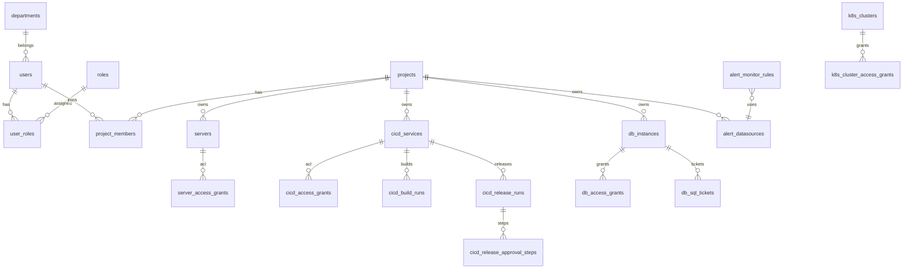

# Yunshu 数据库设计说明书

| 项 | 内容 |
|----|------|
| 文档编号 | YUNSHU-DB-2026-001 |
| 版本 | V1.0.0 |
| ORM | GORM |
| 迁移 | `plugin.Migrate` + `menu.Sync`（`internal/bootstrap/migrate_schema.go`） |
| 日期 | 2026-08-05 |

---

## 1. 设计原则

1. 表随 **启用插件** 迁移，避免未启用模块占用库表。  
2. 项目级资源均含 `project_id`（或等价归属）。  
3. 软删除使用 `gorm.DeletedAt`（如 `users`）。  
4. Casbin 策略独立表 `casbin_rule`（适配器管理）。  

模型源码：`internal/model/*.go`。  
补充说明：`docs/handbook/database/schema-and-relationships.md`。

---

## 2. 全局 ER（核心）

---

## 3. 表清单（按域）

### 3.1 身份与权限（core）

| 表名 | 模型 | 业务说明 |
|------|------|----------|
| `users` | `User` | 用户；唯一用户名；软删 |
| `roles` | `Role` | 角色编码 |
| `user_roles` | `UserRole` | 用户-角色 |
| `permissions` | `Permission` | API 路径+方法，同步 Casbin |
| `casbin_rule` | （适配器） | Casbin 策略 |
| `menus` | `Menu` | 菜单树 |
| `menu_permission_bindings` | `MenuPermissionBinding` | 菜单入口权限 |
| `departments` | `Department` | 部门树 |
| `dict_entries` | `DictEntry` | 字典/敏感配置 |
| `user_groups` / `user_group_users` | `UserGroup*` | 审批用户组 |
| `registration_requests` | `RegistrationRequest` | 注册申请 |
| `login_logs` | `LoginLog` | 登录日志 |
| `operation_logs` | `OperationLog` | 操作审计 |

#### 3.1.1 `users` 字段（摘自模型）

| 字段 | 类型约束 | 说明 |
|------|----------|------|
| id | uint PK | 主键 |
| username | varchar(64) unique not null | 登录名 |
| email | varchar(128) index | 可空 |
| phone | varchar(20) | 告警触达 |
| password | varchar(255) | 哈希，JSON 忽略 |
| nickname | varchar(128) | 昵称 |
| status | int default 1 | 1 启用 0 禁用 |
| department_id | uint index | 部门 |
| created_at / updated_at / deleted_at | time | 审计与软删 |

### 3.2 项目 / CMDB / 日志

| 表名 | 说明 |
|------|------|
| `projects` | 项目租户 |
| `project_members` | 项目成员与角色 |
| `server_groups` | 服务器分组 |
| `servers` | 主机 |
| `server_credentials` | 凭据（加密） |
| `server_access_grants` | 服务器资源 ACL |
| `cloud_accounts` | 云账号 |
| `services` | 项目服务 |
| `service_log_sources` | 日志源 |
| `service_catalog` / `service_links` | 服务目录 |
| `loggie_agents` | Agent 登记与心跳 |
| `log_retention_policies` | 日志保留 |
| `change_events` | 变更事件埋点 |

### 3.3 CI/CD

| 表名 | 说明 |
|------|------|
| `cicd_services` | CI/CD 应用 |
| `cicd_ci_configs` | CI 配置 |
| `cicd_deploy_configs` | 部署配置 |
| `cicd_build_runs` | 构建运行 |
| `cicd_release_runs` | 发布运行 |
| `cicd_release_approval_steps` | 发布审批步骤 |
| `cicd_approval_flow_stages` | 审批流模板阶段 |
| `cicd_access_grants` | 服务级 ACL |

### 3.4 数据库管理（dbmgmt）

| 表名 | 说明 |
|------|------|
| `db_instances` | MySQL/PG 实例 |
| `db_instance_accounts` | 托管账号 |
| `db_access_grants` | 库表授权 |
| `db_access_requests` / `db_access_request_steps` | 权限申请 |
| `db_app_user_requests` / `db_app_user_request_steps` | 应用用户申请 |
| `db_sql_tickets` / `db_sql_ticket_steps` | SQL 工单 |
| `db_sql_executions` | 执行历史 |
| `db_audit_logs` | 审计摘要 |
| `db_approval_flow_stages` | 审批流阶段 |

### 3.5 告警

| 表名 | 说明 |
|------|------|
| `alert_channels` | 通知渠道 |
| `alert_datasources` | 数据源 |
| `alert_monitor_rules` | 监控规则 |
| `alert_rule_assignees` | 规则负责人 |
| `alert_duty_blocks` | 值班块 |
| `alert_silences` | 静默 |
| `alert_inhibition_rules` / `alert_inhibition_events` | 抑制 |
| `alert_maintenance_windows` | 维护窗 |
| `alert_subscription_nodes` / `alert_subscription_matches` | 订阅路由 |
| `alert_receiver_groups` | 接收组 |
| `alert_events` | 告警事件 |
| `alert_firing_deliveries` | 投递记录 |
| `cloud_expiry_rules` | 云到期 |

> 抑制活跃态等可存 Redis（见 `AlertInhibitionActive` 注释），非强制 MySQL 表。

### 3.6 Kubernetes

| 表名 | 说明 |
|------|------|
| `k8s_clusters` | 集群 |
| `k8s_cluster_access_grants` | 集群授权档位 |
| `k8s_namespace_allow_rules` / `k8s_namespace_deny_rules` | NS 规则 |
| `k8s_event_forward_rules` / `k8s_event_forward_settings` | 事件转发 |
| `k8s_forwarded_events` | 已转发事件 |
| `k8s_workload_snapshots` | 工作负载快照 |

### 3.7 备份 / 巡检

| 表名 | 说明 |
|------|------|
| `mysql_backup_instances` / `mysql_backup_jobs` | MySQL 备份 |
| `inspect_plans` / `inspect_items` / `inspect_runs` | 巡检 |
| `inspect_report_templates` | 报告模板 |

---

## 4. 关键索引与约束（实现约定）

| 对象 | 约束 |
|------|------|
| `users.username` | unique |
| `project_members` | `(project_id, user_id)` 业务唯一 |
| 多数 `*_grants` | `(project_id, resource, principal)` 唯一 upsert |
| 外键 | GORM tag 声明 OnUpdate/OnDelete（如用户-部门 SET NULL） |

具体索引以 GORM tag 与 AutoMigrate 结果为准；生产建议对高频查询字段（`project_id`、`status`、`created_at`）做巡检。

---

## 5. 数据字典示例：发布工单状态

来源：`internal/model/cicd.go` 常量（以代码为准）：

- `pending_approval` 待审批  
- `pending_execution` 待执行  
- `running` 执行中  
- `success` / `failed` / `rejected` / `cancelled` 等终态  

SQL 工单状态见 `internal/model/dbmgmt.go`。

---

## 6. 迁移与回滚

| 操作 | 命令/方式 |
|------|-----------|
| 迁移 | 服务启动 AutoMigrate；或 `go run . migrate` |
| Seed | `go run . seed` 或容器 `RUN_SEED=1` |
| 回滚 | **无自动 down 迁移**；需 DBA 备份后按变更单回滚 |

交付建议：上线前全库备份；变更窗口执行 migrate + 冒烟。

---

## 7. 安全相关字段

| 类型 | 处理 |
|------|------|
| 用户密码 | bcrypt 哈希，API 不返回 |
| 服务器/DB/集群凭据 | 应用层加密（`ENCRYPTION_KEY`） |
| 字典敏感项 | 存储加密/掩码；reveal 接口受 Casbin 控制 |
