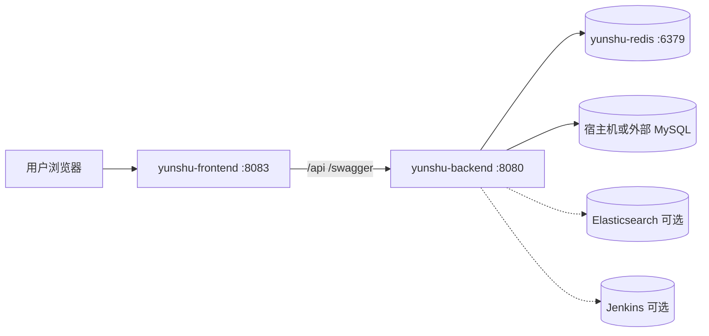

# Yunshu 系统部署实施方案

| 项 | 内容 |
|----|------|
| 文档编号 | YUNSHU-DEP-2026-001 |
| 版本 | V1.1.0 |
| 日期 | 2026-08-30 |
| 依据 | `docker-compose.yml`、`Dockerfile.backend`、`web/Dockerfile.frontend`、`deploy/docker/entrypoint.sh`、`configs/config.yaml` |

---

## 1. 部署架构



**默认 Compose 组成**：Redis + Backend + Frontend；**MySQL 默认在宿主机**（非容器）。

---

## 2. 环境要求

| 项 | 建议 |
|----|------|
| OS | Linux x86_64（亦支持 Windows 开发；生产见 `docs/deployment/KYLIN_V10_X86_64.md`） |
| Docker / Compose | 支持 compose v3.3 |
| CPU/内存 | 参考 compose 限制：backend 0.6 CPU/384MB；redis 0.3/128MB（可按负载上调） |
| MySQL | 5.7+/8.x，字符集与 `config.yaml` 一致 |
| 磁盘 | 日志目录、Redis data、镜像层 |

---

## 3. 配置清单

### 3.1 应用配置 `configs/config.yaml`（唯一纳管入口）

日常部署只改本文件，**不再使用 `.env.example`**。文件顶部有「场景速查」与「可选能力何时打开」。

| 块 | 何时关注 |
|----|----------|
| `app.env` | `dev` 联调；`prod` 上线（拒绝占位/弱密钥） |
| `mysql.*` / `redis.*` | 必填；Compose 时 `redis.addr=yunshu-redis:6379`，`mysql.host`=宿主机 IP |
| `auth.jwt_secret` / `security.encryption_key` | 上线前 `openssl` 生成；换密钥后历史密文不可解 |
| `plugins.enabled` | 裁剪模块；空=默认全集 |
| `ai.enabled` | 需要 AI 助手时 |
| `cicd.enabled` | 对接 Jenkins 流水线时 |
| `elasticsearch.enabled` / `kafka.enabled` | 日志检索 / Kafka 中转 |
| `swagger.enabled` | 仅开发联调 |
| `dbmgmt.*` / `alert.*` / `k8s_event_forward.*` | 对应业务能力 |

Casbin：`configs/casbin_model.conf`。

可选环境变量（非交付清单）：`RUN_SEED`、`WAIT_MYSQL`、`RUN_MIGRATE`、`GIN_MODE`、`TZ`；临时覆盖可用 `MYSQL_HOST` 等（viper）。

### 3.2 前端构建

`web/Dockerfile.frontend`：`VITE_API_BASE_URL=/api`；Nginx 反代至 `yunshu-backend:8080`（`web/nginx.conf`）。

---

## 4. 标准部署步骤（Docker Compose）

1. **准备 MySQL**：建库与账号；容器访问宿主机用实际 IP（如 `172.17.0.1`）。  
2. **编辑 `configs/config.yaml`**：按顶部场景速查填写 mysql/redis/JWT/encryption_key；`redis.password` 与 compose 中 `--requirepass` 一致。  
3. **构建启动**：

```bash
docker compose up -d --build
```

4. **入口行为**（`deploy/docker/entrypoint.sh`）：  
   - `WAIT_MYSQL=1` 按 config.yaml 中 mysql.host/port 等待库就绪  
   - `RUN_SEED=1` 执行 `/app/yunshu seed`  
   - `exec /app/yunshu server`  
5. **验证**：  
   - `http://<host>:8080/api/v1/health`  
   - 前端 `http://<host>:8083`  
   - 使用首次 seed 管理员登录（见 README：`admin` / 首次 `Admin@123`；**重复 seed 不重置密码**）

### 4.1 停止 / 启动

```bash
docker compose stop
docker compose start
# 或
docker compose down        # 不删外部 MySQL 数据
docker compose down -v     # 慎用：删 compose 卷
```

---

## 5. 源码开发部署（可选）

```bash
# 依赖：本地 MySQL、Redis
go run . migrate
go run . seed
go run . server

cd web && npm ci && npm run dev
```

前端开发代理见 `web` Vite 配置（默认后端 `127.0.0.1:8080`）。

---

## 6. 依赖组件部署要点

| 组件 | 何时需要 | 说明 |
|------|----------|------|
| Elasticsearch | 日志检索 | `elasticsearch.enabled` |
| Kafka | 日志管道 | `kafka.enabled` + project worker |
| Jenkins | CI/CD | `cicd` 配置或字典；网络互通 |
| MinIO | 备份/制品 | backup/cicd 配置 |
| goInception | MySQL 审核执行 | `dbmgmt.goinception_*` |
| Harbor | 镜像 | cicd/harbor 配置 |
| Prometheus/AM | 告警 | AM Webhook 指向后端 |

Loggie 离线包：`deploy/loggie/binary/`（安装接口使用）。

---

## 7. Kubernetes 相关说明（避免误解）

| 路径 | 实际用途 |
|------|----------|
| `deploy/k8s/*` | 集群组件样例（CoreDNS、Flannel、metrics-server 等），**非 Yunshu 应用 Deployment** |
| `deploy/helm/springbootdemo` | 演示业务 Chart，**非平台自身** |
| Yunshu 纳管 K8s | 通过平台 UI/API 登记集群 kubeconfig |

若需将 Yunshu 自身迁入 K8s，应另编 Deployment/Service/Ingress/Secret（本仓库未提供完整官方 Chart）。

---

## 8. 升级方案

1. 备份 MySQL；记录当前镜像 tag / git commit。  
2. 拉取新代码/镜像；核对 `configs/config.yaml` 与新增配置项。  
3. 滚动：先 backend（自动/手动 migrate），再 frontend。  
4. 冒烟：登录、项目列表、健康检查、关键插件页。  

### 回滚

1. 切换回上一镜像 tag。  
2. 若已 migrate 且不兼容，从备份恢复 DB（**无自动 down migration**）。  

---

## 9. 安全加固检查表

- [ ] `auth.jwt_secret` / `security.encryption_key` / Redis 密码非仓库默认  
- [ ] 生产 `app.env=prod` 且密钥为 `openssl` 生成的 32 字节强度材料  
- [ ] 生产关闭或限制 Swagger 暴露  
- [ ] 前端仅暴露 80/443；后端不直连公网（经 Nginx）  
- [ ] Alertmanager Webhook Token 已配置  
- [ ] MySQL 仅内网；最小权限账号  

---

## 10. 验收部署证据

| 项 | 期望 |
|----|------|
| `docker compose ps` | redis/backend/frontend healthy 或 running |
| 健康检查 | 200 |
| Seed 用户 | 可登录控制台 |
| 插件 | `plugins.enabled` 对应菜单可见 |
