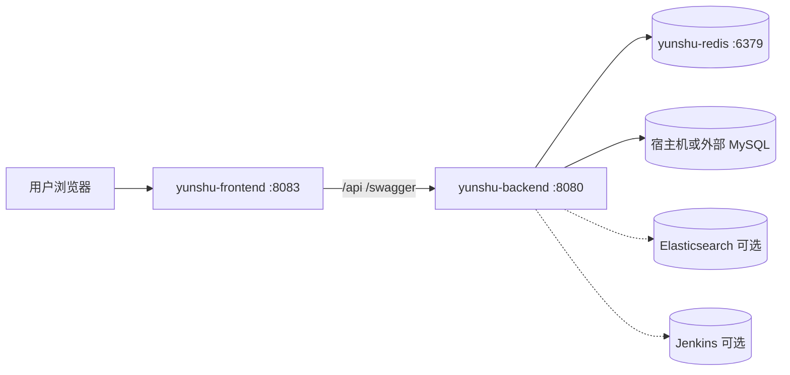

# Yunshu 系统部署实施方案

| 项 | 内容 |
|----|------|
| 文档编号 | YUNSHU-DEP-2026-001 |
| 版本 | V1.0.0 |
| 日期 | 2026-08-05 |
| 依据 | `docker-compose.yml`、`Dockerfile.backend`、`web/Dockerfile.frontend`、`deploy/docker/entrypoint.sh`、`configs/config.yaml`、`.env.example` |

---

## 1. 部署架构



**默认 Compose 组成**：Redis + Backend + Frontend；**MySQL 默认在宿主机**（非容器）。

---

## 2. 环境要求

| 项 | 建议 |
|----|------|
| OS | Linux x86_64（亦支持 Windows 开发；生产见 `docs/deployment/KYLIN_V10_X86_64.md`） |
| Docker / Compose | 支持 compose v3.3 |
| CPU/内存 | 参考 compose 限制：backend 0.6 CPU/384MB；redis 0.3/128MB（可按负载上调） |
| MySQL | 5.7+/8.x，字符集与 `config.yaml` 一致 |
| 磁盘 | 日志目录、Redis data、镜像层 |

---

## 3. 配置清单

### 3.1 环境变量（`.env.example`）

| 变量 | 用途 |
|------|------|
| `MYSQL_HOST` / `MYSQL_PORT` / `MYSQL_USER` / `MYSQL_PASSWORD` / `MYSQL_DB_NAME` | 业务库 |
| `MYSQL_ROOT_PASSWORD` | 可选 |
| `REDIS_PASSWORD` | Redis 密码 |
| `JWT_SECRET` | JWT 签名 |
| `ENCRYPTION_KEY` | 凭据加密（**必填**，启动校验） |
| `RUN_SEED` | 容器是否执行 seed（entrypoint） |

Compose 另设：`GIN_MODE`、`APP_ENV`、`TZ`、`REDIS_ADDR`、`WAIT_MYSQL`。

### 3.2 应用配置 `configs/config.yaml`

关键段：`app.port`（8080）、`plugins.enabled`、`mysql`、`redis`、`auth`、`swagger`、`dbmgmt`、`cicd`、`elasticsearch`、`kafka`、`loggie`、`alert`、`k8s_event_forward`。

Casbin：`configs/casbin_model.conf`。

### 3.3 前端构建

`web/Dockerfile.frontend`：`VITE_API_BASE_URL=/api`；Nginx 反代至 `yunshu-backend:8080`（`web/nginx.conf`）。

---

## 4. 标准部署步骤（Docker Compose）

1. **准备 MySQL**：创建库与账号；网络可达（容器访问宿主机可用 `host.docker.internal` 或实际 IP）。  
2. **准备 `.env`**：复制 `.env.example`，填写强随机 `JWT_SECRET`、`ENCRYPTION_KEY`、`REDIS_PASSWORD`。  
3. **放置配置**：确认镜像内/挂载的 `configs/config.yaml` 与环境一致（插件列表、外部依赖地址）。  
4. **构建启动**：

```bash
docker compose up -d --build
```

5. **入口行为**（`deploy/docker/entrypoint.sh`）：  
   - `WAIT_MYSQL=1` 等待库就绪  
   - `RUN_SEED=1` 执行 `/app/yunshu seed`  
   - `exec /app/yunshu server`  
6. **验证**：  
   - `http://<host>:8080/api/v1/health`  
   - 前端 `http://<host>:8083`  
   - 使用首次 seed 管理员登录（见 README：`admin` / 首次 `Admin@123`；**重复 seed 不重置密码**）

### 4.1 停止 / 启动

```bash
docker compose stop
docker compose start
# 或
docker compose down        # 不删外部 MySQL 数据
docker compose down -v     # 慎用：删 compose 卷
```

---

## 5. 源码开发部署（可选）

```bash
# 依赖：本地 MySQL、Redis
go run . migrate
go run . seed
go run . server

cd web && npm ci && npm run dev
```

前端开发代理见 `web` Vite 配置（默认后端 `127.0.0.1:8080`）。

---

## 6. 依赖组件部署要点

| 组件 | 何时需要 | 说明 |
|------|----------|------|
| Elasticsearch | 日志检索 | `elasticsearch.enabled` |
| Kafka | 日志管道 | `kafka.enabled` + project worker |
| Jenkins | CI/CD | `cicd` 配置或字典；网络互通 |
| MinIO | 备份/制品 | backup/cicd 配置 |
| goInception | MySQL 审核执行 | `dbmgmt.goinception_*` |
| Harbor | 镜像 | cicd/harbor 配置 |
| Prometheus/AM | 告警 | AM Webhook 指向后端 |

Loggie 离线包：`deploy/loggie/binary/`（安装接口使用）。

---

## 7. Kubernetes 相关说明（避免误解）

| 路径 | 实际用途 |
|------|----------|
| `deploy/k8s/*` | 集群组件样例（CoreDNS、Flannel、metrics-server 等），**非 Yunshu 应用 Deployment** |
| `deploy/helm/springbootdemo` | 演示业务 Chart，**非平台自身** |
| Yunshu 纳管 K8s | 通过平台 UI/API 登记集群 kubeconfig |

若需将 Yunshu 自身迁入 K8s，应另编 Deployment/Service/Ingress/Secret（本仓库未提供完整官方 Chart）。

---

## 8. 升级方案

1. 备份 MySQL；记录当前镜像 tag / git commit。  
2. 拉取新代码/镜像；核对 `config.yaml` 与新增环境变量。  
3. 滚动：先 backend（自动/手动 migrate），再 frontend。  
4. 冒烟：登录、项目列表、健康检查、关键插件页。  

### 回滚

1. 切换回上一镜像 tag。  
2. 若已 migrate 且不兼容，从备份恢复 DB（**无自动 down migration**）。  

---

## 9. 安全加固检查表

- [ ] `JWT_SECRET` / `ENCRYPTION_KEY` / Redis 密码非默认  
- [ ] 生产关闭或限制 Swagger 暴露  
- [ ] 前端仅暴露 80/443；后端不直连公网（经 Nginx）  
- [ ] Alertmanager Webhook Token 已配置  
- [ ] MySQL 仅内网；最小权限账号  

---

## 10. 验收部署证据

| 项 | 期望 |
|----|------|
| `docker compose ps` | redis/backend/frontend healthy 或 running |
| 健康检查 | 200 |
| Seed 用户 | 可登录控制台 |
| 插件 | `plugins.enabled` 对应菜单可见 |
