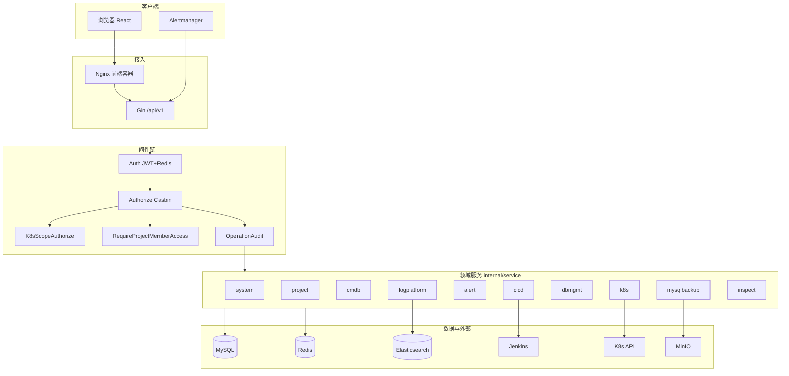
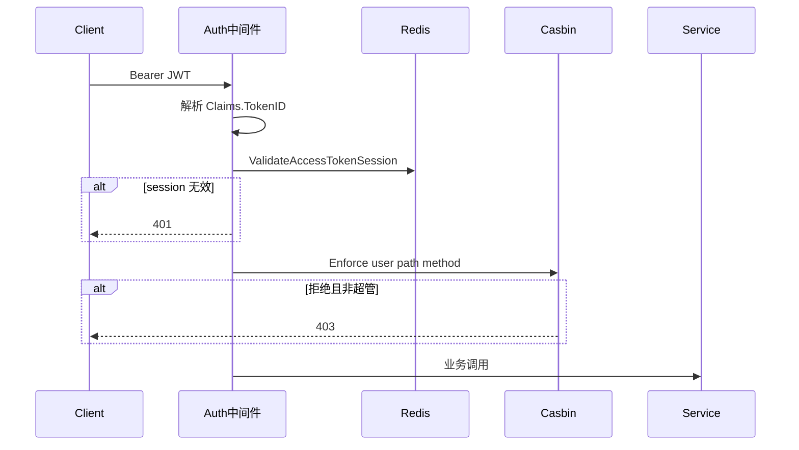

# Yunshu 软件概要设计说明书（HLD）

| 项 | 内容 |
|----|------|
| 文档编号 | YUNSHU-HLD-2026-001 |
| 版本 | V1.0.0 |
| 依据 | 当前代码架构（Clean Architecture + 插件化） |
| 日期 | 2026-08-05 |

---

## 1. 设计目标

1. 以 **插件** 划分业务边界，支持按环境启停能力。  
2. 分层清晰：Handler → Service → Repository → Model。  
3. 统一鉴权：JWT + Redis Session + Casbin +（可选）K8s Scope / 项目成员 / 资源 ACL。  
4. 前端按插件模块挂载静态路由，其余页面经菜单动态加载。

---

## 2. 逻辑架构

---

## 3. 物理部署视图

| 组件 | 镜像/进程 | 端口 | 说明 |
|------|-----------|------|------|
| 前端 | `web/Dockerfile.frontend` → nginx | 宿主机 8083→80 | 反代 `/api`、`/swagger` 至 backend |
| 后端 | `Dockerfile.backend` → `yunshu server` | 8080 | 入口 `deploy/docker/entrypoint.sh` 可先 seed |
| Redis | redis:7.4.2-alpine | 6379 | Session / 告警状态 |
| MySQL | 宿主机或外部 | 3306 | 默认不容器化（compose 注释说明） |

可选外部依赖：ES、Kafka、Jenkins、MinIO、Harbor、goInception、Prometheus。

---

## 4. 分层与依赖规则

| 层 | 路径 | 职责 | 禁止 |
|----|------|------|------|
| Router | `internal/router` | 插件路由注册、Wire 注入 | 业务逻辑 |
| Handler | `internal/handler` | 参数绑定、调 Service、响应 | 直接 DB |
| Service | `internal/service/<域>` | 业务规则、事务编排 | 依赖具体 HTTP |
| Repository | `internal/repository` | GORM 访问 | 业务规则 |
| Model | `internal/model` | 表结构 | — |
| Middleware | `internal/middleware` | 横切鉴权/审计 | — |
| Plugin | `internal/plugins/<id>` | Migrate / Routes / Workers | — |

依赖注入：Google Wire（`internal/router/wire_*.go`）。

---

## 5. 插件边界

| 插件 | 路由注册 | 后台 Worker（若启用） |
|------|----------|----------------------|
| core | `RegisterCoreRoutes` | 无 |
| project | Project + LogPlatform | 日志保留、Kafka→ES |
| cmdb | CMDB | 无 |
| k8s | K8s | Event Forward |
| alert | Alert | 聚合评估、云到期、Webhook 队列等 |
| backup | Backup | MySQL 备份调度 |
| cicd | Cicd | Jenkins 同步 |
| dbmgmt | Dbmgmt | 探活、审批 SLA |
| inspect | Inspect | 巡检调度 |

装配入口：`internal/router/router.go` → `plugin.RegisterRoutes` / `plugin.StartWorkers`。

---

## 6. 鉴权概要设计

补充控制：

- **项目**：`RequireProjectMemberAccess`（`:id` 必填）
- **K8s**：`K8sScopeAuthorize`（集群档位 + NS 规则）
- **资源 ACL**：Service 内 `AssertCicdAccess` / 服务器 `can_exec` 等
- **WS**：`WSAuth` 消费一次性 ticket

---

## 7. 前端概要设计

| 项 | 说明 |
|----|------|
| 入口 | `web/src` + Vite |
| 插件路由 | `web/src/modules/{core,k8s,alert,cicd,cmdb,dbmgmt}/routes.tsx` |
| 动态页 | `DynamicMenuPage` + 菜单 `component` |
| 状态 | `auth-context`；Token 存 `localStorage`（`services/storage.ts`） |
| HTTP | `services/http.ts` Axios；401 处理 |
| WS | `services/ws-auth.ts` 先取 ticket 再连接 |

---

## 8. 关键数据流

### 8.1 告警

Alertmanager → Webhook → 入队/匹配订阅树 → 渠道投递 → `alert_events` / 投递日志；平台规则评估器可辅助 PromQL 类监控（配置依赖数据源）。

### 8.2 发布

创建 ReleaseRun → 初始化审批步骤 → 审批通过 → 待执行 → 提交人执行 → Jenkins → `RunSyncWorker` 回写状态。

### 8.3 SQL 变更

控制台/工单 → `AssessSQL` → 审批流 →（MySQL）goInception 执行 → 审计表。

---

## 9. 质量属性设计

| 属性 | 策略 |
|------|------|
| 扩展性 | 新业务以插件形式注册 Manifest/Migrate/Routes/Workers |
| 安全性 | 多层鉴权；敏感配置加密字段；出站 URL 防护 |
| 可维护性 | 域分包；统一错误码与日志 |
| 可部署性 | Compose 一键；entrypoint 可选 seed |

---

## 10. 设计约束与已知边界

1. OpenAPI 生成物可能滞后于路由，交付以 `register_*_routes.go` 为准，验收前应重跑 `tools/genopenapi`。  
2. 仓库内 `deploy/helm/springbootdemo` 为业务样例 Chart，**不是** Yunshu 平台自身 Helm。  
3. 自审自批（提交人在审批组）为产品保留行为，见核查报告 B-M1。
